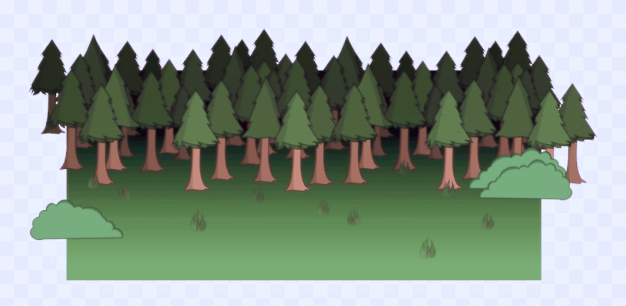

```{r setup, include=FALSE}
# knitr::opts_chunk$set(echo = FALSE)
knitr::opts_chunk$set(fig.width=6.5, fig.height=6.5, collapse = TRUE, comment = "##", dev="png")
#knitr::opts_chunk$set(tidy.opts=list(width.cutoff=60),tidy=TRUE)
library(RColorBrewer)
cols = brewer.pal(8, "Set1")

library(knitr)
library(kableExtra)

```

## Populations & Samples
<div class="left lt">
* A **population** is the unit about which we want to use statistics to describe, analyse, or perform inference.
  - e.g., all the trees in a forest
</div>

<div class="right rt">

</div>


## Populations & Samples
<div class="left lt">
* A **population** is the unit about which we want to use statistics to describe, analyse, or perform inference.
  - e.g., all the trees in a forest
* A **sample** is a subset of a population that is observed with the goal of obtaining knowledge about a population.
</div>

<div class="right rt">

</div>


## Populations & Samples
<div class="left lt">
* A **population** is the unit about which we want to use statistics to describe, analyse, or perform inference.
  - e.g., all the trees in a forest
* A **sample** is a subset of a population that is observed with the goal of obtaining knowledge about a population.
  - select 7 trees at random
  - Samples must be taken carefully so that they are representative of the entire population!
  - Gold standard: sample sizes must be **large** and drawn **randomly** from the population
  - **Experimental design**: designing the sample such that it represents the desired population
</div>

<div class="right rt">

</div>


## Describing populations and samples
<div class="left lt">
* We can visualise the distribution of values within a population using a **histogram**

> - We use **summary statistics** to describe the values numerically.
> - In practise, we must estimate population statistics via sample statistics.
> - We can formally describe the shape of the distribution of values using special statistics called **moments**.

</div>

<div class="right rt">
```{r echo=FALSE}
x = rlnorm(1000, log(10), 0.5)
pl1 = 'hist(x, xlab="Variable of interest", col="#999999", border=NA, main="", breaks=20)'
eval(parse(text=pl1))
```

</div>


## Summary statistics: location

<div class="left lt">

* **First moment**: Arithmetic mean. 

The population mean ($\mu$) can be approximated with the **sample mean**:

$$
\mu \approx \bar{x} = \frac{1}{n}\sum_{i=1}^n x_i
$$

</div>

<div class="right rt">
```{r echo=FALSE}
lwd=2
pl1 = paste(pl1, "abline(v=mean(x), col=cols[1], lwd=lwd)", "text(mean(x), 10, 'mean', col=cols[1], pos=4)", sep=';')
eval(parse(text=pl1))
```

```{r}
mean(x)
```

</div>


## Summary statistics: location

<div class="left lt">

* **First moment**: Arithmetic mean. 

The population mean ($\mu$) can be approximated with the **sample mean**:

$$
\mu \approx \bar{x} = \frac{1}{n}\sum_{i=1}^n x_i
$$

### Other location statistics

The mean can be strongly influenced by outliers.

* median: The 50% quantile (i.e., half the values of x are above the median, half below)
* mode: the most common value, the "peak" of a distribution

</div>

<div class="right rt">
```{r echo=FALSE}
pl2 = paste(pl1, "abline(v=median(x), col=cols[2], lwd=lwd)", "text(median(x), 30, 'median', col=cols[2], pos=4)", sep=';')
eval(parse(text=pl2))
```

```{r}
median(x)

## mode
mode(x) ## wrong!
## we can use the histogram function to approximate the sample mode
## changing the number of breaks will have a large impact on the results
x_hist = hist(x, breaks = 20, plot = FALSE)
x_hist$mids[which.max(x_hist$density)]

```

</div>


## Summary statistics: location

<div class="left lt">

* **First moment**: Arithmetic mean. 

The population mean ($\mu$) can be approximated with the **sample mean**:

$$
\mu \approx \bar{x} = \frac{1}{n}\sum_{i=1}^n x_i
$$

### Other location statistics

* minimum, maximum values
* quantiles: the p-th quantile of x is the value of x such that p% of values are beneath the quantile
   - commonly used: (2.5%, 97.5%), 50%, (25%, 75%)

### Comparing variables

We can compare variables in a way that is *location independent* by **centering** (subtracting the mean)


</div>

<div class="right rt">
```{r echo=FALSE}
pl2 = paste(pl1, "abline(v=median(x), col=cols[2], lwd=lwd)", "text(median(x), 30, 'median', col=cols[2], pos=4)", sep=';')
eval(parse(text=pl2))
```

```{r}
c(min(x), max(x))
range(x)

quantile(x, 0.4)

## Centre the variable
## note! arithmetic operators like `-` are vectorized!
x_ctr = x - mean(x)
mean(x_ctr)

```

</div>


## Summary statistics: dispersion (or scale)

<div class="left lt">


* **Second moment**: Variance ($\sigma^2$)

$$
\sigma^2 = \frac{1}{N}\sum_{i=1}^N (X_i-\mu)^2
$$


We can estimate $\sigma^2$ using the **sample variance**:

$$
\sigma^2 \approx s^2 = \frac{1}{n-1}\sum_{i=1}^n (x_i -\bar{x})^2
$$

It is convenient to talk about the scale of $x$ in the same units as $x$ itself, so we use the (population or sample) **standard deviation**:

$$
\sigma = \sqrt{\sigma^2} \approx s = \sqrt{s^2}
$$


</div>
<div class="right rt">

```{r echo=FALSE}

pl3 = paste(pl1, "lines(c(-sd(x), sd(x)) + mean(x), c(50, 50), col=cols[2], lwd=lwd)", 
            "text(sd(x) + mean(x), 50, '±s', col=cols[2], pos=4)", sep=';')
eval(parse(text=pl3))
```


```{r}
# Population variance -- biased if x is a sample!
sum((x-mean(x))^2)/length(x)

# These R functions always produce the sample variance and sd
var(x)
sd(x)


```
</div>


## Summary statistics: dispersion (or scale)

<div class="left lt">

### Other dispersion statistics

* range: `max(x) - min(x)`
* interquartile range (IQR): the difference between the third and first quartiles
* coefficient of variation (CV): 
$$
\frac{s}{|\bar{x}|}
$$


</div>
<div class="right rt">

```{r echo=FALSE}

pl4 = paste(pl3, "lines(c(min(x), max(x)), c(75, 75), col=cols[3], lwd=lwd)", 
            "text(max(x) - sd(x), 75, 'range', col=cols[3], pos=3)", 
            "lines(c(quantile(x, 0.25), quantile(x, 0.75)), c(100, 100), col=cols[4], lwd=lwd)", 
            "text(quantile(x, 0.75), 100, 'IQR', col=cols[4], pos=4)", sep=';')
eval(parse(text=pl4))
```


```{r}
# the range function gives you the min and max
## Take the difference to get the statistical range
diff(range(x))
max(x) - min(x)

IQR(x)
quantile(x, 0.75) - quantile(x, 0.25)

# coefficient of variation can be done manually
sd(x)/mean(x)


```
</div>


## Summary statistics: higher moments
<div class="left lt">

### Asymmetry: skewness

Is the distribution weighted to one side or the other?

$$
\mathrm{skewness} = \frac{\sum_{i=1}^{n}(x_i-\bar{x})^3}{(n-1)s^3}
$$

```{r, echo = FALSE}
xx = seq(0, 1, length.out=100)
y1 = dbeta(xx, 2, 8)
y2 = dbeta(xx, 8, 2)
y3 = dbeta(xx, 5, 5)
y1 = y1/max(y1)
y2 = y2/max(y2)
y3 = y3/max(y3)

plot(xx, y3, type='l', col=cols[1], xaxt='n', yaxt='n', ylab="Density", lwd=2, xlab="Variable value", bty='l')
lines(xx, y1, type='l', col=cols[2], lwd=2)
lines(xx, y2, type='l', col=cols[3], lwd=2)
legend("center", legend = c("skew = 0", "right (positive) skew", "left (negative) skew"), lwd=2, bty='n', col=cols[1:3])

```

</div>
<div class="right rt">

### Tailedness: kurtosis

How fat are the tails relative to a normal distribution?

$$
\mathrm{kurtosis} = \frac{\sum_{i=1}^{n}(x_i-\bar{x})^4}{(n-1)s^4}
$$


```{r, echo = FALSE}
y1 = dnorm(xx, 0.5, 0.15)
y2 = dbeta(xx, 15, 15)
y3 = dbeta(xx, 3, 3)
# y1 = y1/max(y1)
# y2 = y2/max(y2)
# y3 = y3/max(y3)

plot(xx, y1, type='l', col=cols[1], xaxt='n', yaxt='n', ylab="Density", lwd=2, xlab="Variable value", bty='l', ylim=c(0, max(y2)))
lines(xx, y2, type='l', col=cols[2], lwd=2)
lines(xx, y3, type='l', col=cols[3], lwd=2)
legend("topleft", legend = c("mesokurtic (normal distribution)", 
                            "leptokurtic (positive kurtosis)", 
                            "platykurtic (negative kurtosis)"), lwd=2, bty='n', col=cols[1:3])

```


</div>


## Summarizing samples graphically: histograms
<div class="left lt">

* A **histogram** reports the frequency (or density) of a sample on the y-axis, with the variable on the x-axis.
* Often the simplest view of the entire distribution of a dataset
* In R, we use the `hist` function
  - `col` changes the colour of the bars
  - `breaks` changes the number of bins, or specifies exactly where the breaks are
  - `main` gives the plot a title

</div>

<div class="right rt">

```{r}
data(iris)

## subset the data by a single species
iris_setosa = subset(iris, Species == "setosa")

## change the bin width and the title
hist(iris_setosa$Sepal.Length, breaks=20, col="gray", main="Histogram of setosa sepal length")
```
</div>


## Summarizing samples graphically: boxplots

<div class="left lt">

* **Boxplots** (sometimes **box-and-whisker** diagrams) summarize key statistics.
* They are very useful for comparing variables.
* `y ~ group` is a special data type called a `formula`

</div>

<div class="right rt">

```{r, eval = FALSE}
boxplot(Sepal.Length ~ Species, data = iris)
```

```{r, echo = FALSE}
boxplot(Sepal.Length ~ Species, data = iris, boxwex=0.4)
```

</div>


## Summarizing samples graphically: boxplots

<div class="left lt">

* **Boxplots** (sometimes **box-and-whisker** diagrams) summarize key statistics.
* They are very useful for comparing variables.
* `y ~ group` is a special data type called a `formula`

</div>

<div class="right rt">

```{r, eval = FALSE}
boxplot(Sepal.Length ~ Species, data = iris)
```

```{r, echo = FALSE}
boxplot(Sepal.Length ~ Species, data = iris, boxwex=0.4)
rng = range(iris$Sepal.Length[iris$Species == "setosa"])
lines(c(0.75, 0.75), rng, col=cols[1])
text(0.75, rng[2], "range", col=cols[1], pos=2)

iqr = quantile(iris$Sepal.Length[iris$Species == "versicolor"], c(0.25, 0.75))
lines(c(1.75, 1.75), iqr, col=cols[2])
text(1.75, rng[2], "IQR", col=cols[2], pos=2)
text(2.25, rng[2], "median", col=cols[3], pos=2)

text(3, min(iris$Sepal.Length[iris$Species == "virginica"]), 
     "outliers\n x < quartile(x, 0.25) - 1.5*IQR(x)\n x > quartile(x, 0.75) + 1.5*IQR(x)", 
     pos=1, col=cols[4], cex=0.7)
```

</div>


## Programming in R: Repeating yourself

<div class="left lt">
* An important programming concept is **DRY**: Don't Repeat Yourself!
   - Don't copy and paste code if you can instead instruct the computer to repeat things for you.
* There are many ways to execute the same code repeatedly; we will cover these in detail as they are needed.
* A motivating example:
    - Compute the mean of every variable in the `iris` dataset
    - Note that the last variable, `species`, is nominal and thus the mean is not defined

</div>

<div class="right rt">

```{r}
## bad!
col_means = c(
  mean(iris[,1]),
  mean(iris[,2]),
  mean(iris[,3]),
  mean(iris[,1]),  # it's easy to introduce mistakes this way!
  mean(iris[,5]))
```

```{r echo = FALSE, results = 'asis'}
kable(matrix(col_means, nrow=1, dimnames=list(NULL, colnames(iris))), digits=3)
```


</div>


## Programming in R: applying functions

* We want to **apply** the function named `mean` separately to every variable in `iris` 
* R has many different ways to apply functions, in this case we use `s`imple `apply` (`sapply`)

```{r results=FALSE}
col_means = sapply(iris, mean) # apply the function mean to each variable in iris
col_means
```

```{r echo = FALSE, results = 'asis'}
kable(col_means)
```


## Programming in R: applying functions

* We want to **apply** the function named `mean` separately to every variable in `iris` 
* R has many different ways to apply functions, in this case we use `s`imple `apply` (`sapply`)
* this works with any function that accepts a vector, even when they return more than a single value
```{r results=FALSE}
# we use only the first four columns, because these functions throw an error with non-numeric data
sapply(iris[,1:4], range)
```

```{r echo = FALSE, results = 'asis'}
kable_styling(kable(sapply(iris[,1:4], range)), font_size = 14)
```

```{r results=FALSE}
sapply(iris[,1:4], quantile, c(0.25, 0.5, 0.75))
```

```{r echo = FALSE, results = 'asis'}
kable_styling(kable(sapply(iris[,1:4], quantile, c(0.25, 0.5, 0.75))), font_size = 14)
```


## Programming in R: applying functions to tabular data

<div class="left lt">
* There are three species of iris; it makes more sense to have summary statistics for each one
* `tapply`: `t`abular `apply`
  - produces a summary table for a single variable (e.g., `Sepal.Length`) based on categories in another variable (e.g., `Species`)

</div>

<div class="right rt">

```{r}
tapply(iris$Sepal.Length, iris$Species, mean)
```

</div>


## Programming in R: combining applys

* We can combine apply statements
* `tapply` works with a single variable, 
* `sapply` can be used to run the same `tapply` on every variable
   - `sapply(X=iris,FUN=tapply,...)` where arguments for `tapply` replace `...`

```{r results=FALSE}
# this runs tapply on each of the four variables in iris
# it uses the Species variable to tabulate, then runs the mean function on each slice
mean_by_species = sapply(iris[,1:4], tapply, iris$Species, mean)
mean_by_species
```

```{r echo = FALSE, results='asis'}
kable(mean_by_species)
```


## Probability distributions

**Thought experiment**
You and 99 of your closest friends gather on the centre line of a football pitch. The pitch runs north-south, and is 100 m long. We will define the centre line as 0m, the northern boundary +50 m, and the southern boundary as -50 m.

Each person flips a fair coin. If the coin is heads, they take a step north (add 0.5 m to their location), if its tails, they take a step south (subtract 0.5 m from their location). Then we repeat this exercise 100 times (100 people, 100 coin flips each).

**Question**: What is the distribution of positions on the field?

## Probability distributions

**Thought experiment**
You and 99 of your closest friends gather on the centre line of a football pitch. The pitch runs north-south, and is 100 m long. We will define the centre line as 0m, the northern boundary +50 m, and the southern boundary as -50 m.

Each person flips a fair coin. If the coin is heads, they take a step north (add 0.5 m to their location), if its tails, they take a step south (subtract 0.5 m from their location). Then we repeat this exercise 100 times (100 people, 100 coin flips each).

**Question**: What is the distribution of positions on the field?

We can simulate this experiment in R. Here is code for doing it for one person:

```{r, results=FALSE}
position = 0
for(i in 1:100) {
  coin_flip = sample(c("heads", "tails"), 1)
  if(coin_flip == "heads") {
    position = position + 0.5
  } else {
    position = position - 0.5
  }
}
position
```


## Probability distributions
<div class="left lt">

**Thought experiment**
You and 99 of your closest friends gather on the centre line of a football pitch. The pitch runs north-south, and is 100 m long. We will define the centre line as 0m, the northern boundary +50 m, and the southern boundary as -50 m.

Each person flips a fair coin. If the coin is heads, they take a step north (add 0.5 m to their location), if its tails, they take a step south (subtract 0.5 m from their location). Then we repeat this exercise 100 times (100 people, 100 coin flips each).

**Question**: What is the distribution of positions on the field?

We can simulate this experiment in R.

And for a larger sample (2500) friends, doing more coin flips (500 each)

```{r include=FALSE}
set.seed(123)
```

```{r, results=FALSE}
positions = rep(0, 2500)
for(i in 1:500) {
  coin_flips = sample(c("heads", "tails"), length(positions), replace = TRUE)
  positions = positions + ifelse(coin_flips == "heads", 0.5, -0.5)
}

```
</div>


<div class="right rt">
```{r}
hist(positions, breaks=40, col="gray", main="")
```

</div>


## Probability distributions: PDFs
<div class="left lt">
* We can rescale this histogram, such that the **area** of each bar represents the proportion of samples within that bin.

> - The height of each bar is the **probability density**.
> - The figure approximates an empirical **probability density function**.

</div>

<div class="right rt">
```{r}
hist(positions, breaks=40, col="gray", main = "", freq=FALSE)
```

</div>


## Probability distributions: PDFs
<div class="left lt">
* We can rescale this histogram, such that the **area** of each bar represents the proportion of samples within that bin.
* The height of each bar is the **probability density**.
* The figure approximates an empirical **probability density function**.
* We can use the `density` function in R to add a curve approximating this density. 

</div>

<div class="right rt">
```{r}
hist(positions, breaks=40, col="gray", main = "", freq=FALSE)
lines(density(positions, adjust=1.5), col='red', lwd=2)
```

</div>


## Normal distributions
<div class="left lt">
* This looks a lot like a normal distribution.
* As we take smaller and smaller steps, and do more coin flips, the distribution of values will converge exactly on a normal distribution.
* Here we add a normal **PDF** based on the sample mean and sd (in blue).

Side note: the curve produced by `density` works in two steps: First, it replaces each observation by a *small* normal **PDF** with the observation as its mean and some given standard deviation (the kernel size). Second, it sums up all those PDFs to get a smooth curve approximating the histogram.
</div>

<div class="right rt">
```{r}
hist(positions, breaks=40, col="gray", main = "", freq=FALSE)
lines(density(positions, adjust=1.5), col='red', lwd=2)
mu = mean(positions)
sig = sd(positions)
x_norm = seq(min(positions), max(positions), length.out = 400)
y_norm = dnorm(x_norm, mu, sig)
lines(x_norm, y_norm, lwd=2, col='blue')
legend("topright", legend=c(paste("sample mean =", round(mu, 2)), 
                            paste("sample sd =", round(sig, 2))), lwd=0, bty='n')
```

</div>


## Normal distributions

> - In nature, any process that involves summing small random values produces exactly this shape.
> - The distribution is **symmetric** and **unimodal**.
> - mean, median, mode are all equal.
> - The distribution has two **parameters**, the mean ($\mu$) and the standard deviation ($\sigma$).
> - If $\mu = 0$ and $\sigma = 1$, the distribution is called the **standard normal**.
> - Transforming a variable so that $\mu = 0$ and $\sigma = 1$ is called **standardization**.
$$
x_{std} = \frac{(x - \bar{x})}{s}\approx\frac{(x - \mu)}{\sigma}
$$
> - In R, we can use the `scale` function.

## Normal distributions

* In nature, any process that involves summing small random values produces exactly this shape.
* The distribution is **symmetric** and **unimodal**.
* mean, median, mode are all equal.
* The distribution has two **parameters**, the mean ($\mu$) and the standard deviation ($\sigma$).
* If $\mu = 0$ and $\sigma = 1$, the distribution is called the **standard normal**.
* Transforming a variable so that $\mu = 0$ and $\sigma = 1$ is called **standardization**.
$$
x_{std} = \frac{(x - \bar{x})}{\sigma}
$$
* In R, we can use the `scale` function.

```{r echo=FALSE, fig.height=5}
plot(seq(-30,0,by=.1),dnorm(seq(-30,0,by=.1),mean=-15,sd=3),type="l",bty="n",xlim=c(-20,20),ylim=c(0,0.7),xlab="",ylab="density")
lines(seq(-5,5,by=.1),dnorm(seq(-5,5,by=.1)))
lines(seq(10,20,by=.1),dnorm(seq(10,20,by=.1),mean=15,sd=.6))
text(-15,0.2,"A",cex=1.5); text(0,0.55,"scale(A)=scale(B)",cex=1.5); text(12,0.3,"B",cex=1.5)
```


## Normal distributions

<div class="left lt">
* The typical "bell-curve" shape of the normal distribution is the Normal **Probability Density Function** (PDF)

$$
\mathcal{f}(x) = \frac{1}{\sigma \sqrt{2\pi}} \mathcal{e}^{-\frac{1}{2} \left (\frac{x-\mu}{\sigma} \right )^2}
$$

* It is easiest to understand what this function represents by understanding its **integral**.
* Recall that the area of each bar in our histogram represents the *proportion* of observations in that bin.


</div>

<div class="right rt">
```{r echo = FALSE}
hist(positions, breaks=40, col="gray", main = "", freq=FALSE)
lines(x_norm, y_norm, lwd=2, col='blue')
legend("topright", legend=c(paste("sample mean =", round(mu, 2)), 
                            paste("sample sd =", round(sig, 2))), lwd=0, bty='n')
```

</div>


## Normal distributions: area under the curve

<div class="left lt">

* The integral between two values $a$ and $b$ is equal to the area under the curve.
* This is exactly the probability of observing a value between $a$ and $b$.
* Rule of thumb: about 68% of values in any normal distribution will be within 1 standard deviation of the mean.


</div>

<div class="right rt">
```{r echo = FALSE}
plot(0,0, xlim=range(x_norm), ylim=range(y_norm), xlab = "X", ylab = "Probability Density", bty="n", type='n')
x_poly = seq(mu-sig, mu+sig, length.out=200)
y_poly = dnorm(x_poly, mean(positions), sd(positions))
x_poly = c(x_poly, rev(x_poly))
y_poly = c(y_poly, rep(0, length(y_poly)))
polygon(x_poly, y_poly, col=cols[2])
lines(x_norm, y_norm, lwd=2, col='blue')
text(mu+c(sig, -sig), dnorm(mu+c(sig, -sig), mu, sig), c(expression(mu+sigma), expression(mu-sigma)), pos = c(4,2))

legend("topright", legend=c(paste("sample mean =", round(mu, 2)), 
                            paste("sample sd =", round(sig, 2)),
                            paste("area under curve =", round(diff(pnorm(mu+c(-sig, sig), mu, sig)), 4))), lwd=0, bty='n')
```
</div>

## Normal distributions: area under the curve

<div class="left lt">

* The integral between two values $a$ and $b$ is equal to the area under the curve.
* This is exactly the probability of observing a value between $a$ and $b$.
* Rule of thumb: about 68% of values in any normal distribution will be within 1 standard deviation of the mean.
* Rule of thumb: 95% of values are $\mu \pm 1.96 \sigma \approx \mu \pm 2 \sigma$.

</div>

<div class="right rt">
```{r echo = FALSE}
plot(0,0, xlim=range(x_norm), ylim=range(y_norm), xlab = "X", ylab = "Probability Density", bty="n", type='n')
x_poly = seq(mu-1.96*sig, mu+1.96*sig, length.out=200)
y_poly = dnorm(x_poly, mean(positions), sd(positions))
x_poly = c(x_poly, rev(x_poly))
y_poly = c(y_poly, rep(0, length(y_poly)))
polygon(x_poly, y_poly, col=cols[2])
lines(x_norm, y_norm, lwd=2, col='blue')
text(mu+c(1.96*sig, -1.96*sig), dnorm(mu+c(1.96*sig, -1.96*sig), mu, sig), 
     c(expression(mu+1.96*sigma), expression(mu-1.96*sigma)), pos = c(4,2))

legend("topright", legend=c(paste("sample mean =", round(mu, 2)), 
                            paste("sample sd =", round(sig, 2)),
                            paste("area under curve =", round(diff(pnorm(mu+c(-1.96*sig, 1.96*sig), mu, sig)), 4))), lwd=0, bty='n')
```
</div>


## Normal distributions: CDF

<div class="left lt">
* If we integrate from  $-\infty$ to some value $x$, then we have the probability of observing a value **less than** $x$.
* This integral of the Normal PDF is known as the Normal **cumulative distribution function**.

$$
\mathcal{g}(x) = \int_{-\infty}^{x} \frac{1}{\sigma \sqrt{2\pi}} \mathcal{e}^{-\frac{1}{2} \left (\frac{x-\mu}{\sigma} \right )^2} dx
$$


```{r echo = FALSE}
plot(0,0, xlim=range(x_norm), ylim=c(0,1), xlab = "X", ylab = "Cumulative Probability", bty="n", type='n')
lines(x_norm, pnorm(x_norm, mu, sig), lwd=2, col='red')
```

</div>

<div class="right rt">


```{r echo = FALSE}
plot(0,0, xlim=range(x_norm), ylim=range(y_norm), xlab = "X", ylab = "Probability Density", bty="n", type='n')
x_poly = seq(-50, mu-1.96*sig, length.out=100)
y_poly = dnorm(x_poly, mean(positions), sd(positions))
x_poly = c(x_poly, rev(x_poly))
y_poly = c(y_poly, rep(0, length(y_poly)))
polygon(x_poly, y_poly, col=cols[2])
lines(x_norm, y_norm, lwd=2, col='blue')
text(mu+-1.96*sig, dnorm(mu-1.96*sig, mu, sig), expression(mu-1.96*sigma), pos = 4)

legend("topright", legend=c(paste("sample mean =", round(mu, 2)), 
                            paste("sample sd =", round(sig, 2)),
                            paste("area under curve =", round(pnorm(mu-1.96*sig, mu, sig), 4))), lwd=0, bty='n')
```


</div>


## Distributions in R

* R has four functions in common for many families of distributions:

**PDF**: what is the probability `d`ensity when $x=3$ (the height of the bell curve)

```{r}
dnorm(x = 3, mean = 0, sd = 1)
```

**CDF**: what is the cumulative `p`robability when $x=q$

(area under the bell curve from $-\infty$ to $q$)

(probability of observing a value < $q$)

```{r}
pnorm(q = 3, mean = 0, sd = 1)
```


**Quantiles**: what is the value of $x$, such that the probability of observing **x or smaller** is $p$

(inverse of the CDF)

```{r}
qnorm(p = 0.025, mean = 0, sd = 1)
```


**RNG**: Random number generator, produces $n$ random numbers from the desired distribution

```{r}
rnorm(n = 10, mean= 0, sd = 1)
```


R supports many distributions, we will discuss others as they come up.


## Sampling error
> - In practise, we work with samples, which are imperfectly representative of the populations from which they are drawn.
> - The **sample mean** $(\bar{x})$ and **sample standard deviation** $(s)$ approximate the population $\mu$ and $\sigma$.
> - We would like to known how good our estimates are!
> - A **standard error** tells you how well a **sample statistic** represents the **population parameter**.
> - If you repeat your sampling many times, and compute a separate sample statistic each time (e.g., $\bar{x}$, $s$, etc)...
> - The sample statistics will converge on a normal distribution (if the sample size is large).
> - The **standard deviation of sample statistics** will equal the **standard error** of the statistic.

## Standard error of the mean
* In practise, we work with samples, which are imperfectly representative of the populations from which they are drawn
* The **sample mean** $(\bar{x})$ and **sample standard deviation** $(s)$ approximate the population $\mu$ and $\sigma$
* We would like to known how good our estimates are!
* A **standard error** tells you how well a **sample statistic** represents the **population parameter**.
* If you repeat your sampling many times, and compute a separate sample statistic each time (e.g., $\bar{x}$, $s$, etc)...
* The sample statistics will converge on a normal distribution (if the sample size is large)
* The **standard deviation of sample statistics** will equal the **standard error** of the statistic.
* We commonly use the **standard error of the mean** to make inferences about the mean of a sample
* A larger sample size results in a smaller standard error


$$
\sigma_{\bar{x}} = \frac{\sigma}{\sqrt{n}} \approx \frac{s}{\sqrt{n}}
$$


## Central limit theorem
* If you repeat your sampling many times, and compute a separate sample statistic each time (e.g., $\bar{x}$, $s$, etc)...
* The sample statistics will converge on a normal distribution (if the sample size is large).

> - This holds generally in many natural systems.
> - If a variable $x$ is normally distributed, then $\bar{x}$ will be normally distributed, regardless of sample size.
> - The farther $x$ is away from a normal distribution, the larger $n$ must be before $\bar{x}$ follows a normal distribution.
> - If $n$ is large enough...
> - $\bar{x}$ will be normally distributed with a mean = $\mu$ and standard deviation = the standard error of the mean.