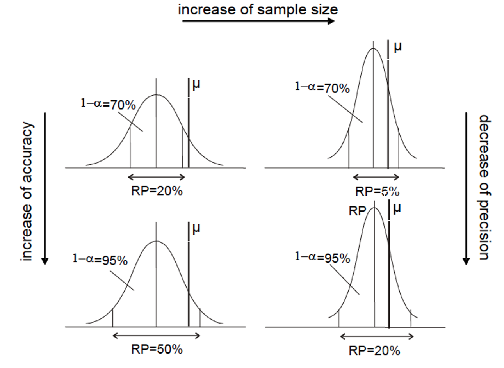
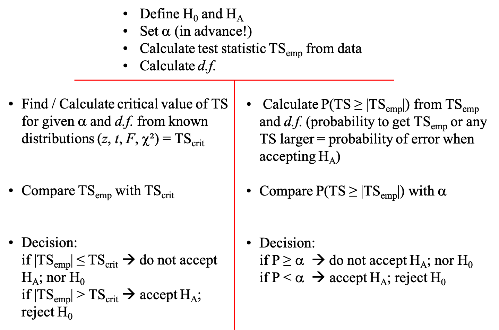
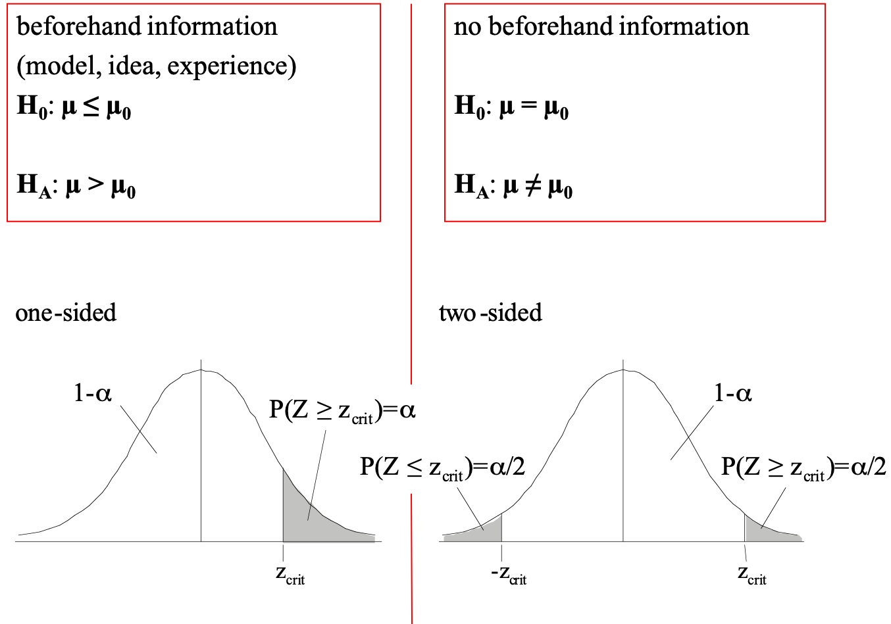
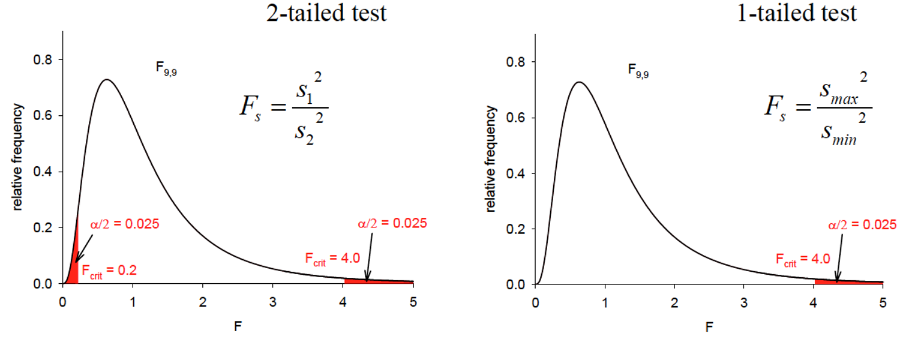
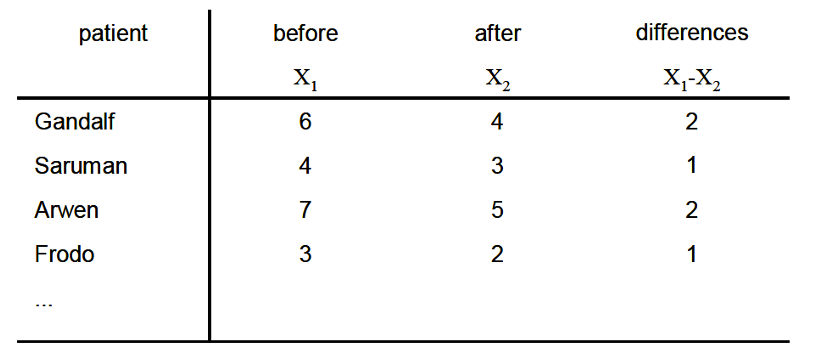

```{r setup, include=FALSE}
knitr::opts_chunk$set(fig.width=5.5, fig.height=5.5, fig.align="center",collapse = TRUE, comment = "##", dev="png")
library(RColorBrewer)
cols = brewer.pal(8, "Set1")

## to use tables
library(knitr)
library(kableExtra)
```

## The central limit theorem revisited

<div class="left lt">

Assume x is normally distributed. Randomly sampled means must be normally distributed with a standard deviation given by S.E.M., which decreases as n increases.

$$
\sigma_{\bar{x}} = \frac{\sigma}{\sqrt{n}}
$$

Standardized (scaled) sample means z are computed as sample means minus the true mean, divided by the standard error. 

$$
{z} = \frac{(\bar{x}-\mu)}{\frac{\sigma}{\sqrt{n}}}
$$

These z-values follow a standard normal distribution (with mean=0 and sd=1).

</div>

<div class="right rt">

```{r echo=FALSE}
x<-seq(-10,10,by=0.01)
hist(rnorm(1000),freq=FALSE,col="grey",border="grey",ylim=c(0,1),main="Distribution of means with n=1, n=3, n=6",xlab="X or sample means of X",xlim=c(-4,4))
lines(x,dnorm(x),col="black",lwd=2)
lines(x,dnorm(x,sd=1/sqrt(3)),col="orange",lwd=2)
lines(x,dnorm(x,sd=1/sqrt(6)),col="red",lwd=2)
text(1.5,0.8,expression(symbol(sigma)/sqrt(6)),col="red")
text(1.75,0.6,expression(symbol(sigma)/sqrt(3)),col="orange")
text(2,0.4,expression(symbol(sigma)/sqrt(1)))
```

Knowing $\sigma$ and $\mu$ we could compute intervals around $\mu$, in which various sample means would end up with a certain probability.

</div>

## Putting the central limit theorem to work: Confidence intervals

<div class="left lt">

Vice versa, we could compute an interval around any found sample mean, which includes $\mu$ with a certain probability. This probability - called confidence - should be close to 1. Its complement to 1 is here called $\alpha$.

$$
z = \frac{(\bar{x}-\mu)}{\frac{\sigma}{\sqrt{n}}}
$$
$$
P(-z_\frac{\alpha}{2}\leq \frac{(\bar{x}-\mu)}{\frac{\sigma}{\sqrt{n}}}\leq+z_\frac{\alpha}{2})=1-\alpha
$$
$$
P(\bar{x}-z_\frac{\alpha}{2}\frac{\sigma}{\sqrt{n}}\leq \mu \leq\bar{x}+z_\frac{\alpha}{2}\frac{\sigma}{\sqrt{n}})=1-\alpha
$$
$$
CI: \bar{x}\pm z_\frac{\alpha}{2}\frac{\sigma}{\sqrt{n}}
$$

A confidence interval is constructed symmetrically around a sample mean $\bar{x}$. With a high probability (usually 95%) $\mu$ is included in intervals constructed around $\bar{x}$'s.

</div>

<div class="right rt">

Graphically this is just a translation of the density distributions of the means from $\mu$ as center to $\bar{x}$ as center.
```{r echo=FALSE}
x<-seq(-3,3,by=0.01)
plot(x,dnorm(x),col="black",bty="n",type="l",lwd=2,xlab="sample means of X",ylim=c(0,.5))
lines(x,dnorm(x,mean=-.7),col="orange",lwd=2)
lines(x,dnorm(x,mean=2.5),col="red",lwd=2)
abline(v=c(0,-.7,2.5),lwd=2,col=c("black","orange","red"),lty=3)
text(c(0,-.7,2.5),0.45,c(expression(symbol(mu)),expression(bar(x)),expression(bar(x))),col=c("black","orange","red"),pos=4)
```

Cool! **One sample** is enough for a good **interval estimate** of $\mu$. But wait - where from do I know $\sigma$?!? 

</div>


## The t-distribution
<div class="left lt">

If S.E.M. is estimated using the *sample* standard deviation, then *standardized* sample means follow a Student´s t-distribution:

$$
\sigma_{\bar{x}} = \frac{\sigma}{\sqrt{n}} \approx \frac{s}{\sqrt{n}} = S.E.M.
$$
$$
{t} = \frac{(\bar{x}-\mu)}{\frac{s}{\sqrt{n}}}
$$

The t-distribution is wider, i.e. has fatter tails, when n is low, but converges to a normal with infinite n. Its shape is determined by d.f.=n-1. Functions in R are `qt`, `pt`,`dt` and `rt`.

</div>

<div class="right rt">

```{r echo=FALSE,fig.width=7}
plot(seq(-5,5,length.out=100),dt(seq(-5,5,length.out=100),df=3),bty="n",ylim=c(0,.41),xlab="standardised sample means", ylab="density",type="l")
lines(seq(-5,5,length.out=100),dt(seq(-5,5,length.out=100),df=20),lt=2)
lines(seq(-5,5,length.out=100),dnorm(seq(-5,5,length.out=100)),lt=3)
legend(-4,0.3,legend=c("t (d.f.=3)","t (d.f.=20)","normal"),lty=c(1,2,3),bty="n")
```

Above 100 df, t is basically equivalent to a normal distribution.

</div>


## Confidence intervals: accuracy, precision, sample size

<div class="left lt">

Also t-distribution can be used to construct a confidence interval:

$$
{t} = \frac{(\bar{x}-\mu)}{\frac{s}{\sqrt{n}}}
$$
$$
P(\bar{x}-t_{\frac{\alpha}{2},d.f.}\frac{s}{\sqrt{n}}\leq \mu \leq\bar{x}+t_{\frac{\alpha}{2},d.f.}\frac{s}{\sqrt{n}})=1-\alpha
$$
$$
CI: \bar{x}\pm t_{\frac{\alpha}{2},d.f.} \frac{s}{\sqrt{n}}
$$

Allows **interval estimate** of $\mu$ with an estimate for $\sigma$ derived from the same sample as $\bar{x}$.

</div>

<div class="right rt">

```{r}

data<-read.table("data/Glaciers.txt",header=TRUE)
# radiocarbon in dissolved organic carbon from glacier ice samples 
d14C<-data$delta14C.permil

# Give mean and confidence interval with alpha=0.05 #
(m<-mean(d14C))
(s<-sd(d14C))
(n<-length(d14C))
alpha<-0.05
accuracy<-1-alpha

t<-qt(p=1-alpha/2,df=n-1) # two-sided, P goes 50/50 to both tails
aprec<-t*s/sqrt(n) 
aprec # absolute precision = half the CI width
(rprec<-aprec/m*100)

(LL<-m-aprec)
(UL<-m+aprec)
```

</div>


## Confidence intervals: accuracy, precision, sample size

* Confidence = accuracy = the probability close to 1 with which $\mu$ is included in intervals constructed around $\bar{x}$'s.
* Precision = half the width of the interval (in units of variable). Precision may be expressed relative to the mean as a percentage.
* Precision, accuracy and sample size n are interdependent. A *low* precision (i.e. narrow interval) and high accuracy (e.g. 99% probability of including $\mu$) needs a large sample size n.

<div class="left lt">

$$
AP= t_{\frac{\alpha}{2},d.f.} \frac{s}{\sqrt{n}}
$$

$$
RP= \frac{t_{\frac{\alpha}{2},d.f.}}{\bar{x}} \frac{s}{\sqrt{n}}
$$

With knowledge of s (pilot study!), we can pre-set RP, i.e. a needed precision, and a desired level of confidence in order to compute a necessary sample size:
$$
n= \left(\frac{t_{\frac{\alpha}{2},d.f.}\cdot{s}}{{RP\cdot\bar{x}}}\right)^2
$$

Solution of this formula iteratively as n remains on both sides, in R with `while`.

</div>

<div class="right rt">

```{r}
# Regard data as pilot study
# Set accuracy and rprec as needed
accuracy<-0.95 # <90-95 % is questionable
rprec<-0.10 # assume more (or less) precise estimate is needed

alpha<-1-accuracy

n<-2   # left side of formula, low n as starting value
t<-qt(1-alpha/2,n-1)  
((t*s/(rprec*m))^2)  # right side of formula
diff<-((t*s/(rprec*m))^2)-n
# right side minus left side, you want this to be close to zero, when diff falls below zero - then enough sampling effort 

while (diff>=0){
	n<-n+1
	t<-qt(1-alpha/2,n-1)
	diff<-((t*s/(rprec*m))^2)-n
}
n # -> this is the needed sample size (minimum) to achieve the desired precision and accuracy
```

</div>


## Accuracy and precision illustrated




## Accuracy and precision illustrated


## Statistical decision theory

... at the heart of inferential statistics: learning about the population from sample(s).

* **Statistical decision**: a decision about the population based on sample information.
* **Statistical hypothesis**: an assumption about the population to reach a decision, formulated as a (paired) statement, often derived from a research question.

<br/>

* **Null hypothesis**: the assumption that an eventually obtained result (from sampling) is **entirely due to chance** (*initial innocence*)
* **Alternative hypothesis**: any hypothesis that differs from the null.

<br/>

Example:

**H0: Two populations do not differ.** An eventually observed difference obtained from two samples is entirely due to chance. If the studied property is naturally variable, then samples will never be identical.

**HA: Two populations differ.** An observed difference between two samples reflects this difference, the samples were collected from two different underlying populations.

<br/>

A decision is made by rejecting/accepting the hypotheses, our aim is to reject H0 and accept HA (the other direction is harder).

Now, imagine you observe a difference between two samples. If asked to make a decision you will probably look at the absolute observed difference (sample mean B is X-times larger than sample mean A), maybe also try to take into account the observable variation in the two samples. **Make a decision** ;-) 


## Type I & II Errors
When making a decision based on **(incomplete) sample information** you can make an error!

There are two types of error: alpha (type I), beta (type II)


<br/>
Type I error: **wrong alarm**, there is no real effect, but you think there is one.

Type II error: **missed opportunity**, there is a real effect, but you failed to find it.

Power (1-beta): The probability to correctly identify an existing real effect.

<br/>
Power increases

* as the strength of the effect increases (e.g., larger difference between populations)
* as the population variance decreases
* as we increase alpha
* as we increase sample size


## Statistical hypothesis testing - strategy
Consider the example from before as a classical situation of a two sample-test:

**H0: Two populations do not differ.** An eventually observed difference obtained from two samples is entirely due to chance. If the studied property is naturally variable, then samples will never be identical.

**HA: Two populations differ.** An observed difference between two samples reflects this difference, the samples were collected from two different underlying populations.


## Statistical hypothesis testing - strategy
Consider the example from before as a classical situation of a two sample-test:

**H0: Two populations do not differ.** An eventually observed difference obtained from two samples is entirely due to chance. If the studied property is naturally variable, then samples will never be identical.

**HA: Two populations differ.** An observed difference between two samples reflects this difference, the samples were collected from two different underlying populations.

<br/>
To test, we have collected empirical information, i.e. each population is represented by 1 sample (of some size).

<br/>
The testing strategy essentially contains 3 steps:

1. **We assume H0 is true. We are suspicious, however, maybe the two samples even differ remarkably. Thus, we calculate the “chance” to observe what was empirically found under a true H0.**
2. **This probability is then compared to a preset threshold probability (alpha).**
3. **If the empirically found outcome is highly unlikely (< alpha), we decide H0 cannot be true and reject it.**


## Mechanics of testing illustrated step-by-step: one-sample test
<div class="left lt">
**Example:** Mice population on an island. We do a census and identify body size (as weight) of ALL MICE. Weight is ND with $\mu0$ and $\sigma$. On the way home between island and mainland we find a single mouse on a drifting log, it is surprisingly large (weight x1). Is it from the island? From the mainland? We will use a 1-sample test with a size n=1.

<br/>
**Testable hypotheses:**

**H0: The ‘new’ mouse belongs to the island population.** Its weight is similar to those of other island mice: Its relatively high weight is entirely due to chance, it´s just a slightly heavy mouse of the population. 

**HA: The ‘new’ mouse does not belong to the island population.** Its weight is higher than that of other island mice, it must belong to some other mouse population, say from the mainland.

</div>

<div class="right rt">

```{r fig.height=5, fig.width=5}
data<-read.table("data/IslandMice.txt",header=TRUE)
x<-data$weight
hist(x,xlab="Mouse weight (g)",freq=F,ylim=c(0,.2))
x1<-13 # Drifting mouse (x1)
abline(v=x1,col="red",lwd=2)

mu<-mean(x) # population mean of island mice
n<-length(x) # population size
sigma<-sqrt(sum((x-mu)^2)/n) # population sd (sigma)
# remember sd(x) assumes x is a sample, use n-1 in denominator
lines(seq(-5,20,by=.1),dnorm(seq(-5,20,by=.1),mean=mu,sd=sigma),lwd=2)
```

</div>

## Mechanics of testing: assuming H0 but remaining suspicious
We believe in H0 (initial innocence), yet we are suspicious (the mouse is heavy!).

How likely is it to find such a heavy mouse x in the island population? How likely is it to find an even heavier one?

We can directly compute this probability from $\mu0$, $\sigma$ and x. This probability also corresponds to a standardized mouse weight, which is the **test statistic** in this case.

$$
{TS} = z_1 = \frac{(x_1-\mu)}{\sigma}
$$
$$
P(z\geq z_1)
$$
```{r echo=FALSE, fig.height=4, fig.width=4}
hist(scale(x),xlab='z (scaled mouse weight)',freq=F,ylim=c(0,.4),main='H0 is right')
lines(seq(-3,3,by=.01),dnorm(seq(-3,3,by=.01)),lwd=2)
z1<-(x1-mu)/sigma
abline(v=z1,col='red',lwd=2)
polygon(c(z1,seq(z1,3,by=.01),3),c(0,dnorm(seq(z1,3,by=.01)),0),col='red')
text(z1,0.35,expression("z"[1]),pos=4,col="red")
legend(-3,0.35,legend=expression("P(z">="z"[1]*")"),fill=c("red"),bty="n")
```


## Mechanics of testing: assessing significance
<div class="left lt">
Now we compare P to a pre-set threshold P = **significance level $\alpha$** (by convention 0.05, i.e. 5% tail probability). Alternatively, we could compute a critical quantile $z_{crit}$ from the standard normal distribution and compare it to $z_1$

```{r echo=FALSE, fig.height=5, fig.width=5}
hist(scale(x),xlab="z (scaled mouse weight)",freq=F,ylim=c(0,.4),main="H0 is right")
lines(seq(-3,3,by=.01),dnorm(seq(-3,3,by=.01)),lwd=2)
z1<-(x1-mu)/sigma
abline(v=z1,col="red",lwd=2)
polygon(c(z1,seq(z1,3,by=.01),3),c(0,dnorm(seq(z1,3,by=.01)),0),col="red")
#text(0.75,0.1,"z1"); arrows(0.85,0.1,z1-0.1,0.01)
z_crit<-qnorm(0.95)
abline(v=z_crit,col="black",lwd=2,lty=2)
polygon(c(z_crit,seq(z_crit,3,by=.01),3),c(0,dnorm(seq(z_crit,3,by=.01)),0),col="black",density=20,angle=45)
text(z1,0.35,expression("z"[1]),pos=2,col="red")
text(z_crit,0.35,expression("z"["crit"]),pos=4)
legend(-3,0.35,legend=c(expression("P(z">="z"[1]*")"),expression(symbol(alpha))),fill=c("red","black"),density=c(NA,20),angle=c(0,045),bty="n")
```

In this case: P>0.05 and $z_1<z_{crit}$. Thus, H0 cannot be rejected, it´s too likely that the drifting mouse actually comes from the island.

</div>

<div class="right rt">

```{r}
# Standardised drifting mouse in island population
z1<-(x1-mu)/sigma
z1

# Critical z-value for island mice given significance level alpha
z_crit<-qnorm(0.95,mean=0,sd=1)
z_crit

# Probability to find a mouse as heavy or 
# heavier than x1 in the island population
p<-1-pnorm(z1,mean=0,sd=1)
p<-1-pnorm(x1,mean=mu,sd=sigma)
p
```

The probability that a mouse is as heavy as (or heavier than) the drifting mouse is 7.4 %. Therefore, we cannot accept the alternative hypothesis.

</div>

## Mechanics of testing: assessing error


<div class="left lt">
```{r echo=FALSE, fig.height=5, fig.width=5}
hist(scale(x),xlab="z (scaled mouse weight)",freq=F,ylim=c(0,.4),main="H0 is right")
lines(seq(-3,3,by=.01),dnorm(seq(-3,3,by=.01)),lwd=2)
z2<-(13.8-mu)/sigma
abline(v=z2,col="red",lwd=2)
polygon(c(z2,seq(z2,3,by=.01),3),c(0,dnorm(seq(z2,3,by=.01)),0),col="red")
zcrit<-qnorm(0.95)
abline(v=zcrit,col="black",lwd=2,lty=2)
polygon(c(zcrit,seq(zcrit,3,by=.01),3),c(0,dnorm(seq(zcrit,3,by=.01)),0),col="black",density=20,angle=45)
text(z2,0.35,expression("z"[1]),pos=4,col="red")
text(z_crit,0.35,expression("z"["crit"]),pos=2)
legend(-3,0.35,legend=c(expression("P(z">="z"[1]*")"),expression(symbol(alpha))),fill=c("red","black"),density=c(NA,20),angle=c(0,045),bty="n")
```

We reject H0 and accept HA. How large is the chance of making an error with this decision?

We make this error in all outcomes of $z_1>z_{crit}$, thus type I error = $\alpha$ = 0.05.
 
</div>

<div class="right rt">

```{r echo=FALSE, fig.height=5, fig.width=5}
hist(scale(x),xlab="z (scaled mouse weight)",freq=F,ylim=c(0,.4),main="H0 is right")
lines(seq(-3,3,by=.01),dnorm(seq(-3,3,by=.01)),lwd=2)
z1<-(x1-mu)/sigma
abline(v=z1,col="red",lwd=2)
polygon(c(z1,seq(z1,3,by=.01),3),c(0,dnorm(seq(z1,3,by=.01)),0),col="red")
zcrit<-qnorm(0.95)
abline(v=zcrit,col="black",lwd=2,lty=2)
polygon(c(zcrit,seq(zcrit,3,by=.01),3),c(0,dnorm(seq(zcrit,3,by=.01)),0),col="black",density=20,angle=45)
text(z1,0.35,expression("z"[1]),pos=2,col="red")
text(z_crit,0.35,expression("z"["crit"]),pos=4)
legend(-3,0.35,legend=c(expression("P(z">="z"[1]*")"),expression(symbol(alpha))),fill=c("red","black"),density=c(NA,20),angle=c(0,045),bty="n")
```

We cannot reject H0. Should we accept it? How large is our error in doing so?

Assessment of type II error **needs knowledge of a defined HA**!
 
</div>

## Mechanics of testing: computing beta and power
<div class="left lt">
A definite HA could be: Mouse comes from mainland, where weight is ND($\mu_{main}$,$\sigma$) with $\mu0>\mu_{main}$.

```{r echo=FALSE, fig.height=5, fig.width=7}
hist(x,xlab="Mouse weight",freq=F,main="",ylim=c(0,.22),xlim=c(02,22),border="white")
xcrit<-mu+qnorm(0.95)*sigma
data_main<-read.table("data/MainlandMice.txt",header=TRUE); y<-data_main$weight
mu_main<-mean(y)
polygon(c(xcrit,seq(xcrit,25,by=.01),25),c(0,dnorm(seq(xcrit,25,by=.01),mean=mu_main,sd=sigma),0),col="yellow")
polygon(c(xcrit,seq(xcrit,0,by=-.01),0),c(0,dnorm(seq(xcrit,0,by=-.01),mean=mu_main,sd=sigma),0),col="orange")
polygon(c(xcrit,seq(xcrit,25,by=.01),25),c(0,dnorm(seq(xcrit,25,by=.01),mean=mu,sd=sigma),0),col="black",density=20,angle=45)
abline(v=x1,col="red",lwd=2)
lines(seq(-5,20,by=.1),dnorm(seq(-5,20,by=.1),mean=mu,sd=sigma),lwd=2)
lines(seq(-5,25,by=.1),dnorm(seq(-5,25,by=.1),mean=mu_main,sd=sigma),lwd=2)
abline(v=xcrit,col="black",lwd=2,lty=2)
text(5,0.15,"H0 is right"); text(20,0.15,"HA is right")
text(x1,0.20,expression("x"[1]),col="red",pos=2); text(xcrit,0.20,expression("x"["crit"]),pos=4)
legend(2,0.1,legend=c(expression(symbol(alpha)),expression(symbol(beta)),"power"),fill=c("black","orange","yellow"),density=c(20,NA,NA),angle=c(45,0,0),bty="n")
```


</div>

<div class="right rt">

```{r}
# Read file of mainland mice
data_main<-read.table("data/MainlandMice.txt",header=TRUE)
(mu_main<-mean(data_main$weight))
(sd(y)) # sigma of mainland mice is ~identical to island mice
sigma

(x_crit<-qnorm(0.95,mu,sigma)) # z_crit as weight

# Probability to find a mouse 
# lighter than the "critical" mouse on the mainland
(beta<-pnorm(x_crit,mu_main,sigma))
```

Any mouse not found as significantly different from the island population still has a high probability to come from the mainland. Therefore, we should not accept H0. It would be dangerous to state that this mouse comes from the island.

</div>

## Mechanics of testing: controlling decision errors

<div class="left lt">

```{r echo=FALSE,fig.height=5}
hist(x,xlab="Mouse weight",freq=F,main="",ylim=c(0,.22),xlim=c(02,22),border="white")
polygon(c(xcrit,seq(xcrit,25,by=.01),25),c(0,dnorm(seq(xcrit,25,by=.01),mean=mu_main,sd=sigma),0),col="yellow")
polygon(c(xcrit,seq(xcrit,0,by=-.01),0),c(0,dnorm(seq(xcrit,0,by=-.01),mean=mu_main,sd=sigma),0),col="orange")
polygon(c(xcrit,seq(xcrit,25,by=.01),25),c(0,dnorm(seq(xcrit,25,by=.01),mean=mu,sd=sigma),0),col="black",density=20,angle=45)
abline(v=x1,col="red",lwd=2)
lines(seq(-5,20,by=.1),dnorm(seq(-5,20,by=.1),mean=mu,sd=sigma),lwd=2)
lines(seq(-5,25,by=.1),dnorm(seq(-5,25,by=.1),mean=mu_main,sd=sigma),lwd=2)
abline(v=xcrit,col="black",lwd=2,lty=2)
text(5,0.15,"H0 is right"); text(20,0.15,"HA is right")
text(xcrit,0.20,expression("x"["crit"]),pos=4)
legend(2,0.1,legend=c(expression(symbol(alpha)*"=0.05"),expression(symbol(beta)),"power"),fill=c("black","orange","yellow"),density=c(20,NA,NA),angle=c(45,0,0),bty="n")
```

```{r echo=FALSE,fig.height=5}
hist(x,xlab="Mouse weight",freq=F,main="",ylim=c(0,.22),xlim=c(02,22),border="white")
xcrit<-mu+qnorm(0.99)*sigma
polygon(c(xcrit,seq(xcrit,25,by=.01),25),c(0,dnorm(seq(xcrit,25,by=.01),mean=mu_main,sd=sigma),0),col="yellow")
polygon(c(xcrit,seq(xcrit,0,by=-.01),0),c(0,dnorm(seq(xcrit,0,by=-.01),mean=mu_main,sd=sigma),0),col="orange")
polygon(c(xcrit,seq(xcrit,25,by=.01),25),c(0,dnorm(seq(xcrit,25,by=.01),mean=mu,sd=sigma),0),col="black",density=20,angle=45)
abline(v=x1,col="red",lwd=2)
lines(seq(-5,20,by=.1),dnorm(seq(-5,20,by=.1),mean=mu,sd=sigma),lwd=2)
lines(seq(-5,25,by=.1),dnorm(seq(-5,25,by=.1),mean=mu_main,sd=sigma),lwd=2)
abline(v=xcrit,col="black",lwd=2,lty=2)
text(5,0.15,"H0 is right"); text(20,0.15,"HA is right")
text(xcrit,0.20,expression("x"["crit"]),pos=4)
legend(2,0.1,legend=c(expression(symbol(alpha)*"=0.01"),expression(symbol(beta)),"power"),fill=c("black","orange","yellow"),density=c(20,NA,NA),angle=c(45,0,0),bty="n")
```

</div>

<div class="right rt">

Trying to be on the "safe side" by choosing small alpha (e.g. 0.01) and thus limiting the type I error...

...means increasing the chance for a type II error!

<br/>
In other words: A *conservative* test with small $\alpha$ helps to avoid a *wrong alarm* (i.e. declaring an inexistent effect) but it increases our chance to *miss an opportunity* (failing in detecting an existing effect).

<br/>
Way out: Increase effort = sample with higher sample size!

</div>

## Mechanics of testing: increasing sample size

<div class="left lt">

```{r echo=FALSE,fig.height=5}
hist(x,xlab="Mouse weight",freq=F,ylim=c(0,.22),xlim=c(02,22),border="white",main="1 mouse on log")
polygon(c(xcrit,seq(xcrit,25,by=.01),25),c(0,dnorm(seq(xcrit,25,by=.01),mean=mu_main,sd=sigma),0),col="yellow")
polygon(c(xcrit,seq(xcrit,0,by=-.01),0),c(0,dnorm(seq(xcrit,0,by=-.01),mean=mu_main,sd=sigma),0),col="orange")
polygon(c(xcrit,seq(xcrit,25,by=.01),25),c(0,dnorm(seq(xcrit,25,by=.01),mean=mu,sd=sigma),0),col="black",density=20,angle=45)
abline(v=x1,col="red",lwd=2)
lines(seq(-5,20,by=.1),dnorm(seq(-5,20,by=.1),mean=mu,sd=sigma),lwd=2)
lines(seq(-5,25,by=.1),dnorm(seq(-5,25,by=.1),mean=mu_main,sd=sigma),lwd=2)
abline(v=xcrit,col="black",lwd=2,lty=2)
text(5,0.15,"H0 is right"); text(20,0.15,"HA is right")
text(x1,0.20,expression("x"[1]),col="red",pos=2); text(xcrit,0.20,expression("x"["crit"]),pos=4)
legend(2,0.1,legend=c(expression(symbol(alpha)*"=0.05"),expression(symbol(beta)),"power"),fill=c("black","orange","yellow"),density=c(20,NA,NA),angle=c(45,0,0),bty="n")
```

```{r echo=FALSE,fig.height=5}
hist(x,xlab="Mouse weight",freq=F,ylim=c(0,.35),xlim=c(02,22),border="white", main="3 mice on log")
xcrit<-mu+qnorm(0.99)*sigma/sqrt(3)
polygon(c(xcrit,seq(xcrit,25,by=.01),25),c(0,dnorm(seq(xcrit,25,by=.01),mean=mu_main,sd=sigma/sqrt(3)),0),col="yellow")
polygon(c(xcrit,seq(xcrit,0,by=-.01),0),c(0,dnorm(seq(xcrit,0,by=-.01),mean=mu_main,sd=sigma/sqrt(3)),0),col="orange")
polygon(c(xcrit,seq(xcrit,25,by=.01),25),c(0,dnorm(seq(xcrit,25,by=.01),mean=mu,sd=sigma/sqrt(3)),0),col="black",density=20,angle=45)
abline(v=x1,col="red",lwd=2)
lines(seq(-5,20,by=.1),dnorm(seq(-5,20,by=.1),mean=mu,sd=sigma/sqrt(3)),lwd=2)
lines(seq(-5,25,by=.1),dnorm(seq(-5,25,by=.1),mean=mu_main,sd=sigma/sqrt(3)),lwd=2)
abline(v=xcrit,col="black",lwd=2,lty=2)
text(5,0.30,"H0 is right"); text(20,0.30,"HA is right")
text(x1,0.35,expression(bar(x)),col="red",pos=4); text(xcrit,0.35,expression(bar(x)["crit"]),pos=2)
legend(2,0.20,legend=c(expression(symbol(alpha)*"=0.01"),expression(symbol(beta)),"power"),fill=c("black","orange","yellow"),density=c(20,NA,NA),angle=c(45,0,0),bty="n")
```

</div>

<div class="right rt">

When we find a **sample of n>1 mice** on the drifting log, the distributions of test statistics can be computed for **sample means**!

Sampling with higher effort decreases both errors and thus allows a conservative test with more power.

```{r}
# Sample of 3 mice: do they belong to the island population?
# Test at alpha=0.05
x_sample<-c(12.09,15.48,11.76)
xbar<-mean(x_sample)
SEM<-sigma/sqrt(length(x_sample))
SEM

# Standardised weight of the sample mean
# assuming it belongs to a "population of island means"
z_sample<-(xbar-mu)/SEM
z_sample

# Probability to find a mean at least as great as (or greater than)
# the sample mean (of 3 drifting mice) in the population of island means
p<-1-pnorm(z_sample,0,1)
p<-1-pnorm(xbar,mean=mu,sd=SEM)
p

# ...and power is
1-pnorm(x_crit,mean=mu_main,sd=SEM)
```
</div>


## One-sample t-test
<div class="left lt">

The illustrated example assumed knowledge of $\sigma$. The test is known as a **Gauss-test**, uses the test statistic **z**, and computes P assuming a **normal distribution**.

$$
TS =z= \frac{(\bar{x}-\mu)}{\frac{\sigma}{\sqrt{n}}}
$$
In case $\sigma$ is unknown and thus estimated, the test uses **t** as a test statistic and computes P from a **t-distribution** with the appropriate **d.f.=n-1**.
$$
TS =t= \frac{(\bar{x}-\mu)}{\frac{s}{\sqrt{n}}}
$$
In R, `t.test` with a value (scalar) for argument `mu`.

<br/>
A two-sided (!) one-sample t-test is fully equivalent to a check whether the fixed value ($\mu$) is within the confidence interval constructed around $\bar{x}$.

<br/>
Side note: For count data a continuous distribution may only be assumed if counts are high. For low counts a more appropriate assumption is a binomial distribution, use `binom.test`.

</div>

<div class="right rt">

```{r}
# Body temperature of crabs
data<-read.table("data/Crabs.txt",header=TRUE)
x<-data$body_temp
air_temp<-24.3 # Is the body temperature higher than air temperature?

(xbar<-mean(x))
s<-sd(x)
n<-length(x)
SEM<-s/sqrt(n)

(t<-(xbar-air_temp)/SEM)
(t.crit<-qt(p=0.95,df=n-1))
(p<-1-pt(t,n-1))

# Maybe simpler:
t.test(x,mu=air_temp,alternative="greater") # note default alternative="two.sided"

# confidence interval
t_CI<-qt(1-0.05/2,df=n-1)
aprec<-t_CI*SEM
(LL<-xbar-aprec)
(UL<-xbar+aprec)
# Air temperature is outside of this interval!
```

</div>


## Steps to conduct a (two-sided) statistical test.

<br/>




## Significance levels and example statements

<br/>


## One-sided vs two-sided hypotheses

<br/>




## Parametric vs. non-parametric tests, testing normality
* **Parametric** tests assume applicability of a known parameterized probability distribution, e.g. ND ($\mu$, $\sigma$). Mostly the word is used to describe tests that assume ND for data.
* **Non-parametric** tests do not make any assumption about frequency distributions. They are also called *distribution-free*.

<br/>
This makes it necessary to **check** normal distribution in case a parametric test using ND should be used:

> - Compute **skewness and kurtosis** values with their respective S.E. and form CIs for these statistics.
> - Check relative difference of **mean and median** (eventually mode).
> - Plot **histograms** with `hist` supported by `density` and `lines` drawn with `dnorm`.
> - Use **boxplots** with `boxplot` in case multiple groups need simultaneous assessments.
> - **QQ-plots** (`qqplot`and `qqnorm`) graphically assess linearity between observed and expected quantiles.
> - **Statistical tests** allow a formal test of H0: data is normal, e.g. `shapiro.test`.


## Parametric vs. non-parametric tests, testing normality

* **Parametric** tests assume applicability of a known parameterized probability distribution, e.g. ND ($\mu$, $\sigma$). Mostly the word is used to describe tests that assume ND for data.
* **Non-parametric** tests do not make any assumption about frequency distributions. They are also called *distribution-free*.

<br/>

This makes it necessary to **check** normal distribution in case a parametric test using ND should be used:

* Compute **skewness and kurtosis** values with their respective S.E. and form CIs for these statistics.
* Check relative difference of **mean and median** (eventually mode).
* Plot **histograms** with `hist` supported by `density` and `lines` drawn with `dnorm`.
* Use **boxplots** with `boxplot` in case multiple groups need simultaneous assessments.
* **QQ-plots** (`qqplot`and `qqnorm`) graphically assess linearity between observed and expected quantiles.
* **Statistical tests** allow a formal test of H0: data is normal, e.g. `shapiro.test`.

<br/>

Note: **Statistical tests are notorious** - their aim is insignificance  ;-)

<br/>

> - This usually means that either one gets an insignificant result when the sample size is small, but then a judgement about distribution is anyway impossible.
> - Or one gets a significant result with large sample sizes even if actual deviation from a normal distribution is minimal.
> - Rather than hoping for the perfect sample size (probably 20-30), **statisticians rely on graphical means!**
> - Consider data transformation to achieve normally distributed data, e.g. log(x) or 1/x or sqrt(x) when data is skewed to the right, exponential functions x^2 or x^3, etc. when data is skewed to the left.


## F-distribution

<div class="left lt">

Another thought experiment:

1. Take two (!) samples from a population (ND with $\mu,\sigma^2$)
2. Calculate $s_1^2$ (from sample 1 with $n_1$) and Calculate $s_2^2$ (from sample 1 with $n_2$)
3. Calculate statistic F:
$$
F=\frac{s_1^2}{s_2^2}
$$
4. Repeat 1.-3. and build distribution of F-values

Since $s_1^2$ and $s_2^2$ are from 2 samples from the same population, they are both estimates for $\sigma^2$, we thus expect $F\approx1$.

The F-distribution is asymmetrical. Its shape is determined by $df_1=n_1-1$ and $df_2=n_2-1$. There is a separate F-distribution for each combination of $df_1$ and $df_2$.

</div>

<div class="right rt">

```{r echo=FALSE}
x<-seq(0,5,by=.01)
plot(x,df(x,df1=4,df2=19),type="l",bty="n",lwd=2,ylab="Density",xlab="F-quantile")
lines(x,df(x,df1=19,df2=4),type="l",bty="n",lty=2,lwd=2)
lines(x,df(x,df1=3,df2=10),type="l",bty="n",lty=3,lwd=2)
qf<-qf(p=0.05,df1=4,df2=19,lower.tail=FALSE)
polygon(c(qf,seq(qf,5,by=0.01),5),c(0,df(seq(qf,5,by=0.01),df1=4,df2=19),0),col="red")
abline(v=qf,lty=3,lwd=2)
text(qf,0.4,bquote("F"["4,19"]*"="*.(round(qf,2))),pos=4)
legend(3.5,0.20,legend=expression(symbol(alpha)*"=0.05"),fill="red",bty="n")
legend(1,0.65,legend=c(expression("F"["4,19"]),expression("F"["19,4"]),expression("F"["3,10"])),lty=c(1:3),lwd=2,bty="n")
```

</div>


## F-test: Variance homogeneity?

H0: The sample variances estimate the same parametric variance. Or: $\sigma_1^2 = \sigma_2^2$

Variance homogeneity = homoscedasticity

<br/>

HA: The sample variances estimate different parametric variances. Or: $\sigma_1^2 \neq \sigma_2^2$

Variance heterogeneity = heteroscedasticity

<br/>

a =  0.05, TS: variance ratio Fs




## Standard test procedure tables: what is "standard"? ;-)

Selection of different standard tests for testing for differences in location among 2 or more groups.

<br/>

An important distinction here is between:

* **Independent samples** do not depend on each other, were independently collected.
* **Dependent/paired** samples depend on each other. Usually the same object is measured multiple times, e.g. the same variable was measured before and after a treatment on the same objects. Dependency can also exist across space.

**When data can be paired, then do it!** It assures proper degrees of freedom in tests. It also increases the power of your analysis.

<br/>


## Two-sample tests: independent t-test

Student´s t-test tests for differences of means between two independent samples.

H0: Sample means estimate the same mean $\mu$.

The t-statistic is computed differently depending on whether samples have similar variances or not:

<br/>


<br/>

F-test for the check of variance homogeneity (H0: Variances are homogeneous) with `var.test` and by graphical means.

R does Welch's (unequal variance) t-test by default, use `var.equal = TRUE` in `t.test`.


## Two-sample tests: paired t-test

Student´s t-test tests for differences of means between two **paired** samples.

<br/>



<br/>


This is simply a one-sided t-test on differences against the fixed value 0. Computing differences (or ratios) can help to *disentangle* data, i.e. remove dependencies and create new more meaningful variables that allow more powerful analysis.


## Two-sample tests: non-parameteric Mann-Whitney U and Wilcoxon tests

* These tests are based on ranks.
* All values are sorted and sequentially numbered, the original values are replaced by ranks.
* Generally less powerful due to loss of information.

<br/>

**Mann-Whitney U-test** is analogous to independent t-test.
**Wilcoxon-test** is analogous to paired t-test.

<br/>

Find both in R as `wilcox.test` with argument `paired=TRUE` when appropriate.

<br/>

H0: Two samples come from populations with identical *locations*, i.e. medians.

<br/>

Simple procedure for U:

1. Ranking of all observations. Ties get average ranks.
2. Sums of ranks R1 and R2 for both samples. Under true H0 ranks should be randomly mixed and rank sums should be similar.
3. Test statistic U is computed based on rank sum difference, approaches ND when n>20, thus ND can be used to find P. 
4. For small samples, a null distribution for the test statistic is computed by permutation and an "exact probability" is computed.


