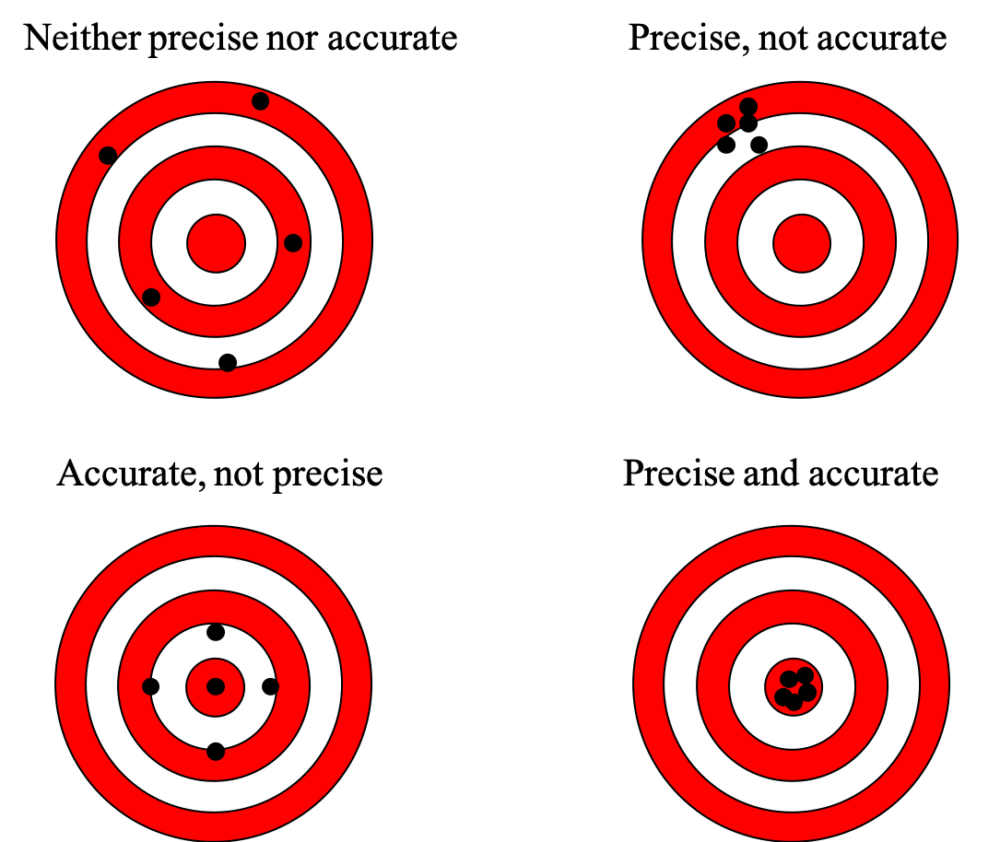

```{r setup, include=FALSE}
knitr::opts_chunk$set(fig.width=5.5, fig.height=5.5, fig.align="center",
					  error = TRUE, collapse = TRUE, comment = "##", dev="png")
library(RColorBrewer)
cols = brewer.pal(8, "Set1")

## to use tables
library(knitr)
library(kableExtra)
```

## The central limit theorem revisited

<div class="left lt">

Assume x is normally distributed. Randomly sampled means must be normally distributed with a standard deviation given by S.E.M., which decreases as n increases.

$$
\sigma_{\bar{x}} = \frac{\sigma}{\sqrt{n}}
$$

Standardized (scaled) sample means z are computed as sample means minus the true mean, divided by the standard error. 

$$
{z} = \frac{(\bar{x}-\mu)}{\frac{\sigma}{\sqrt{n}}}
$$

These z-values follow a standard normal distribution (with mean=0 and sd=1).

</div>

<div class="right rt">

```{r echo=FALSE}
x<-seq(-10,10,by=0.01)
hist(rnorm(1000),freq=FALSE,col="grey",border="grey",ylim=c(0,1),main="Distribution of means with n=1, n=3, n=6",xlab="X or sample means of X",xlim=c(-4,4))
lines(x,dnorm(x),col="black",lwd=2)
lines(x,dnorm(x,sd=1/sqrt(3)),col="orange",lwd=2)
lines(x,dnorm(x,sd=1/sqrt(6)),col="red",lwd=2)
text(1.5,0.8,expression(symbol(sigma)/sqrt(6)),col="red")
text(1.75,0.6,expression(symbol(sigma)/sqrt(3)),col="orange")
text(2,0.4,expression(symbol(sigma)/sqrt(1)))
```

Knowing $\sigma$ and $\mu$ we could compute intervals around $\mu$, in which various sample means would end up with a certain probability.

</div>

## Putting the central limit theorem to work: Confidence intervals

<div class="left lt">

Vice versa, we could compute an interval around any found sample mean, which includes $\mu$ with a certain probability. This probability - called confidence - should be close to 1. Its complement to 1 is here called $\alpha$.

$$
z = \frac{(\bar{x}-\mu)}{\frac{\sigma}{\sqrt{n}}}
$$
$$
P(-z_\frac{\alpha}{2}\leq \frac{(\bar{x}-\mu)}{\frac{\sigma}{\sqrt{n}}}\leq+z_\frac{\alpha}{2})=1-\alpha
$$
$$
P(\bar{x}-z_\frac{\alpha}{2}\frac{\sigma}{\sqrt{n}}\leq \mu \leq\bar{x}+z_\frac{\alpha}{2}\frac{\sigma}{\sqrt{n}})=1-\alpha
$$
$$
CI: \bar{x}\pm z_\frac{\alpha}{2}\frac{\sigma}{\sqrt{n}}
$$

A confidence interval is constructed symmetrically around a sample mean $\bar{x}$. With a high probability (usually 95%) $\mu$ is included in intervals constructed around $\bar{x}$'s.

</div>

<div class="right rt">

Graphically this is just a translation of the density distributions of the means from $\mu$ as center to $\bar{x}$ as center.
```{r echo=FALSE}
x<-seq(-3,3,by=0.01)
plot(x,dnorm(x),col="black",bty="n",type="l",lwd=2,xlab="sample means of X",ylim=c(0,.5))
lines(x,dnorm(x,mean=-.7),col="orange",lwd=2)
lines(x,dnorm(x,mean=2.5),col="red",lwd=2)
abline(v=c(0,-.7,2.5),lwd=2,col=c("black","orange","red"),lty=3)
text(c(0,-.7,2.5),0.45,c(expression(symbol(mu)),expression(bar(x)),expression(bar(x))),col=c("black","orange","red"),pos=4)
```

Cool! **One sample** is enough for a good **interval estimate** of $\mu$. But wait - where from do I know $\sigma$?!? 

</div>


## The t-distribution
<div class="left lt">

If S.E.M. is estimated using the *sample* standard deviation, then *standardized* sample means follow a Student´s t-distribution:

$$
\sigma_{\bar{x}} = \frac{\sigma}{\sqrt{n}} \approx \frac{s}{\sqrt{n}} = S.E.M.
$$
$$
{t} = \frac{(\bar{x}-\mu)}{\frac{s}{\sqrt{n}}}
$$

The t-distribution is wider, i.e. has fatter tails, when n is low, but converges to a normal with infinite n. Its shape is determined by d.f.=n-1. Functions in R are `qt`, `pt`,`dt` and `rt`.

</div>

<div class="right rt">

```{r echo=FALSE,fig.width=7}
plot(seq(-5,5,length.out=100),dt(seq(-5,5,length.out=100),df=3),bty="n",ylim=c(0,.41),xlab="standardised sample means", ylab="density",type="l")
lines(seq(-5,5,length.out=100),dt(seq(-5,5,length.out=100),df=20),lt=2)
lines(seq(-5,5,length.out=100),dnorm(seq(-5,5,length.out=100)),lt=3)
legend(-4,0.3,legend=c("t (d.f.=3)","t (d.f.=20)","normal"),lty=c(1,2,3),bty="n")
```

Above 100 df, t is basically equivalent to a normal distribution.

</div>


## Confidence intervals: accuracy, precision, sample size

<div class="left lt">

Also t-distribution can be used to construct a confidence interval:

$$
{t} = \frac{(\bar{x}-\mu)}{\frac{s}{\sqrt{n}}}
$$
$$
P(\bar{x}-t_{\frac{\alpha}{2},d.f.}\frac{s}{\sqrt{n}}\leq \mu \leq\bar{x}+t_{\frac{\alpha}{2},d.f.}\frac{s}{\sqrt{n}})=1-\alpha
$$
$$
CI: \bar{x}\pm t_{\frac{\alpha}{2},d.f.} \frac{s}{\sqrt{n}}
$$

Allows **interval estimate** of $\mu$ with an estimate for $\sigma$ derived from the same sample as $\bar{x}$.

</div>

<div class="right rt">

```{r}

data = read.table("data/Glaciers.txt", header=TRUE)
# radiocarbon in dissolved organic carbon from glacier ice samples 
d14C = data$delta14C.permil

# Give mean and confidence interval with alpha=0.05 #
(m = mean(d14C))
(s = sd(d14C))
(n = length(d14C))
alpha = 0.05
accuracy = 1-alpha

(t = qt(p = 1 - alpha/2, df = n-1)) # two-sided, P goes 50/50 to both tails
(aprec = t*s/sqrt(n))
aprec # absolute precision = half the CI width
(rprec = aprec/m*100) # relative precision

# confidence limits
c(lower = m - aprec, upper = m + aprec)
```

</div>


## Confidence intervals: accuracy, precision, sample size

* Confidence = accuracy = the probability close to 1 with which $\mu$ is included in intervals constructed around $\bar{x}$'s.
* Precision = half the width of the interval (in units of variable). Precision may be expressed relative to the mean as a percentage.
* Precision, accuracy and sample size n are interdependent. A *low* precision (i.e. narrow interval) and high accuracy (e.g. 99% probability of including $\mu$) needs a large sample size n.

<div class="left lt">

$$
AP= t_{\frac{\alpha}{2},d.f.} \frac{s}{\sqrt{n}}
$$

$$
RP= \frac{t_{\frac{\alpha}{2},d.f.}}{\bar{x}} \frac{s}{\sqrt{n}}
$$

With knowledge of s (pilot study!), we can pre-set RP, i.e. a needed precision, and a desired level of confidence in order to compute a necessary sample size:
$$
n= \left(\frac{t_{\frac{\alpha}{2},d.f.}\cdot{s}}{{RP\cdot\bar{x}}}\right)^2
$$

Solution of this formula iteratively as n remains on both sides, in R with `while`.

</div>

<div class="right rt">

```{r}
# Regard data as pilot study
# Set accuracy and rprec as needed
accuracy = .95 # <90-95 % is questionable
rprec = 0.10 # assume more (or less) precise estimate is needed

alpha = 1-accuracy

n = 2   # left side of formula, low n as starting value
t = qt(1 - alpha/2, n-1)  
(rhs = (t * s/(rprec * m))^2)  # right side of formula

# right side minus left side, you want this to be close to zero, 
# when diff falls below zero - then enough sampling effort 
diff = rhs - n

while(diff >= 0) {
	n = n + 1
	t = qt(1 - alpha/2, n - 1)
	diff = ((t * s/(rprec * m))^2) - n
}
n # -> this is the needed sample size (minimum) to achieve the desired precision and accuracy
```

```{r echo = FALSE, eval = FALSE}
# note, this is much nicer for matt's brain using uniroot
f = function(n) {
	t = qt(1 - alpha/2, n-1)
	((t * s/(rprec * m))^2) - n
}
uniroot(f, lower = 2, upper = 1000)
```

</div>


## Accuracy and precision illustrated


## Accuracy and precision illustrated




## Statistical decision theory

... at the heart of inferential statistics: learning about the population from sample(s).

* **Statistical decision**: a decision about the population based on sample information.
* **Statistical hypothesis**: an assumption about the population to reach a decision, formulated as a (paired) statement, often derived from a research question.

<br/>

* **Null hypothesis**: the assumption that an eventually obtained result (from sampling) is **entirely due to chance** (*initial innocence*)
* **Alternative hypothesis**: any hypothesis that differs from the null.

<br/>

Example:

**H0: Two populations do not differ.** An eventually observed difference obtained from two samples is entirely due to chance. If the studied property is naturally variable, then samples will never be identical.

**HA: Two populations differ.** An observed difference between two samples reflects this difference, the samples were collected from two different underlying populations.

<br/>

A decision is made by rejecting/accepting the hypotheses, our aim is to reject H0 and accept HA (the other direction is harder).

Now, imagine you observe a difference between two samples. If asked to make a decision you will probably look at the absolute observed difference (sample mean B is X-times larger than sample mean A), maybe also try to take into account the observable variation in the two samples. **Make a decision** ;-) 


## Type I & II Errors
When making a decision based on **(incomplete) sample information** you can make an error!

There are two types of error: alpha (type I), beta (type II)


<br/>
Type I error: **wrong alarm**, there is no real effect, but you think there is one.

Type II error: **missed opportunity**, there is a real effect, but you failed to find it.

Power (1-beta): The probability to correctly identify an existing real effect.

<br/>
Power increases

* as the strength of the effect increases (e.g., larger difference between populations)
* as the population variance decreases
* as we increase alpha
* as we increase sample size


## Statistical hypothesis testing - strategy
Consider the example from before as a classical situation of a two sample-test:

**H0: Two populations do not differ.** An eventually observed difference obtained from two samples is entirely due to chance. If the studied property is naturally variable, then samples will never be identical.

**HA: Two populations differ.** An observed difference between two samples reflects this difference, the samples were collected from two different underlying populations.


## Statistical hypothesis testing - strategy
Consider the example from before as a classical situation of a two sample-test:

**H0: Two populations do not differ.** An eventually observed difference obtained from two samples is entirely due to chance. If the studied property is naturally variable, then samples will never be identical.

**HA: Two populations differ.** An observed difference between two samples reflects this difference, the samples were collected from two different underlying populations.

<br/>
To test, we have collected empirical information, i.e. each population is represented by 1 sample (of some size).

<br/>
The testing strategy essentially contains 3 steps:

1. **We assume H0 is true. We are suspicious, however, maybe the two samples even differ remarkably. Thus, we calculate the “chance” to observe what was empirically found under a true H0.**
2. **This probability is then compared to a preset threshold probability (alpha).**
3. **If the empirically found outcome is highly unlikely (< alpha), we decide H0 cannot be true and reject it.**


## Mechanics of testing illustrated step-by-step: one-sample test
<div class="left lt">
**Example:** Mice population on an island. We do a census and identify body size (as weight) of ALL MICE. 

Weight ~ Normal($\mu_0$, $\sigma$) 

On the way home between island and mainland we find a single mouse on a drifting log, it is surprisingly large

Is it from the island? From the mainland? We will use a 1-sample test with a size n = 1.

</div>


## Mechanics of testing illustrated step-by-step: one-sample test
<div class="left lt">
**Example:** Mice population on an island. We do a census and identify body size (as weight) of ALL MICE. 

Weight ~ Normal($\mu_0$, $\sigma$) 

On the way home between island and mainland we find a single mouse on a drifting log, it is surprisingly large

Is it from the island? From the mainland? We will use a 1-sample test with a size n = 1.

</div>

<div class="right rt">

```{r fig.height=5, fig.width=5}
data = read.table("data/IslandMice.txt", header=TRUE)
x = data$weight
hist(x, xlab = "Mouse weight (g)", freq = F, ylim = c(0, 0.2), main = "")
x1 = 13 # Drifting mouse (x1)
abline(v = x1, col = "red", lwd = 2)

mu = mean(x) # population mean of island mice
n = length(x) # population size
sigma = sqrt(sum((x - mu)^2)/n) # population sd (sigma)
# remember sd(x) assumes x is a sample, use n-1 in denominator

## add a normal density curve
x_curve = seq(0, 20, by = 0.1)
y_curve = dnorm(x_curve, mean = mu, sd = sigma)
lines(x_curve, y_curve, lwd = 2)
```

</div>


## Mechanics of testing illustrated step-by-step: one-sample test
<div class="left lt">
**Example:** Mice population on an island. We do a census and identify body size (as weight) of ALL MICE. 

Weight ~ Normal($\mu_0$, $\sigma$) 

On the way home between island and mainland we find a single mouse on a drifting log, it is surprisingly large

Is it from the island? From the mainland? We will use a 1-sample test with a size n = 1.


<br/>
**Testable hypotheses:**

**H0: The ‘new’ mouse belongs to the island population.** Its weight is similar to those of other island mice: Its relatively high weight is entirely due to chance, it´s just a slightly heavy mouse of the population. 

**HA: The ‘new’ mouse does not belong to the island population.** Its weight is higher than that of other island mice, it must belong to some other mouse population, say from the mainland.

</div>

<div class="right rt">

```{r fig.height=5, fig.width=5, echo = FALSE}
data = read.table("data/IslandMice.txt", header=TRUE)
x = data$weight
hist(x, xlab = "Mouse weight (g)", freq = F, ylim = c(0, 0.2), main = "")
x1 = 13 # Drifting mouse (x1)
abline(v = x1, col = "red", lwd = 2)

mu = mean(x) # population mean of island mice
n = length(x) # population size
sigma = sqrt(sum((x - mu)^2)/n) # population sd (sigma)
# remember sd(x) assumes x is a sample, use n-1 in denominator

## add a normal density curve
x_curve = seq(0, 20, by = 0.1)
y_curve = dnorm(x_curve, mean = mu, sd = sigma)
lines(x_curve, y_curve, lwd = 2)
```

</div>

## Mechanics of testing: assuming H0 but remaining suspicious

<div class="left lt">

>- We believe in H0 (initial innocence), yet we are suspicious (the mouse is heavy!).
>- How likely is it to find such a heavy mouse x in the island population? How likely is it to find an even heavier one?
>- We can directly compute this probability from $\mu_0$, $\sigma$ and $x$. 
>- This probability also corresponds to a standardized mouse weight, which is the **test statistic** in this case.

</div>

## Mechanics of testing: assuming H0 but remaining suspicious

<div class="left lt">

* We believe in H0 (initial innocence), yet we are suspicious (the mouse is heavy!).
* How likely is it to find such a heavy mouse x in the island population? How likely is it to find an even heavier one?
* We can directly compute this probability from $\mu_0$, $\sigma$ and $x$. 
* This probability also corresponds to a standardized mouse weight, which is the **test statistic** in this case.


$$
{TS} = z_1 = \frac{(x_1-\mu)}{\sigma}
$$
$$
P(z\geq z_1) = ?
$$
</div>
<div class="right rt">

```{r echo=FALSE, fig.height=4, fig.width=4}
hist(scale(x),xlab='z (scaled mouse weight)',freq=F,ylim=c(0,.4),main='H0 is right')
lines(seq(-3,3,by=.01),dnorm(seq(-3,3,by=.01)),lwd=2)
z1<-(x1-mu)/sigma
abline(v=z1,col='red',lwd=2)
polygon(c(z1,seq(z1,3,by=.01),3),c(0,dnorm(seq(z1,3,by=.01)),0),col='red')
text(z1,0.35,expression("z"[1]),pos=4,col="red")
legend(-3,0.35,legend=expression("P(z">="z"[1]*")"),fill=c("red"),bty="n")
```

</div>


## Mechanics of testing: evaluating probabilities

<div class="left lt">

$$
{TS} = z_1 = \frac{(x_1-\mu)}{\sigma}
$$
$$
p = P(z\geq z_1) = ?
$$

Assume our population of body weights is normally distributed.

We can compute $p$ as the integral of the normal PDF.

</div>
<div class="right rt">

```{r echo=FALSE, fig.height=4, fig.width=4}
hist(scale(x),xlab='z (scaled mouse weight)',freq=F,ylim=c(0,.4),main='H0 is right')
lines(seq(-3,3,by=.01),dnorm(seq(-3,3,by=.01)),lwd=2)
z1<-(x1-mu)/sigma
abline(v=z1,col='red',lwd=2)
polygon(c(z1,seq(z1,3,by=.01),3),c(0,dnorm(seq(z1,3,by=.01)),0),col='red')
text(z1,0.35,expression("z"[1]),pos=4,col="red")
legend(-3,0.35,legend=expression("P(z">="z"[1]*")"),fill=c("red"),bty="n")
```

</div>


## Mechanics of testing: assessing significance
<div class="left lt">
* Now we compare $p$ to a pre-set threshold **significance level** $\alpha$ 
	* conventionally in ecology $\alpha = 0.05$
	

```{r echo=FALSE, fig.height=5, fig.width=5}
hist(scale(x),xlab="z (scaled mouse weight)",freq=F,ylim=c(0,.4),main="H0 is right")
lines(seq(-3,3,by=.01),dnorm(seq(-3,3,by=.01)),lwd=2)
z1<-(x1-mu)/sigma
abline(v=z1,col="red",lwd=2)
polygon(c(z1,seq(z1,3,by=.01),3),c(0,dnorm(seq(z1,3,by=.01)),0),col="red")
#text(0.75,0.1,"z1"); arrows(0.85,0.1,z1-0.1,0.01)
text(z1,0.35,expression("z"[1]),pos=2,col="red")
legend(-3,0.35,legend=c(expression("P(z">="z"[1]*")"),expression(symbol(alpha))),fill=c("red","black"),density=c(NA,20),angle=c(0,045),bty="n")
```

</div>

## Mechanics of testing: assessing significance
<div class="left lt">
* Now we compare $p$ to a pre-set threshold **significance level** $\alpha$ 
	* conventionally in ecology $\alpha = 0.05$
	

```{r echo=FALSE, fig.height=5, fig.width=5}
hist(scale(x),xlab="z (scaled mouse weight)",freq=F,ylim=c(0,.4),main="H0 is right")
lines(seq(-3,3,by=.01),dnorm(seq(-3,3,by=.01)),lwd=2)
z1<-(x1-mu)/sigma
abline(v=z1,col="red",lwd=2)
polygon(c(z1,seq(z1,3,by=.01),3),c(0,dnorm(seq(z1,3,by=.01)),0),col="red")
#text(0.75,0.1,"z1"); arrows(0.85,0.1,z1-0.1,0.01)
text(z1,0.35,expression("z"[1]),pos=2,col="red")
legend(-3,0.35,legend=c(expression("P(z">="z"[1]*")"),expression(symbol(alpha))),fill=c("red","black"),density=c(NA,20),angle=c(0,045),bty="n")
```

</div>

<div class="right rt">

```{r}
# z-score for our drifter
(z1 = (x1 - mu)/sigma)

# Probability to find a mouse as heavy or 
# heavier than x1 in the island population
# first on the standardized (z-) scale
(p = 1 - pnorm(z1, mean = 0, sd = 1))
# and again on the original scale
(1 - pnorm(x1, mean = mu, sd = sigma))
```

The probability that a mouse is as heavy as (or heavier than) the drifting mouse is 7.4 %. Therefore, we fail to reject the null hypothesis that the mouse is from the island.

</div>

## Mechanics of testing: assessing error

<div class="left lt">
```{r truth_table, echo = FALSE}
tab = matrix(c("", "Decision", "accept H$_0$", "reject H$_0$", 
			   "Reality", "H$_0$ true", "correct decision", "type I error (α)", 
			   "", "H$_0$ false", "type II error (β)", "correct decision"), ncol = 3)
ktab = column_spec(kable(tab), 1, border_right = TRUE, bold = TRUE)
ktab = row_spec(ktab, 1:2, bold = TRUE)
ktab = row_spec(ktab, 2, extra_css = "border-bottom: solid")
ktab
```
</div>


## Mechanics of testing: assessing error

<div class="left lt">
```{r truth_table2, echo = FALSE}
ktab
```
<br/><br/>
For every test statistic, there will exist a critical test statistic where $P(z \ge z_{crit}) = \alpha$.
</div>


## Mechanics of testing: assessing error

<div class="left lt">
```{r truth_table3, echo = FALSE}
ktab
```
<br/><br/>
For every test statistic, there will exist a critical test statistic where $P(z \ge z_{crit}) = \alpha$.
</div>

<div class="right rt">

$z_1 > z_{crit}$

```{r echo=FALSE, fig.height=5, fig.width=5}
zcrit<-qnorm(0.95)
hist(scale(x),xlab="z (scaled mouse weight)",freq=F,ylim=c(0,.4),main="")
lines(seq(-3,3,by=.01),dnorm(seq(-3,3,by=.01)),lwd=2)
z2<-(13.8-mu)/sigma
abline(v=z2,col="red",lwd=2)
polygon(c(z2,seq(z2,3,by=.01),3),c(0,dnorm(seq(z2,3,by=.01)),0),col="red")
abline(v=zcrit,col="black",lwd=2,lty=2)
polygon(c(zcrit,seq(zcrit,3,by=.01),3),c(0,dnorm(seq(zcrit,3,by=.01)),0),col="black",density=20,angle=45)
text(z2,0.35,expression("z"[1]),pos=4,col="red")
text(zcrit,0.35,expression("z"["crit"]),pos=2)
legend(-3,0.35,legend=c(expression("P(z">="z"[1]*")"),expression(symbol(alpha))),fill=c("red","black"),density=c(NA,20),angle=c(0,045),bty="n")
```

Decision:

>- Reject H0 (and accept HA). 
>- What is the chance of making an error with this decision?
>- Anytime we observe $z_1 > z_{crit}$, we take the same risk
>- Thus, the **type I error rate** = $\alpha$ (normally 0.05)

</div>


## Mechanics of testing: assessing error

<div class="left lt">
```{r truth_table4, echo = FALSE}
ktab
```
<br/><br/>
For every test statistic, there will exist a critical test statistic where $P(z \ge z_{crit}) = \alpha$.
</div>

<div class="right rt">

$z_1 < z_{crit}$

```{r echo=FALSE, fig.height=5, fig.width=5}
hist(scale(x),xlab="z (scaled mouse weight)",freq=F,ylim=c(0,.4),main="")
lines(seq(-3,3,by=.01),dnorm(seq(-3,3,by=.01)),lwd=2)
z1<-(x1-mu)/sigma
abline(v=z1,col="red",lwd=2)
polygon(c(z1,seq(z1,3,by=.01),3),c(0,dnorm(seq(z1,3,by=.01)),0),col="red")
zcrit<-qnorm(0.95)
abline(v=zcrit,col="black",lwd=2,lty=2)
polygon(c(zcrit,seq(zcrit,3,by=.01),3),c(0,dnorm(seq(zcrit,3,by=.01)),0),col="black",density=20,angle=45)
text(z1,0.35,expression("z"[1]),pos=2,col="red")
text(zcrit,0.35,expression("z"["crit"]),pos=4)
legend(-3,0.35,legend=c(expression("P(z">="z"[1]*")"),expression(symbol(alpha))),fill=c("red","black"),density=c(NA,20),angle=c(0,045),bty="n")
```

Decision:

>- We cannot reject H0.
>- Do we accept it then?
>- What is the chance of making an error with this decision?
>- We cannot assess the **type II error rate** without knowledge of HA!

</div>


## Mechanics of testing: computing beta and power
<div class="left lt">
A well-defined HA could be: Mouse comes from mainland, where :

$weight \sim \mathcal{N}(\mu_{main}, \sigma)$ with $\mu_0 < \mu_{main}$.

```{r echo=FALSE, fig.height=5, fig.width=7}
hist(x,xlab="Mouse weight",freq=F,main="",ylim=c(0,.22),xlim=c(02,22),border="white")
xcrit<-mu+qnorm(0.95)*sigma
data_main<-read.table("data/MainlandMice.txt",header=TRUE); y<-data_main$weight
mu_main<-mean(y)
polygon(c(xcrit,seq(xcrit,25,by=.01),25),c(0,dnorm(seq(xcrit,25,by=.01),mean=mu_main,sd=sigma),0),col="yellow")
polygon(c(xcrit,seq(xcrit,0,by=-.01),0),c(0,dnorm(seq(xcrit,0,by=-.01),mean=mu_main,sd=sigma),0),col="orange")
polygon(c(xcrit,seq(xcrit,25,by=.01),25),c(0,dnorm(seq(xcrit,25,by=.01),mean=mu,sd=sigma),0),col="black",density=20,angle=45)
lines(seq(-5,20,by=.1),dnorm(seq(-5,20,by=.1),mean=mu,sd=sigma),lwd=2)
lines(seq(-5,25,by=.1),dnorm(seq(-5,25,by=.1),mean=mu_main,sd=sigma),lwd=2)
abline(v=xcrit,col="black",lwd=2,lty=2)
text(5,0.15,"H0 is right"); text(20,0.15,"HA is right")
text(xcrit,0.20,expression("x"["crit"]),pos=4)
legend(2,0.1,legend=c(expression(symbol(alpha)),expression(symbol(beta)),"power"),fill=c("black","orange","yellow"),density=c(20,NA,NA),angle=c(45,0,0),bty="n")
```


>- A mouse found with $x < x_{crit}$ (i.e., fail to reject H0) still has a 22% chance to be from the mainland!
>- **Accepting** H0 has a high chance of error!


</div>

<div class="right rt">

```{r}
# Read file of mainland mice
data_main = read.table("data/MainlandMice.txt", header=TRUE)
(mu_main = mean(data_main$weight))
c(sd(y), sigma) # sd of mainland mice is ~identical to island mice

# critical value on original scale
(x_crit = qnorm(0.95, mu, sigma)) 

# Type II error rate (orange)
# Probability to find a mouse lighter than xcrit
# under the assumption that HA is right
# (i.e., the mouse comes from the mainland)
(beta = pnorm(x_crit, mu_main, sigma))

# Power is just 1 - beta
(1 - beta)
```

</div>

## Mechanics of testing: controlling decision errors

<div class="left lt">
```{r echo=FALSE, fig.width = 5, fig.height=8}
par(mfrow = c(2,1), oma = c(0, 0, 0, 0), mar = c(4, 4, 0, 0))
hist(x,xlab="",freq=F,main="",ylim=c(0,.22),xlim=c(02,22),border="white")
polygon(c(xcrit,seq(xcrit,25,by=.01),25),c(0,dnorm(seq(xcrit,25,by=.01),mean=mu_main,sd=sigma),0),col="yellow")
polygon(c(xcrit,seq(xcrit,0,by=-.01),0),c(0,dnorm(seq(xcrit,0,by=-.01),mean=mu_main,sd=sigma),0),col="orange")
polygon(c(xcrit,seq(xcrit,25,by=.01),25),c(0,dnorm(seq(xcrit,25,by=.01),mean=mu,sd=sigma),0),col="black",density=20,angle=45)
lines(seq(-5,20,by=.1),dnorm(seq(-5,20,by=.1),mean=mu,sd=sigma),lwd=2)
lines(seq(-5,25,by=.1),dnorm(seq(-5,25,by=.1),mean=mu_main,sd=sigma),lwd=2)
abline(v=xcrit,col="black",lwd=2,lty=2)
text(5,0.15,"H0 is right"); text(20,0.15,"HA is right")
text(xcrit,0.20,expression("x"["crit"]),pos=4)
legend(2,0.1,legend=c(expression(symbol(alpha)*"=0.05"),expression(symbol(beta)),"power"),fill=c("black","orange","yellow"),density=c(20,NA,NA),angle=c(45,0,0),bty="n")

hist(x,xlab="Mouse weight",freq=F,main="",ylim=c(0,.22),xlim=c(02,22),border="white")
xcrit<-mu+qnorm(0.99)*sigma
polygon(c(xcrit,seq(xcrit,25,by=.01),25),c(0,dnorm(seq(xcrit,25,by=.01),mean=mu_main,sd=sigma),0),col="yellow")
polygon(c(xcrit,seq(xcrit,0,by=-.01),0),c(0,dnorm(seq(xcrit,0,by=-.01),mean=mu_main,sd=sigma),0),col="orange")
polygon(c(xcrit,seq(xcrit,25,by=.01),25),c(0,dnorm(seq(xcrit,25,by=.01),mean=mu,sd=sigma),0),col="black",density=20,angle=45)
lines(seq(-5,20,by=.1),dnorm(seq(-5,20,by=.1),mean=mu,sd=sigma),lwd=2)
lines(seq(-5,25,by=.1),dnorm(seq(-5,25,by=.1),mean=mu_main,sd=sigma),lwd=2)
abline(v=xcrit,col="black",lwd=2,lty=2)
text(5,0.15,"H0 is right"); text(20,0.15,"HA is right")
text(xcrit,0.20,expression("x"["crit"]),pos=4)
legend(2,0.1,legend=c(expression(symbol(alpha)*"=0.01"),expression(symbol(beta)),"power"),fill=c("black","orange","yellow"),density=c(20,NA,NA),angle=c(45,0,0),bty="n")
```

</div>
<div class="right rt">

* Should we play it safe by reducing alpha?

>- This will increase the type II error rate!
>- A *conservative* test (small $\alpha$) helps avoid false alarms (reporting a difference when there is none)
>- But it increases our chance to *miss an opportunity* (failing in detecting an existing effect).

<br/>

>- Solution: Increase effort = sample with higher sample size!

</div>

## Mechanics of testing: increasing sample size

<div class="left lt">

```{r echo=FALSE, fig.width = 5, fig.height=8}
par(mfrow = c(2,1), oma = c(0, 0, 0, 0), mar = c(4, 4, 2, 0))
xcrit<-mu+qnorm(0.95)*sigma
hist(x,xlab="",freq=F,ylim=c(0,.22),xlim=c(02,22),border="white",main="1 mouse on log")
polygon(c(xcrit,seq(xcrit,25,by=.01),25),c(0,dnorm(seq(xcrit,25,by=.01),mean=mu_main,sd=sigma),0),col="yellow")
polygon(c(xcrit,seq(xcrit,0,by=-.01),0),c(0,dnorm(seq(xcrit,0,by=-.01),mean=mu_main,sd=sigma),0),col="orange")
polygon(c(xcrit,seq(xcrit,25,by=.01),25),c(0,dnorm(seq(xcrit,25,by=.01),mean=mu,sd=sigma),0),col="black",density=20,angle=45)
abline(v=x1,col="red",lwd=2)
lines(seq(-5,20,by=.1),dnorm(seq(-5,20,by=.1),mean=mu,sd=sigma),lwd=2)
lines(seq(-5,25,by=.1),dnorm(seq(-5,25,by=.1),mean=mu_main,sd=sigma),lwd=2)
abline(v=xcrit,col="black",lwd=2,lty=2)
text(5,0.15,"H0 is right"); text(20,0.15,"HA is right")
text(x1,0.20,expression("x"[1]),col="red",pos=2); text(xcrit,0.20,expression("x"["crit"]),pos=4)
legend(2,0.1,legend=c(expression(symbol(alpha)*"=0.05"),expression(symbol(beta)),"power"),fill=c("black","orange","yellow"),density=c(20,NA,NA),angle=c(45,0,0),bty="n")

hist(x,xlab="Mouse weight",freq=F,ylim=c(0,.35),xlim=c(02,22),border="white", main="3 mice on log")
xcrit<-mu+qnorm(0.99)*sigma/sqrt(3)
polygon(c(xcrit,seq(xcrit,25,by=.01),25),c(0,dnorm(seq(xcrit,25,by=.01),mean=mu_main,sd=sigma/sqrt(3)),0),col="yellow")
polygon(c(xcrit,seq(xcrit,0,by=-.01),0),c(0,dnorm(seq(xcrit,0,by=-.01),mean=mu_main,sd=sigma/sqrt(3)),0),col="orange")
polygon(c(xcrit,seq(xcrit,25,by=.01),25),c(0,dnorm(seq(xcrit,25,by=.01),mean=mu,sd=sigma/sqrt(3)),0),col="black",density=20,angle=45)
abline(v=x1,col="red",lwd=2)
lines(seq(-5,20,by=.1),dnorm(seq(-5,20,by=.1),mean=mu,sd=sigma/sqrt(3)),lwd=2)
lines(seq(-5,25,by=.1),dnorm(seq(-5,25,by=.1),mean=mu_main,sd=sigma/sqrt(3)),lwd=2)
abline(v=xcrit,col="black",lwd=2,lty=2)
text(5,0.30,"H0 is right"); text(20,0.30,"HA is right")
text(x1,0.35,expression(bar(x)),col="red",pos=4); text(xcrit,0.35,expression(bar(x)["crit"]),pos=2)
legend(2,0.20,legend=c(expression(symbol(alpha)*"=0.01"),expression(symbol(beta)),"power"),fill=c("black","orange","yellow"),density=c(20,NA,NA),angle=c(45,0,0),bty="n")
```

</div>

<div class="right rt">

What if we find more than one mouse?

A **sample of n > 1** allows us to compute test statistics on **sample means**!

Sampling with higher effort decreases both errors and thus allows a conservative test with more power.

</div>

## Mechanics of testing: increasing sample size

<div class="left lt">

```{r echo=FALSE, fig.width = 5, fig.height=8}
par(mfrow = c(2,1), oma = c(0, 0, 0, 0), mar = c(4, 4, 2, 0))
xcrit<-mu+qnorm(0.95)*sigma
hist(x,xlab="",freq=F,ylim=c(0,.22),xlim=c(02,22),border="white",main="1 mouse on log")
polygon(c(xcrit,seq(xcrit,25,by=.01),25),c(0,dnorm(seq(xcrit,25,by=.01),mean=mu_main,sd=sigma),0),col="yellow")
polygon(c(xcrit,seq(xcrit,0,by=-.01),0),c(0,dnorm(seq(xcrit,0,by=-.01),mean=mu_main,sd=sigma),0),col="orange")
polygon(c(xcrit,seq(xcrit,25,by=.01),25),c(0,dnorm(seq(xcrit,25,by=.01),mean=mu,sd=sigma),0),col="black",density=20,angle=45)
abline(v=x1,col="red",lwd=2)
lines(seq(-5,20,by=.1),dnorm(seq(-5,20,by=.1),mean=mu,sd=sigma),lwd=2)
lines(seq(-5,25,by=.1),dnorm(seq(-5,25,by=.1),mean=mu_main,sd=sigma),lwd=2)
abline(v=xcrit,col="black",lwd=2,lty=2)
text(5,0.15,"H0 is right"); text(20,0.15,"HA is right")
text(x1,0.20,expression("x"[1]),col="red",pos=2); text(xcrit,0.20,expression("x"["crit"]),pos=4)
legend(2,0.1,legend=c(expression(symbol(alpha)*"=0.05"),expression(symbol(beta)),"power"),fill=c("black","orange","yellow"),density=c(20,NA,NA),angle=c(45,0,0),bty="n")

hist(x,xlab="Mouse weight",freq=F,ylim=c(0,.35),xlim=c(02,22),border="white", main="3 mice on log")
xcrit<-mu+qnorm(0.99)*sigma/sqrt(3)
polygon(c(xcrit,seq(xcrit,25,by=.01),25),c(0,dnorm(seq(xcrit,25,by=.01),mean=mu_main,sd=sigma/sqrt(3)),0),col="yellow")
polygon(c(xcrit,seq(xcrit,0,by=-.01),0),c(0,dnorm(seq(xcrit,0,by=-.01),mean=mu_main,sd=sigma/sqrt(3)),0),col="orange")
polygon(c(xcrit,seq(xcrit,25,by=.01),25),c(0,dnorm(seq(xcrit,25,by=.01),mean=mu,sd=sigma/sqrt(3)),0),col="black",density=20,angle=45)
abline(v=x1,col="red",lwd=2)
lines(seq(-5,20,by=.1),dnorm(seq(-5,20,by=.1),mean=mu,sd=sigma/sqrt(3)),lwd=2)
lines(seq(-5,25,by=.1),dnorm(seq(-5,25,by=.1),mean=mu_main,sd=sigma/sqrt(3)),lwd=2)
abline(v=xcrit,col="black",lwd=2,lty=2)
text(5,0.30,"H0 is right"); text(20,0.30,"HA is right")
text(x1,0.35,expression(bar(x)),col="red",pos=4); text(xcrit,0.35,expression(bar(x)["crit"]),pos=2)
legend(2,0.20,legend=c(expression(symbol(alpha)*"=0.01"),expression(symbol(beta)),"power"),fill=c("black","orange","yellow"),density=c(20,NA,NA),angle=c(45,0,0),bty="n")
```

</div>

<div class="right rt">

```{r}
# Sample of 3 mice: do they belong to the island population?
x_sample = c(12.09, 15.48, 11.76)
(xbar = mean(x_sample))
(SEM = sigma/sqrt(length(x_sample)))

# Standardised weight of the sample mean
# assuming it belongs to a "population of island means"
(z_sample = (xbar - mu)/SEM)

# Probability to find a mean at least as great as (or greater than)
# the sample mean (of 3 drifting mice) in the population of island means
(p = 1 - pnorm(z_sample, 0,1))
# equivalent to:
(p = 1 - pnorm(xbar, mean = mu, sd = SEM))

# Power (1 - beta)
1 - pnorm(x_crit, mean = mu_main, sd = SEM)
```
</div>


## One-sample z-test

* For the mice, we knew the underlying population was **normally distributed**
* Additionally, we knew the population standard deviation $\sigma$. 
* The test is known as a **z-test** (sometimes Gauss test), with test statistic $z \sim \mathcal{N(0,1)}$

$$
TS =z= \frac{(\bar{x}-\mu)}{\frac{\sigma}{\sqrt{n}}}
$$

## One-sample t-test

* For the mice, we knew the underlying population was **normally distributed**
* Additionally, we knew the population standard deviation $\sigma$. 
* The test is known as a **z-test** (sometimes Gauss test), with test statistic $z \sim \mathcal{N(0,1)}$

$$
TS =z= \frac{(\bar{x}-\mu)}{\frac{\sigma}{\sqrt{n}}}
$$

* Generally, we must *estimate* $\sigma$ from a sample
* The equivalent statistic using a sample standard deviation is:

$$
t = \frac{(\bar{x}-\mu)}{\frac{s}{\sqrt{n}}}
$$

* This test statistic follows **Student's t-distribution** with degrees of freedom $\nu = n - 1$:

$$
t \sim \mathcal{T}(\nu)
$$

## One-sample t-test

<div class="right rt">

```{r}
# Body temperature of crabs
data = read.table("data/Crabs.txt", header=TRUE)
x = data$body_temp

# null hypothesis: body temp is equal to air temp
# HA: body temp is greater (metabolic heat)
# one-sided test!
air_temp = 24.3

(xbar = mean(x))
(s = sd(x))
n = length(x)
(SEM = s/sqrt(n))

(t = (xbar - air_temp)/SEM)
(t_crit = qt(p = 0.95, df= n - 1))
(p = 1 - pt(t, n - 1))

```

</div>

<div class="left lt">

```{r echo = FALSE}
hist(x, main = "", xlab = "body temperature", freq = FALSE, breaks = 7, ylim = c(0, 0.35))
abline(v = air_temp, col = 'blue')
text(air_temp, 0.3, "H0 mean: Air temp", col = 'blue', pos = 2, cex = 0.8)
abline(v = xbar, col = 'red')
text(xbar, 0.3, expression(bar(x)), col = 'red', pos = 4, cex = 0.8)
```
</div>


## One-sample t-test

<div class="right rt">

```{r}
# Maybe simpler:
# note default alternative="two.sided"
t.test(x, mu = air_temp, alternative = "greater") 

```

</div>

<div class="left lt">

```{r echo = FALSE}
hist(x, main = "", xlab = "body temperature", freq = FALSE, breaks = 7, ylim = c(0, 0.35))
abline(v = air_temp, col = 'blue')
text(air_temp, 0.3, "H0 mean: Air temp", col = 'blue', pos = 2, cex = 0.8)
abline(v = xbar, col = 'red')
text(xbar, 0.3, expression(bar(x)), col = 'red', pos = 4, cex = 0.8)
```
</div>


## One-sample t-test

<div class="right rt">

```{r}
# confidence interval: 2-sided critical t-value
t_quantile = qt(1 - 0.05/2, df = n - 1)

# re-scale to the original measurement scale
precision = t_quantile * SEM

(interval = xbar + c(-precision, precision))
# Air temperature is outside of this interval!
```

</div>

<div class="left lt">

For 2-sided tests, we can equivalently construct a confidence interval using the quantiles of the t-distribution

```{r echo = FALSE}
hist(x, main = "", xlab = "body temperature", freq = FALSE, breaks = 7, ylim = c(0, 0.35))
abline(v = air_temp, col = 'blue')
text(air_temp, 0.3, "H0 mean: Air temp", col = 'blue', pos = 2, cex = 0.8)
abline(v = xbar, col = 'red')
text(xbar, 0.3, expression(bar(x)), col = 'red', pos = 4, cex = 0.8)
abline(v = interval, lty = 2, col = 'red')
```

Interpretation: if H0 is true (i.e., our population has a mean = $\mu$, 95% of intervals constructed from similar samples will include $\mu$.

Our interval does not include $\mu$, so we can reject the hypothesis that the population mean is $\mu$

</div>


## Steps to conduct a (two-sided) statistical test.

<br/>


## Significance levels and example statements

<br/>


## One-sided vs two-sided hypotheses

<br/>


## Parametric tests

>- A test is **parametric** if it assumes that the underlying population comes from a known parameterized probability distribution
>- Often this distribution is normal, but many others are also used
>- Note that the distribution is a **population** parameter!
>- Checking a **sample** for normality is useful, but not diagnostic!

## Normality checks

### Graphical checks

<div class="left lt">
Histograms with normal density curves
</div>

<div class="right rt">

```{r echo = FALSE, fig.width = 5, fig.height = 7}
set.seed(100)
norm_dat = rnorm(1000)
lnorm_dat = rlnorm(1000)
par(mfrow = c(2, 1), mar = c(4,4,0,0))
hist(norm_dat, main = "", xlab = "x", freq = FALSE, ylim = c(0, 0.4), xlim = c(-3, 3))
x_line = seq(-5, 25, length.out = 1000)
lines(x_line, dnorm(x_line, mean(norm_dat), sd(norm_dat)), col = 'red')
hist(lnorm_dat, main = "", xlab = "x", freq = FALSE, ylim = c(0, 0.5), xlim = c(-3, 15), breaks = 25)
lines(x_line, dnorm(x_line, mean(lnorm_dat), sd(lnorm_dat)), col = 'red')
```

</div>


## Normality checks

### Graphical checks

<div class="left lt">
Histograms with normal density curves

Compare mean and median
</div>

<div class="right rt">

```{r echo = FALSE, fig.width = 5, fig.height = 7}
par(mfrow = c(2, 1), mar = c(4,4,0,0))
hist(norm_dat, main = "", xlab = "x", freq = FALSE, ylim = c(0, 0.4), xlim = c(-3, 3))
abline(v = c(mean(norm_dat), median(norm_dat)), lty=2)
lines(x_line, dnorm(x_line, mean(norm_dat), sd(norm_dat)), col = 'red')
hist(lnorm_dat, main = "", xlab = "x", freq = FALSE, ylim = c(0, 0.5), xlim = c(-3, 15), breaks = 25)
lines(x_line, dnorm(x_line, mean(lnorm_dat), sd(lnorm_dat)), col = 'red')
abline(v = c(mean(lnorm_dat), median(lnorm_dat)), lty=2)
```

</div>


## Normality checks

### Graphical checks

<div class="left lt">
* Boxplots can compare multiple groups simultanously
	* Careful! Easy to see skew, but harder to see kurtosis
</div>

<div class="right rt">

```{r echo = FALSE, fig.width = 5, fig.height = 7}
lk_dat = rt(1000, 5)
dat = data.frame(x = c(norm_dat, lnorm_dat, lk_dat),
				 type = rep(c("normal", "right skew", "leptokurtic"), each = 1000))
library(ggplot2)
ggplot(dat) + geom_boxplot(aes(y=x, fill=type))

```

</div>


## Normality checks

### Graphical checks

<div class="left lt">
* QQ plots are perhaps the most useful diagnostic
* Compare observed quantiles (i.e., z-score of a *sample*) to those from a standard normal distribution
* Expectation is that samples fall along the line
* use `qqnorm` and `qqline` in R to make the plots
</div>

<div class="right rt">

```{r echo = FALSE, fig.width = 5, fig.height = 5}
par(mfrow = c(2,2), mar = c(4, 4, 1, 0), bty='n', pch = 16, cex = 0.7)
qqnorm(norm_dat, xlab = "", main = "normal")
qqline(norm_dat)
qqnorm(lnorm_dat, xlab = "", main = "right skew")
qqline(lnorm_dat)
qqnorm(lk_dat, main = "leptokurtic", xlim = c(-6,6), ylim=c(-6,6))
qqline(lk_dat)

```

</div>

## Normality tests

>- It is tempting to seek a formal test for normality
>- Example: `shapiro.test(x)` evaluates the null hypothesis that x comes from a normally distributed population
>- Resist this temptation!
>- Remember that if we fail to reject H0, that doesn't mean we accept H0
>- These tests have low power with small samples: often we fail to reject H0, but type II error rate is high!
>- If power is high (high n), the test is very sensitive. Small departures from normality will be significant.
>- But most parametric tests work just fine with small departures from normality when sample size is large
>- This test will cause us to often make incorrect decisions!


## Normality tests

Conclusions/advice:

>- `shapiro.test` and similar tests are very commonly used and *almost completely useless*. Forget them!
>- Graphically evaluate your data
>- If graphically obviously non-normal, consider the robustness of the chosen test, or transformations
>- Fall back to other distributions or to **non-parametric** tests (more on Thursday)


## F-distribution

<div class="left lt">

Another thought experiment:

1. Take two samples from a population ($\mathcal{N}[\mu, \sigma]$)
2. Calculate $s_1^2$ (from sample 1 with $n_1$) and Calculate $s_2^2$ (from sample 1 with $n_2$)
3. Calculate test statistic F:
$$
F=\frac{s_1^2}{s_2^2}
$$
4. Repeat 1.-3. and build distribution of F-values

>- Since $s_1^2$ and $s_2^2$ are from 2 samples from the same population, they are both estimates for $\sigma^2$, we thus expect $F\approx1$.

>- The F-distribution is asymmetrical. Its shape is determined by $df_1=n_1-1$ and $df_2=n_2-1$. There is a separate F-distribution for each combination of $df_1$ and $df_2$.

</div>

<div class="right rt">

```{r echo=FALSE}
x<-seq(0,5,by=.01)
plot(x,df(x,df1=4,df2=19),type="l",bty="n",lwd=2,ylab="Density",xlab="F-quantile")
lines(x,df(x,df1=19,df2=4),type="l",bty="n",lty=2,lwd=2)
lines(x,df(x,df1=3,df2=10),type="l",bty="n",lty=3,lwd=2)
qf<-qf(p=0.05,df1=4,df2=19,lower.tail=FALSE)
polygon(c(qf,seq(qf,5,by=0.01),5),c(0,df(seq(qf,5,by=0.01),df1=4,df2=19),0),col="red")
abline(v=qf,lty=3,lwd=2)
text(qf,0.4,bquote("F"["4,19"]*"="*.(round(qf,2))),pos=4)
legend(3.5,0.20,legend=expression(symbol(alpha)*"=0.05"),fill="red",bty="n")
legend(1,0.65,legend=c(expression("F"["4,19"]),expression("F"["19,4"]),expression("F"["3,10"])),lty=c(1:3),lwd=2,bty="n")
```

</div>


## F-test: Variance homogeneity?

H0: The sample variances estimate the same parametric variance. Or: $\sigma_1^2 = \sigma_2^2$

Variance homogeneity = homoscedasticity

<br/>

HA: The sample variances estimate different parametric variances. Or: $\sigma_1^2 \neq \sigma_2^2$

Variance heterogeneity = heteroscedasticity

<br/>

Only use this to test variance **heterogeneity** (HA). Do not use it to check whether two samples have the same variance (same problems as Shapiro test)!


## Standard tests for location

### Considerations:

* **Parametric** (populations are normal) vs **non-parametric**
	- Parametric tests are more powerful
* **Number of groups/samples**: 2 or more than 2
* **Independence of samples**
	- **Independent samples** do not depend on each other, were independently collected.
	- **Dependent/paired** samples depend on each other; e.g., the same subjects measured multiple times.
	- Tests for dependent samples are generally more powerful.

## Standard tests for location


## Two-sample tests: independent t-test

* Tests for differences of means between two independent samples
* H0: Samples are from populations with the same mean $\mu$.
* Student's test assumes populations have equal variance $\sigma$
	- **Very** difficult to evaluate, so this test should be used rarely

$$
\begin{align}
	t &= \frac{\bar{x}_1 - \bar{x}_2}{s_p\sqrt{\frac{2}{(n_1+n_2)}}} \\ \\
	s_p &= \sqrt{\frac{s^2_1 + s^2_2}{2}} \\
	\nu & = n_1 + n_2 - 2
\end{align}
$$

## Two-sample tests: independent t-test

* Tests for differences of means between two independent samples
* H0: Samples are from populations with the same mean $\mu$.
* Student's test assumes populations have equal variance $\sigma$
	- **Very** difficult to evaluate, so this test should be used rarely
* Welch's test relaxes this assumption
	- Default in R (`t.test`)
	- Power approaches Student's test if variances are similar and sample sizes are large

\begin{align}
	t &= \frac{\bar{x}_1 - \bar{x}_2}{\sqrt{\frac{s^2_1}{n_1}}+\sqrt{\frac{s^2_2}{n_2}}} \\ \\
	\nu & \approx \frac{\left( \frac{s^2_1}{n_1} + \frac{s^2_2}{n_2} \right )^2} 
	{\frac{s^4_1}{n^2_1\nu_1} + \frac{s^4_2}{n^2_2\nu_2}} \\
	
\end{align}


## Two-sample tests: paired t-test

<div class="left lt">

* Tests for differences of means between two **paired** samples.
* Exactly equal to a one-sample t-test on the **difference** in the samples, on the null hypothesis that the mean of differences is zero.
<br/>

{width=400px}

</div>

<div class="right rt">

```{r}
x1 = c(gandalf = 6, saruman = 4, arwen = 7, frodo = 3)
x2 = c(gandalf = 4, saruman = 3, arwen = 5, frodo = 2)
x1 - x2

t.test(x1, x2, paired = TRUE)
t.test(x1 - x2)
```
</div>

## Nonparametric location tests

<div class="left lt">

* These tests search for a difference in **medians**
* Convert data to **ordinal** scale (i.e., rank data)
* Use for small (ish) samples when population normality cannot be assumed 
* Loss of information == low statistical power!
	- More powerful alternatives will be discussed Thursday

**Independent samples**: Mann-Whitney U-test

**Dependent samples**: Wilcoxon test

</div>

<div class="right rt">
```{r}
rank(c(x1, x2))

wilcox.test(x1, x2)
wilcox.test(x1, x2, paired = TRUE)

```
</div>


