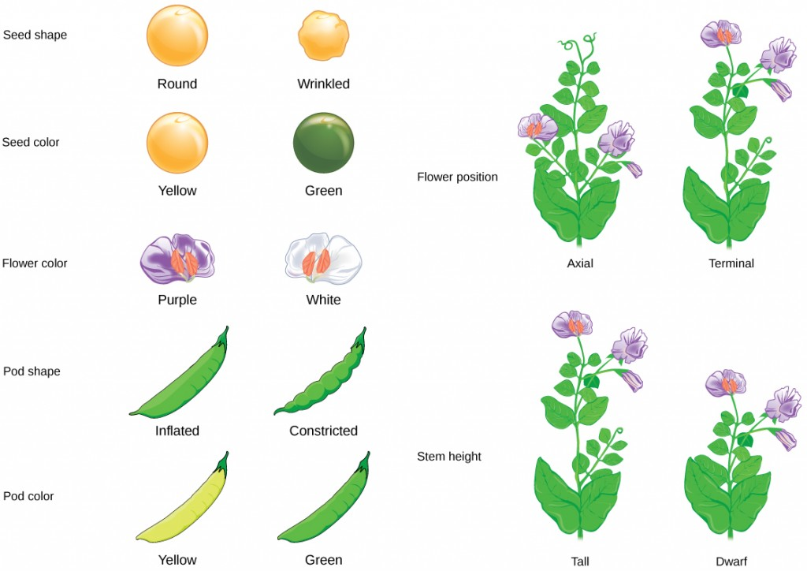
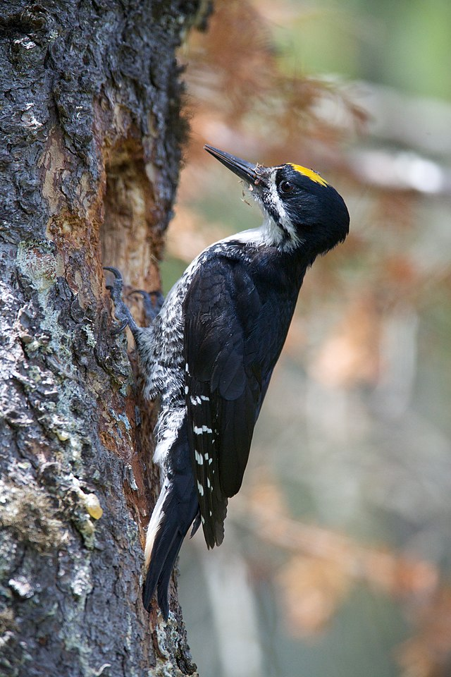

```{r setup, include=FALSE}
## r code goes in to chunks, delimited like this. you can add one with the "Insert" menu
## This setup chunk should be used for defining the document defaults
## here, we set the default figure size, the comment character, and the type
## of graphics to use
knitr::opts_chunk$set(fig.width=5.5, fig.height=5.5, collapse = TRUE, comment = "##", dev="png", error=TRUE)

## this chunk us also a cood place to load any librarys you want
## and to store constants in the R environment
## here I save a set of 8 colours for figures
library(RColorBrewer)
cols = brewer.pal(8, "Set1")
library(mvtnorm)
library(ggplot2)
library(gridExtra)
## These two packages make table display nicer; you can omit them if you don't want
## to use tables
library(knitr)
library(kableExtra)
options(digits = 3)
set.seed(12345)
```


## More data manipulation
<div class="left lt">

* Here we have a sample of abundances of 5 different tree species in plots across a number of years:
* Note that the format of the data makes some analyses easy
	- What is the average abundance for *Abies balsamifera* across all years?
* But other things are harder 
	- What is the average of all species combined for each year? 
	- What is the average for each species among years?

Today we will look at three useful functions for manipulating data frames in more complicated/interesting cases.

</div>
<div class="right rt">

```{r echo = FALSE}
trees = read.csv("../datasets/tree_abundance.csv")
```

```{r eval = FALSE}
trees = read.csv("data/tree_abundance.csv")
```

```{r}
head(trees)
```
</div>


## More data manipulation: tall vs. wide data
<div class="left lt">

* Recall that the columns of our data frame should each be a single variable. This dataset violates this pinciple!
	- One varaible, `abundance`, is spread across five colums.
	- Another variable, `species` is not encoded in a column at all! Rather, the information in this variable is encoded in the *column names*
* We can say that this dataset is in a **wide** format

</div>
<div class="right rt">

```{r}
head(trees)
```
</div>


## More data manipulation: tall vs. wide data
<div class="left lt">

* Recall that the columns of our data frame should each be a single variable. This dataset violates this pinciple!
	- One varaible, `abundance`, is spread across five colums.
	- Another variable, `species` is not encoded in a column at all! Rather, the information in this variable is encoded in the *column names*
* We can say that this dataset is in a **wide** format
* An add-on package, `reshape2`, can help us convert between **wide** and **tall** data frames with two functions:

1. From wide => tall: `melt`
2. From tall => wide: `dcast`

</div>
<div class="right rt">

```{r}
# install.packages("reshape2") # run this once, to install the package
library("reshape2")
trees_tall = melt(trees, id.vars = c("pid", "year"), 
				  variable.name = "species", 
				  value.name = "abundance")
head(trees_tall)
```
</div>


## More data manipulation: tall vs. wide data
<div class="left lt">

* Tall-format data are generally easier to work with (sometimes this is called "tidy" data in the R world)
* **Recommendation** - keep your data tall, convert to wide as needed using `dcast`

</div>
<div class="right rt">

```{r}
# install.packages("reshape2") # run this once, to install the package
library("reshape2")
trees_tall = melt(trees, id.vars = c("pid", "year"), 
				  variable.name = "species", 
				  value.name = "abundance")
head(trees_tall)
```
</div>


## More data manipulation: tall vs. wide data

<div class="left lt">

* If our data are tall, we can easily perform all kinds of operations.
* Here we cast the data to be wide again, but this time broadcasting both the `species` and `year` variables into columns and filling in zeros

</div>
<div class="right rt">
```{r}
trees_wide = dcast(trees_tall, pid ~ species + year, 
				   value.var = "abundance", fill = 0)
trees_wide[1:10, 1:5]
```


</div>

## Taking subsets
<div class="left lt">

* If our data are tall, we can easily perform all kinds of operations.
* `subset` gives you a new data frame that is a subset of the old one

```{r bfir1980_hist, echo = FALSE}
balsam_fir_1980 = subset(trees_tall, 
						 species == "Abies.balsamifera" & 
						 	year == 1980)
hist(balsam_fir_1980$abundance, xlab = "Abundance", main = "Histogram of abundance for Balsam Fir in 1980")
```

</div>
<div class="right rt">

```{r bfir1980_head}
balsam_fir_1980 = subset(trees_tall, 
						 species == "Abies.balsamifera" & 
						 	year == 1980)
head(balsam_fir_1980)
```
</div>


## Boxplots on tall data
<div class="left lt">

* If our data are tall, we can easily perform all kinds of operations.
* Boxplots can use a simple formula syntax

```{r tree_boxplot_code, eval = FALSE}
par(mar = c(8, 3, 0.1, 0.1)) # adjust the margins
# draw a boxplot of abundace, grouped by species and year
bpl = boxplot(abundance ~ species + year, 
			# outline = FALSE disables ploting outliers
			  data = trees_tall, outline = FALSE, 
			# xlab disables the x-axis label, xaxt = "n" disables the x-axis
			  xlab = "", xaxt = "n")

# Here we draw a custom x-axis with labels rotated 90 degrees
axis(side = 1, at = 1:length(bpl$names), 
	 labels = bpl$names, cex.axis = 0.6, las = 2)
```
</div>

<div class="right rt">

### 

```{r tree_boxplot_plot, echo = FALSE}
par(mar = c(8, 3, 0.1, 0.1)) # adjust the margins
bpl = boxplot(abundance ~ species + year, data = trees_tall, outline = FALSE, xlab = "",
			  xaxt = "n")
# do a bit of magic to rotate the axis labels
axis(side = 1, at = 1:length(bpl$names), labels = bpl$names, cex.axis = 0.6, las = 2)
```
</div>


## Aggregation
<div class="left lt">

* We can use `aggregate` to compute all kinds of summaries
	- A bit like a supercharged `tapply`

</div>
<div class="right rt">

```{r}
# compute the mean of abundance, grouped by species and year
head(aggregate(abundance ~ species + year, 
			   data = trees_tall, FUN = mean))
```
</div>


## Paired (x,y) datasets

<div class="left lt">

> - We often measure multiple variables about the same **experimental unit**
> - For example: each penguin has bill length and depth, flipper length, and body mass
> - For the simplest case, we can consider how two of these variables, `flipper_length_mm` and `body_mass_g`, relate to one another

</div>

<div class="right rt">
```{r penguin_read}
# load penguin data
data(penguins, package = "palmerpenguins")
# convert to a data frame
penguins = as.data.frame(penguins)
# remove NAs
penguins = penguins[complete.cases(penguins),]
head(penguins)
```

</div>

## Scatterplots for paired data

<div class="left lt">
* We use **scatterplots** to examine paired variables like this
* In R, this is done with the `plot` function.
* Here we see there is strong dependence between the two variables
</div>
<div class="right rt">
```{r peng_scatterplot}
# pch: plotting character, the symbol to use for the dots
# bty: the type of box to draw around the plot, 'n' disables this
plot(flipper_length_mm ~ body_mass_g, data = penguins, pch = 16, bty = 'n',
	 xlab = "Penguin Body Mass (g)", ylab = "Penguin Flipper Length (mm)")
```

</div>

## Scatterplots for paired data

<div class="left lt">
* We use **scatterplots** to examine paired variables like this
* In R, this is done with the `plot` function.
* Here we see there is strong dependence between the two variables
* If we use `ggplot`, we can also vary colours by categories (e.g., species)

</div>
<div class="right rt">
```{r peng_ggscatterplot}
ggplot(penguins) + 
	geom_point(aes(x = body_mass_g, y = flipper_length_mm, 
				   colour = species)) + 
	theme_minimal() + 
	xlab("Body Mass (g)") + ylab("Flipper Length (mm)")
```

</div>


## Covariance

<div class="left lt">

* If two variables $x$ and $y$ are (**independent**), we can say that if $x$ is known, we have no additional information about $y$ (and vice-versa). 
* In other words, the distribution of values of y does not change with respect to x.

$$
pr(y|x) = pr(y)
$$
</div>
<div class="right rt">

```{r independent_vars}
x = rnorm(1000)
y = rnorm(1000) # these variables are independent

plot(x, y, pch=16, bty='n', main = "Independent random variables")
```

</div>


## Covariance

<div class="left lt">

* Two variables that **covary** do not have this independence property; the values in $x$ can be used to predict $y$ (with some error), and vice-versa.
* The **sample covariance** ($\mathrm{cov}_{xy}$) looks similar to the equation for the sample variance, but relates to the amount of variation that is shared between $x$ and $y$

$$
\mathrm{cov}_{xy} = \frac{\sum_{i=1}^n \left (x_i - \bar{x} \right) \left(y_i - \bar{y} \right)}{n-1}
$$

```{r echo = FALSE}
sig1 = matrix(c(1, 0.9, 0.9, 1), ncol=2)
sig2 = matrix(c(1, -0.4, -0.4, 1), ncol=2)
sig3 = matrix(c(1, 0, 0, 1), ncol=2)
xx1 = rmvnorm(1000, sigma = sig1)
x1 = xx1[,1]; y1 = xx1[,2]
xx2 = rmvnorm(1000, sigma = sig2)
x2 = xx2[,1]; y2 = xx2[,2]
xx3 = rmvnorm(1000, sigma = sig3)
x3 = xx3[,1]; y3 = xx3[,2]
p1 = ggplot(data.frame(x=x1, y = y1), aes(x=x, y=y)) + geom_point() +
	xlab(expression(x[1])) + ylab(expression(y[1])) +
	ggtitle("Strong Positive Covariance") + theme_minimal()
p2 = ggplot(data.frame(x=x2, y = y2), aes(x=x, y=y)) + geom_point() +
	xlab(expression(x[2])) + ylab(expression(y[2])) +
	ggtitle("Weak Negative Covariance") + theme_minimal()
p3 = ggplot(data.frame(x=x3, y = y3), aes(x=x, y=y)) + geom_point() +
	xlab(expression(x[3])) + ylab(expression(y[3])) +
	ggtitle("Covariance = 0") + theme_minimal()

```

```{r}
# in R:
c(cov(x1, y1),
  cov(x2, y2),
  cov(x3, y3))
```

</div>
<div class="right rt">

```{r cov_plot, echo = FALSE, warning = FALSE, fig.height = 6, fig.width = 6}
grid.arrange(p1, p2, p3, ncol=2)
```

</div>


## Correlation

<div class="left lt">

* Like with the mean and standard deviation, we can **rescale** the covariance to make it easier to compare different datasets.
* Scale-independent covariance is called **correlation**; for many datasets we use the **Pearson correlation coefficient** $\rho_{xy}$.
* Ranges from $-1$ to $1$. Zero means zero covariance. $-1$ and $1$ indicates that $x$ and $y$ predict each other perfectly!

$$
\begin{aligned}
\mathrm{cov}_{xy} & = \frac{\sum_{i=1}^n \left (x_i - \bar{x} \right) \left(y_i - \bar{y} \right)}{n-1} \\
r_{xy} & = \frac{\mathrm{cov}_{xy}}{s_x s_y}
\end{aligned}
$$

```{r}
# in R:
c(cor(x1, y1),
  cor(x2, y2),
  cor(x3, y3))
```


</div>

<div class="right rt">

```{r cov_plot_with_cor, echo = FALSE, warning = FALSE, fig.height = 6, fig.width = 6}
grid.arrange(
	p1 + annotate("label", x=-2.5, y=2, label=paste("r =", round(cor(x1, y1), 1))), 
	p2 + annotate("label", x=-2.5, y=2, label=paste("r =", round(cor(x2, y2), 1))), 
	p3 + annotate("label", x=-2.5, y=2, label=paste("r =", round(cor(x3, y3), 1))), ncol=2)
```


</div>

## Correlation significance testing

$H_0$: $r = 0$

$H_A$: two sided ($\rho \ne 0$) or one-sided ($\rho > 0$ or $\rho < 0$)

$r$ has a standard error:


$$
s_{r} = \sqrt{\frac{1-r^2}{n-2}}
$$
We can then compute a $t$-statistic:

$$
t = \frac{r}{s}
$$

The probability that $t > \alpha$ (i.e., use the **CDF** of the t distribution) is the p-value.

## Correlation test in R
<div class="left lt">

We can run this test on the penguin example

```{r peng_cor_test, fig.show='hide'}
n = nrow(penguins)
(r = cor(penguins$body_mass_g, penguins$flipper_length_mm))
(s_r = sqrt((1-r^2)/(n-2)))
(t_val = r/s_r)
(2 * pt(t_val, n-2, lower.tail = FALSE)) # two-sided test

```
</div>

<div class="right rt">
</div>

## Correlation test in R
<div class="left lt">

We can run this test on the penguin example

```{r peng_cor_test2, fig.show='hide'}
n = nrow(penguins)
(r = cor(penguins$body_mass_g, penguins$flipper_length_mm))
(s_r = sqrt((1-r^2)/(n-2)))
(t_val = r/s_r)
(2 * pt(t_val, n-2, lower.tail = FALSE)) # two-sided test

```
</div>

<div class="right rt">
And equivalently, using a built-in function

```{r peng_cor_test3}
with(penguins, 
	 cor.test(body_mass_g, flipper_length_mm, alternative = "two.sided"))
```

</div>


## Correlation test: assumptions

* Data must be at least interval scale
  - ordinal data: Spearman rank correlation (avialable in `cor.test` and `cor`)
  - nominal data: Association test (`prop.test`) or $\chi^2$ test (`chisq.test`)
* Population is distributed *bivariate normal* (or $n$ is sufficiently large)


## Correlation pitfalls
* Test is misleading if relationship is nonlinear

{width=80%}


## Correlation pitfalls

<div class="left lt">

Heterogeneity of subgroups


```{r echo = FALSE}
csg = read.csv("../datasets/cor_subgroup.txt")
csg = csg[order(csg$sex, csg$x),]
mod = coef(lm(y~x, data = csg))
mod2 = lm(y~x*sex, data = csg)
segs = data.frame(xs = csg$x[c(1,10)], xe = csg$x[c(9, nrow(csg))], 
				   ys = predict(mod2)[c(1,10)], 
				   ye = predict(mod2)[c(9, nrow(csg))], sex = c('f', 'm'))
ggplot(csg, aes(x=x, y=y, col=sex)) + geom_point() + ylab("Fish Weight") + 
	xlab("Fish Length") + theme_minimal() + 
	geom_abline(aes(slope=mod[2], intercept = mod[1]), linetype=2) +
	geom_segment(data = segs, aes(x=xs, y=ys, xend=xe, yend=ye)) + 
	theme(axis.ticks=element_blank(), axis.text = element_blank())
```

</div>
<div class="right rt">

</div>

## Spearman correlation

<div class="left lt">

* Used when Pearson correlation assumptions are violated
	- non-normal data
	- non-linear (but monotonic) relationships
	- ordinal data
	
```{r, echo = FALSE}
set.seed(123)
n = 150
x = rlnorm(n)
y = exp(-1.5*x) + rgamma(n, 0.75, 0.75)
plot(x, y, pch=16, bty='n')
```
</div>
<div class="right rt">


```{r}
cor.test(x, y)
```

</div>

## Spearman correlation
<div class="left lt">

* Used when Pearson correlation assumptions are violated
	- non-normal data
	- non-linear (but monotonic) relationships
	- ordinal data

```{r, echo = FALSE}
plot(rank(x), rank(y), pch = 16, bty='n')
```

* The math is simple: rank transform x and y, then compute Pearson correlation.

</div>
<div class="right rt">

```{r}
cor.test(x, y)
cor.test(x, y, method = 'spearman')
```

</div>

## Tests of association: 2 × 1 Tables


<div class="left lt">
### Mendel's peas

* Take homozygous violet (dominant) and white (recessive plants)
* $F_1$ plants are 100% violet
* Theory says that $F_2$ plants should be 75% violet, 25% white

Observation:

```{r echo = FALSE, results = 'asis'}
tab = data.frame("colour" = c("violet", "white"), F2 = c(705, 224))
kable(tab)
```


</div>

<div class="right rt">
{width=75%}

<p style="font-size:x-small;">[source](https://opentextbc.ca/biology/chapter/8-1-mendels-experiments/)</p>


</div>


## Tests of association: 2 × 1 Tables

<div class="left lt">
### Mendel's peas

* Take homozygous violet (dominant) and white (recessive plants)
* $F_1$ plants are 100% violet
* Theory says that $F_2$ plants should be 75% violet, 25% white

Observation:

```{r echo = FALSE, results = 'asis'}
tab = data.frame("colour" = c("violet", "white"), F2 = c(705, 224))
kable(tab)
```

</div>

<div class="right rt">

$H_0$: Inheritance is Mendelian (violet:white = 3:1)

$H_A$: Inheritance is *not* exactly Mendelian


```{r}
# Test of proportions against a null hypothesis
# For small sample sizes, use binom.test
counts = matrix(c(705, 224), ncol = 2)
prop.test(counts, p = 0.75, alternative = "two.sided")
```

</div>


## Tests of association: n × n Tables

<div class="left lt">

### Nesting holes of black-backed woodpeckers.

```{r}
woodpecker = read.csv("../datasets/woodpecker.csv")
head(woodpecker)

table(woodpecker)
```

We want to test for an *association* between the two variables (forest type and nest tree)

</div>

<div class="right rt">
$H_0$: Nesting tree is not associated with forest type

$H_A$: Nest tree is associated with forest type

{width=75px}


</div>


## Chi-squared test

<div class="left lt">

### Nesting holes of black-backed woodpeckers.

```{r}
table(woodpecker)

table(woodpecker)/rowSums(table(woodpecker))

```


</div>
<div class="right rt">

We can use a $\chi^2$-test to test for this association

$H_0$: Nesting tree is not associated with forest type

$H_A$: Nest tree is associated with forest type
</div>


## Chi-squared test

<div class="left lt">

### Nesting holes of black-backed woodpeckers.

```{r}
table(woodpecker)

table(woodpecker)/rowSums(table(woodpecker))

```


</div>


<div class="right rt">

We can use a $\chi^2$-test to test for this association

$H_0$: Nesting tree is not associated with forest type

$H_A$: Nest tree is associated with forest type

```{r}
# for 2x2 tables with small sample sizes: Fisher's exact test
# fisher.test()
with(woodpecker, chisq.test(forest_type, nest_tree))

```

</div>


## Visualisation: Categorical Data
<div class="left lt">

You see this a lot. When should you do it? **NEVER**

 - One problem: your brain is bad at converting angles to numbers
 - This will over-emphasize large values
 - Comparisons among intermediate groups is challenging
</div>
<div class="right rt">

```{r piechart, echo = FALSE, fig.width = 6}
tab_burned = table(woodpecker[woodpecker$forest_type == "burned", "nest_tree"])
tab_burned = as.data.frame(tab_burned)
colnames(tab_burned) = c("nest_tree", "count")

tab_unburned = table(woodpecker[woodpecker$forest_type == "unburned", "nest_tree"])
tab_unburned = as.data.frame(tab_unburned)
colnames(tab_unburned) = c("nest_tree", "count")

p1 = ggplot(tab_burned, aes(x = "", y = count, fill = nest_tree)) +
  geom_col() + xlab("") + ylab("") + ggtitle("Burned") + theme_minimal() + 
  coord_polar(theta = "y") + theme(axis.text.x=element_blank(),
      axis.ticks.x=element_blank(),
      axis.text.y=element_blank(),
      axis.ticks.y=element_blank())
p2 = ggplot(tab_unburned, aes(x = "", y = count, fill = nest_tree)) +
  geom_col() + xlab("") + ylab("") + ggtitle("Unburned") + theme_minimal() + 
  coord_polar(theta = "y") + theme(axis.text.x=element_blank(),
      axis.ticks.x=element_blank(),
      axis.text.y=element_blank(),
      axis.ticks.y=element_blank())
library(gridExtra)
grid.arrange(p1, p2, ncol=2)
```
</div>


## Visualisation: Categorical Data
<div class="left lt">

This is almost as bad, and sadly much more common

</div>
<div class="right rt">

```{r donutplot, echo = FALSE, fig.width = 6}

hsize = 4
tab_burned$x = tab_unburned$x = hsize

p3 = ggplot(tab_burned, aes(x = x, y = count, fill = nest_tree)) +
  geom_col() + xlab("") + ylab("") + ggtitle("Burned") + theme_minimal() + 
  coord_polar(theta = "y") + theme(axis.text.x=element_blank(),
      axis.ticks.x=element_blank(),
      axis.text.y=element_blank(),
      axis.ticks.y=element_blank()) + xlim(c(0.2, hsize + 0.5))
p4 = ggplot(tab_unburned, aes(x = x, y = count, fill = nest_tree)) +
  geom_col() + xlab("") + ylab("") + ggtitle("Unburned") + theme_minimal() + 
  coord_polar(theta = "y") + theme(axis.text.x=element_blank(),
      axis.ticks.x=element_blank(),
      axis.text.y=element_blank(),
      axis.ticks.y=element_blank()) + xlim(c(0.2, hsize + 0.5))
grid.arrange(p3, p4, ncol=2)
```
</div>


## Visualisation: Categorical Data

<div class="left lt">

Barplots, or proportional bars for counts within categories

```{r, fig.show='hide'}
table(woodpecker)

woodp_plot = ggplot(woodpecker, aes(x = nest_tree,
				fill = forest_type)) + theme_minimal()
woodp_plot = woodp_plot + geom_bar(width = 0.5)
woodp_plot
```

Stacked bars are "unfair" — easiest to compare the "rooted" class (unburned).

</div>

<div class="right rt">
```{r, echo = FALSE}
woodp_plot
```
</div>

## Visualisation: Categorical Data

<div class="left lt">

Barplots, or proportional bars for counts within categories

```{r, fig.show='hide'}
table(woodpecker)

woodp_plot = ggplot(woodpecker, aes(x = nest_tree,
				fill = forest_type))
woodp_plot = woodp_plot + geom_bar(width = 0.5, 
					position=position_dodge())
woodp_plot = woodp_plot + xlab("Nest Tree Type") +
	theme_minimal() + labs(fill = "Forest Type")
woodp_plot
```

Side-by-side bars allow us to compare all categories on equal footing. 

</div>

<div class="right rt">
```{r, echo = FALSE}
woodp_plot
```
</div>


## Visualisation: Ordinal Data

<div class="left lt">

Scatterplots become less useful.

```{r, fig.show='hide'}
birddiv = read.csv("../datasets/birddiv.csv")
bird_plot = ggplot(birddiv, aes(x=forest_frag, 
				y = richness, colour = bird_type)) + 
				geom_point() + theme_minimal()
head(birddiv)
```

</div>

<div class="right rt">
```{r, echo = FALSE}
bird_plot
```
</div>


## Visualisation: Ordinal Data

<div class="left lt">

Adding jitter can sometimes improve things

```{r, fig.show='hide'}
bird_plot = ggplot(birddiv, aes(x=forest_frag, 
				y = richness, colour = bird_type)) + 
				geom_jitter() + theme_minimal()
```

</div>

<div class="right rt">
```{r, echo = FALSE}
bird_plot
```
</div>


## Visualisation: Ordinal Data

<div class="left lt">

Another solution: ordered boxplots

```{r, fig.show='hide'}
bird_plot = ggplot(birddiv, aes(x=as.factor(forest_frag), 
				y = richness, fill = bird_type)) + 
				geom_boxplot() + theme_minimal()
bird_plot = bird_plot + xlab("Forest Fragmentation")
```

</div>

<div class="right rt">
```{r, echo = FALSE}
bird_plot
```
</div>


