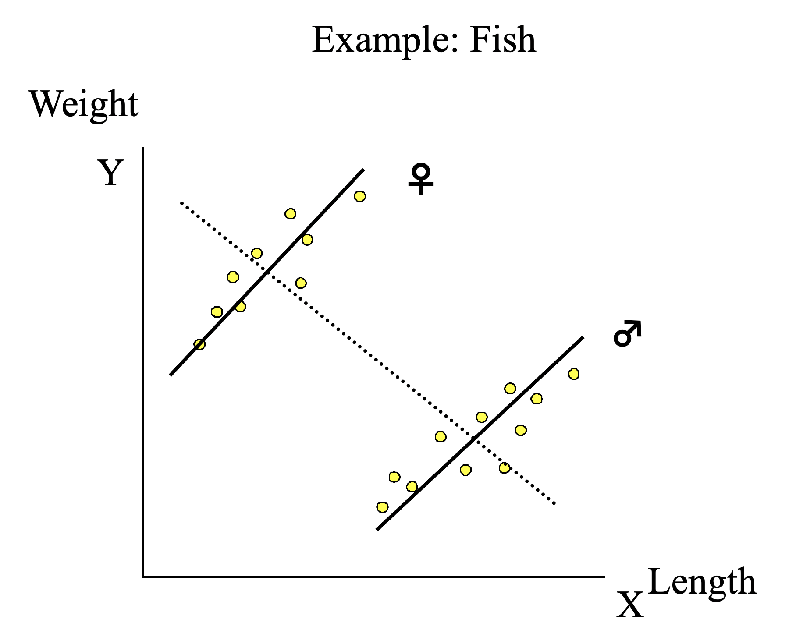
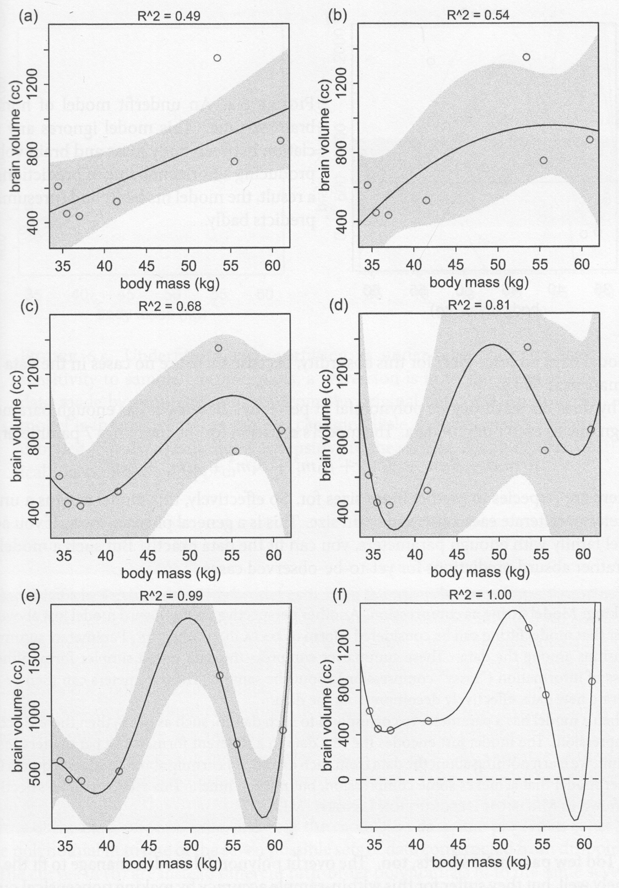

```{r setup, include=FALSE}
## r code goes in to chunks, delimited like this. you can add one with the "Insert" menu
## This setup chunk should be used for defining the document defaults
## here, we set the default figure size, the comment character, and the type
## of graphics to use
knitr::opts_chunk$set(fig.width=5.5, fig.height=5.5, collapse = TRUE, comment = "##", dev="png")

## this chunk us also a cood place to load any librarys you want
## and to store constants in the R environment
## here I save a set of 8 colours for figures
library(RColorBrewer)
cols = brewer.pal(8, "Set1")

## These two packages make table display nicer; you can omit them if you don't want
## to use tables
library(knitr)
library(kableExtra)
```


## Covariance

<div class="left lt">

* If two variables $x$ and $y$ are (**independent**), we can say that if $x$ is known, we have no additional information about $y$ (and vice-versa). 
* In other words, the distribution of values of y does not change with respect to x.

$$
pr(y|x) = pr(y)
$$
</div>
<div class="right rt">

We can use the `plot` function to make a bivariate scatterplot in order to visualise this:

```{r fig.cap = "Independent random variables"}
x = rnorm(1000)
y = rnorm(1000) ## these variables are independent

plot(x, y, pch=16, bty='n')
```

</div>


## Covariance

<div class="left lt">

* Two variables that **covary** do not have this independence property; the values in $x$ can be used to predict $y$ (with some error), and vice-versa.
* The **sample covariance** ($\mathrm{cov}_{xy}$) looks similar to the equation for the sample variance, but relates to the amount of variation that is shared between $x$ and $y$

$$
\mathrm{cov}_{xy} = \frac{\sum_{i=1}^n \left (x_i - \bar{x} \right) \left(y_i - \bar{y} \right)}{n-1}
$$


</div>
<div class="right rt">

```{r echo = FALSE, warning = FALSE, fig.height = 10}
library(mvtnorm)
sig1 = matrix(c(1, 0.9, 0.9, 1), ncol=2)
sig2 = matrix(c(1, -0.5, -0.5, 1), ncol=2)
sig3 = matrix(c(1, 0, 0, 1), ncol=2)
xx1 = rmvnorm(1000, sigma = sig1)
xx2 = rmvnorm(1000, sigma = sig2)
xx3 = rmvnorm(1000, sigma = sig3)

par(mfrow = c(3, 1))
plot(xx1[,1], xx1[,2], pch=16, cex=0.7, bty='n', xlab='x', ylab='y', main = "Strong Positive Covariance")
plot(xx2[,1], xx2[,2], pch=16, cex=0.7, bty='n', xlab='x', ylab='y', main = "Weak Negative Covariance")
plot(xx3[,1], xx3[,2], pch=16, cex=0.7, bty='n', xlab='x', ylab='y', main = "Covariance = 0")
```

</div>


## Correlation

* Like with the mean and standard deviation, we can **rescale** the covariance to make it easier to compare different datasets.
* Scale-independent covariance is called **correlation**; for many datasets we use the **Pearson correlation coefficient** $\rho_{xy}$.

$$
\begin{aligned}
\mathrm{cov}_{xy} & = \frac{\sum_{i=1}^n \left (x_i - \bar{x} \right) \left(y_i - \bar{y} \right)}{n-1} \\
r_{xy} & = \frac{\mathrm{cov}_{xy}}{s_x s_y}
\end{aligned}
$$

## Correlation significance testing

$H_0$: $r = 0$

$H_A$: two sided ($\rho \ne 0$) or one-sided ($\rho > 0$ or $\rho < 0$)

$r$ has a standard error:

$$
s_{r} = \sqrt{\frac{1-r^2}{n-2}}
$$
We can then compute a $t$-statistic:

$$
t = \frac{r}{s}
$$

The probability that $t > \alpha$ (i.e., use the **CDF** of the t distribution) is the p-value.

## Correlation test in R

<div class="left lt">

```{r}
data(iris)
iris_set = subset(iris, Species == "setosa")
n = nrow(iris_set)
r = cor(iris_set$Sepal.Length, iris_set$Petal.Length)
r
s_r = sqrt((1-r^2)/(n-2))
s_r
t_val = r/s_r
t_val
2 * pt(t_val, n-2, lower.tail = FALSE) ## two-sided test
```


</div>
<div class="right rt">
```{r echo= FALSE, fig.height=4, fig.width=4}
plot(iris_set$Sepal.Length, iris_set$Petal.Length, pch=16, xlab = "Setosa Sepal Length", 
     ylab = "Setosa Petal Length", bty='n')
```

</div>

## Correlation test in R

```{r}
## Equivalent built-in test
with(iris_set, cor.test(Sepal.Length, Petal.Length, alternative = "two.sided"))
```

## Correlation test: assumptions

* Data must be at least interval scale
  - ordinal data: Spearman rank correlation (avialable in `cor.test` and `cor`)
  - nominal data: Association test (`prop.test`) or $\chi^2$ test (`chisq.test`)
* Population is distributed *bivariate normal* (or $n$ is sufficiently large)


## Correlation pitfalls
* Test is misleading if relationship is nonlinear

{width=80%}

## Correlation pitfalls
* Heterogeneity of subgroups

{width=60%}


## The linear model

* Correlation assumes nothing about the *causal* nature of the relationship between x and y
* Often, we have a hypothesis that a variable is in some way **functionally dependent** on another

* A **simple linear regression** describes/tests the relationship between
   - the **independent variable** (x, aka predictor or input variable), and
   - the **dependent variable** (y, aka response or outcome)


$$
\begin{aligned}
\mathbb{E}(y|x) & = \hat{y} = \alpha + \beta x \\
 & \approx a + bx \\ \\
\end{aligned}
$$

$y$ is not perfectly predicted by $x$, so we must include an error (residual) term:

$$
\begin{aligned}
y_i & = \hat{y_i} + \epsilon_i  \\ 
& = a + bx_i + \epsilon_i\\ \\
\epsilon & \sim \mathcal{N}(0, s_{\epsilon})
\end{aligned}
$$

## Method of least squares

$$
\begin{aligned}
\hat{y_i} & = a + b x_i \\
y_i & = \hat{y_i} + \epsilon_i  \\ 
\epsilon & \sim \mathcal{N}(0, s_{\epsilon})
\end{aligned}
$$

We want to solve these equations for $a$ and $b$

The "best" $a$ and $b$ are the ones that draw a line that is closest to the most points (i.e., that minimizes $s_{\epsilon}$)

```{r echo = FALSE, fig.width=12}
pars = coef(lm(Petal.Length ~ Sepal.Length, data = iris_set))

par(mfrow = c(1, 3))
plot(iris_set$Sepal.Length, iris_set$Petal.Length, pch=16, 
     xlab = "Setosa Sepal Length", 
     ylab = "Setosa Petal Length", bty='n', main = expression(best~line))
abline(a = pars[1], b = pars[2], col='blue', lwd=2)

plot(iris_set$Sepal.Length, iris_set$Petal.Length, pch=16, 
     xlab = "Setosa Sepal Length", 
     ylab = "Setosa Petal Length", bty='n', 
     main = expression(bias:~bar(epsilon) != 0))
abline(a = pars[1] + 0.2, b = pars[2], col='blue', lwd=2)

plot(iris_set$Sepal.Length, iris_set$Petal.Length, pch=16, 
     xlab = "Setosa Sepal Length", 
     ylab = "Setosa Petal Length", bty='n', 
     main = expression(precision:~s[epsilon]~too~large))
abline(a =mean(iris_set$Petal.Length), b = 0, col='blue', lwd=2)

```


## Method of least squares

$$
s_{\epsilon} = \sqrt{\frac{\sum_{i=1}^n \left (y_i -\hat{y_i}\right )^2}{n-2}}
$$

* $n-2$ is constant w.r.t. $a$ and $b$
* Simpler to compute the **Error** (aka **residual**) **Sum of Squares**:

$$
\begin{aligned}
\mathrm{ESS} & = \sum_{i=1}^n \left (y_i -\hat{y_i}\right )^2 \\
& = \sum_{i=1}^n \left (y_i - a - bx_i \right )^2
\end{aligned}
$$

## Ordinary least squares estimation

Solving for the minimum ESS yields:

$$
\begin{aligned}
b & = \frac{\mathrm{cov_{xy}}}{s^2_x} \\ \\
  & = r_{xy}\frac{s_y}{s_x}\\ \\
a & = \bar{y} - b\bar{x}
\end{aligned}
$$

The parameters have standard errors:

$$
s_a = s_{\hat{y}}\sqrt{\frac{1}{n} + \frac{\bar{x}^2}{\sum{(x-\bar{x}}^2)}}
$$

$$
s_b = \frac{s_{\hat{y}}}{\sqrt{\sum{(x-\bar{x}}^2)}}
$$

## Significance tests

$\mathbf{H_0}$: The slope $\beta$ = 0 (i.e., no variation in $y$ is explained by variation in $x$)

The ratio of variance explained to residual variance follows an $F$ distribution


\begin{aligned}
F & = \frac{MS_{model}}{MS_{err}} \\

MS_{model} & = \sum_{i=1}^n \left ( \hat{y}_i - \bar{y}\right)^2 \\
MS_{err} & = \frac{\sum_{i=1}^n \left ( y_i - \hat{y}_i \right)^2}{n-1}
\end{aligned}

### Goodness of fit

The **coefficient of determination** tells you the proportion of variance explained by the model:

$$
r^2 = \frac{\sum_{i=1}^n \left ( \hat{y_i} - \bar{y} \right )^2}
{\sum_{i=1}^n \left ( y_i - \bar{y} \right )^2}
$$


## Regression assumptions
* Data points are **independent** (*i.i.d*)
* The residuals must be normally distributed 
    - always true if $x$ and $y$ follow a **multivariate normal**
* Homoscedasticity (constant variance of the residuals: $s_{\epsilon}$)
* The relationship between $x$ and $y$ is linear
   - valid if $y$ is linear w.r.t some transformation: $\hat{y} = a + b\mathcal{f}(x)$
   - more complicated in the reverse case: $\mathcal{f}(\hat{y}) = a + bx$

<div class="left lt">

```{r}
set.seed(123)
y = rpois(200, 7.5)
c(
  mean(log(y)),
  log(mean(y)))
y = c(y, 0)
c(
  mean(log(y)),
  log(mean(y)))

```
</div>
<div class="right rt">
```{r echo = FALSE}
hist(y, xlab="count", main="", breaks=0:max(y))
```

</div>

## Transformations

* Transformation can be used to linearize non-linear relationships
* It can also improve the quality of the variance of the residuals
* Use caution! The hypothesized relationship will change!

## Regression in R

<div class="left lt">

```{r}
## Data on sparrow wing lengths from Zar (1984)
dat = data.frame(age = c(3:6, 8:12, 14:17), 
        wing_length = c(1.4, 1.5, 2.2, 2.4, 3.1, 3.2, 3.2, 3.9, 4.1, 4.7, 4.5, 5.2, 5.0))
mod = lm(wing_length ~ age, data = dat)
summary(mod)
confint(mod)

```
</div>

<div class="left lt">
```{r echo = FALSE}
plot(wing_length ~ age, data = dat, pch=16, col="blue", bty='n',
     xlab= "Sparrow wing length (cm)", ylab = "Age (days)")
abline(mod)
```
</div>

## Regression in R: diagnostics

```{r fig.width = 10}
par(mfrow=c(1, 2), bty='n')

## scale(residuals) produces **standardized** residuals
qqnorm(scale(residuals(mod)), pch=16)
qqline(scale(residuals(mod)), lty=2)
plot(dat$age, residuals(mod), xlab = "age", ylab = "residuals", pch=16)
abline(h = 0, lty=2)

## also try
## plot(mod)
```


## Presenting regression output

<div class="left lt">
* **Always**:
  - coefficients and standard errors
  - degrees of freedom or $n$
  - $p$-value, maybe $F$ or $t$ statistic
* Recommended
  - Some metric of goodness of fit (e.g., $R^2$)
  - Visualisation of the relationship
* In supplemental material
  - Diagnostic plots
  - Models tested but not presented

</div>

<div class="right rt">
We found a significant positive relationship between wing length and age ($F_{1,11} = 400$, $p < 0.001$, $R^2 = 0.97$; Table 1) <br/>

```{r echo = FALSE, results = 'asis'}
tab = data.frame(" " = c("intercept", "age"), estimate = c(0.71, 0.27), 
                 s = c(0.15, 0.013), "95\\% CI" = c("0.39, 1.03", "0.24, 0.30"))
kable(tab, col.names = c("", "estimate", "st. error", "95% CI"),
      caption = "Table 1. Parameter estimates for regression of wing length on age")

```

</div>


## Multiple regression

* We can add the effect of an additional variable by simply adding it to the equation:

$$
\hat{y} = a + b_1x_1 + b_2x_2
$$

## Multiple regression

* More generally:

$$
\hat{y} = \mathbf{X}\mathbf{B}
$$

$\mathbf{B}$ is the **parameter vector**

$\mathbf{X}$ is the **design matrix**

$$
\mathbf{X} = \begin{bmatrix}
1 & x_{1,1} & x_{2,1} & \dots & x_{k,1} \\
1 & x_{1,2} & x_{2,2} & \dots & x_{k,2} \\
\vdots & \vdots & \vdots & \dots & \vdots \\
1 & x_{1,n} & x_{2,n} & \dots & x_{k,n} \\
\end{bmatrix}
$$


## Multiple regression

$$
\begin{aligned}
\hat{y} & = \mathbf{X}\mathbf{B} \\
y &= \mathbf{X}\mathbf{B} + \epsilon  \\
\epsilon & \sim \mathcal{N}(0, s_\epsilon)
\end{aligned}
$$

The equation is a **linear system** and can be solved with linear algebra by OLS, minimizing the sum of squared errors:

$$
\mathrm{min}: \sum \epsilon^2 = \sum \left (\mathbf{X}\mathbf{B} - y \right)^2
$$

Or in R we can just add terms to the formula ;-)

```{r eval = FALSE}
lm(y ~ x1+x2)
```

## Hypotheses

1. $\mathbf{H_{0,regression}}$: The model (i.e., the linear system $\mathbf{XB}$) does not explain any of the variation in $y$.
    - Test via ANOVA (F-ratio of explained to residual variance)
2. $\mathbf{H_{0,coef_i}}$: The slope of the relationship between $y$ and $x_i$ is zero.
    - Test with $t$-statistic (in output of `lm`) (or check if CI overlaps 0)
    - Alternatives: ANOVA (nested models), AIC (all models)

## So which predictor is best?
1. Consider dropping non-significant predictors
    - unless you know/strongly suspect they are important
    - $x_1$ might be significant, but only when $x_2$ is in the model!
    - interactions (more on this later) must always have the main effect ($b_1x_1 + b_2x_2 + b_3x_1x_2$)
    - higher-order polynomials should always have lower-order ($b_1x+b_2x^2$)
2. Compare slopes in a scale independent way
    - standardize your predictors (especially if $s_{x_1} >> s_{x_2}$), or
    - standardize the coefficients
    
$$
b_i^* = b_i \frac{s_{x_i}}{s_y}
$$
    

## Pitfalls: Model flexibility

<div class="left lt">

{width=70%}
</div>

<div class="right rt">
```{r eval=FALSE}
lm(brain ~ mass, data = hominid)
lm(brain ~ mass + I(mass^2), data = hominid)
lm(brain ~ mass + I(mass^2) + I(mass^3), data = hominid)
## etc...
```

</div>

## The curse of dimensionality

* High dimensional spaces (lots of $x$ variables) require lots of data
* Rule-of-thumb minimum: $n > 5k$
   - with large $k$, even more is needed

```{r, echo=FALSE, fig.width=12}

par(mfrow = c(1,3))
n = 16
x = seq(-3, 3, length.out=n)
plot(x, rep(0, n), yaxt='n', pch = 16, bty='n', ylab = "",
     main = paste("avg distance =", round(x[2]-x[1], 2)))

x1 = x2 = seq(-3, 3, length.out=sqrt(n))
dat = expand.grid(x1, x2)

plot(dat$Var1, dat$Var2, pch = 16, bty='n', 
     main = "avg distance ≈ 2.42", xlab=expression(x[1]), 
     ylab=expression(x[2]))

plot(runif(16, -3, 3), runif(16, -3, 3), pch = 16, bty='n', 
     main = "much unsampled space", xlab=expression(x[1]), 
     ylab=expression(x[2]), xlim=c(-3, 3), ylim=c(-3, 3))

```


## Multiple comparisons: n = 200
```{r}
set.seed(1515)
n_x = 20
n_obs = n_x*10
y = rnorm(n_obs)  ## random y-variable

## 20! random x-variables, no relationship to y
x = matrix(rnorm(n_obs*n_x), ncol=n_x)
dat = data.frame(cbind(y, x))
colnames(dat) = c("y", paste0('x', 1:n_x))

## y ~ . means use every remaining variable in the data frame
mod = lm(y ~ ., data = dat) 
summary(mod)
```


## Multiple comparisons: n = 40
```{r}
set.seed(1515)
n_x = 20
n_obs = n_x*2
y = rnorm(n_obs)  ## random y-variable

## 20! random x-variables, no relationship to y
x = matrix(rnorm(n_obs*n_x), ncol=n_x)
dat = data.frame(cbind(y, x))
colnames(dat) = c("y", paste0('x', 1:n_x))

## y ~ . means use every remaining variable in the data frame
mod = lm(y ~ ., data = dat) 
summary(mod)
```


## Additional assumptions
* $x$ measured with no/minimal error
* $\mathbb{E}(y|x)$ is a linear combination of x (hard to check!)
* normally distributed residuals w/ constant variance
   - use `qqnorm(residuals(mod))`, `qqline(residuals(mod))`, and `plot(mod)`
   - examine residuals for high leverage/influence
* limited multicollinearity
   - quick test: run `cor` on predictor matrix, check for large correlations
   - formal test: Variance Inflation Factors (VIF) < 10 (ish)
   
Ignoring $y$ for a moment, we can perform regressions of the $x$ variables against each other:

$$
x_i = b_0 + b_1x_1 \dots b_kx_k +\epsilon \mathrm{~;~excluding~x_i}
$$

$$
\mathrm{VIF}_i = \frac{1}{1-R^2_i}
$$

The VIF tells you that $s_b = s_{b,\rho=0}\sqrt{\mathrm{VIF}}$