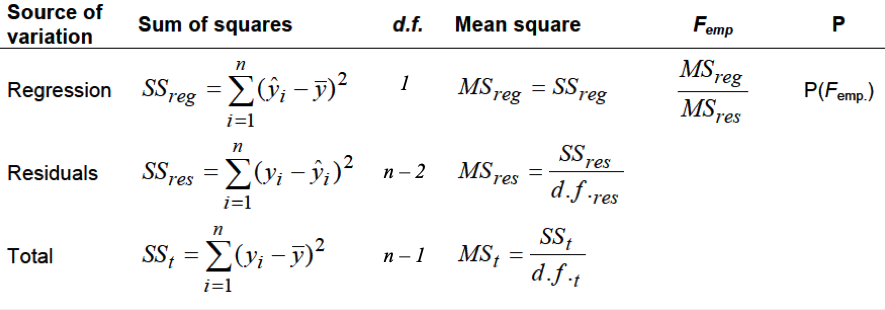
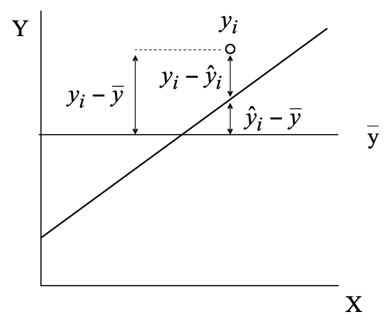
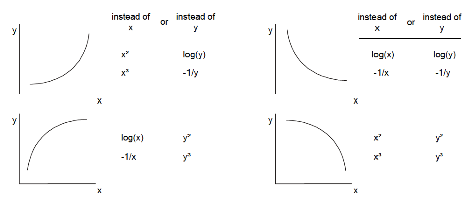
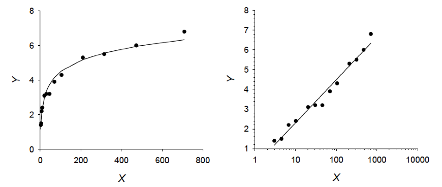
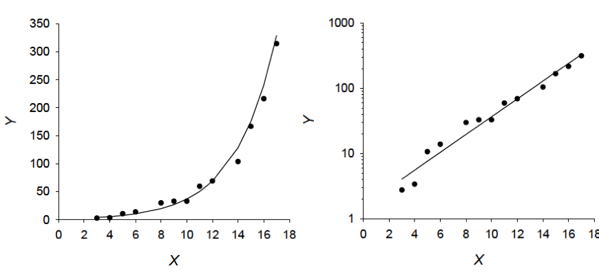
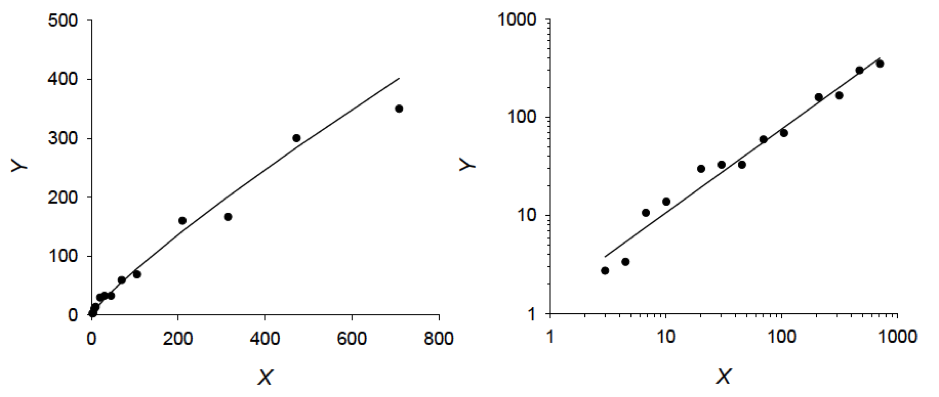

```{r setup, include=FALSE}
## r code goes in to chunks, delimited like this. you can add one with the "Insert" menu
## This setup chunk should be used for defining the document defaults
## here, we set the default figure size, the comment character, and the type
## of graphics to use
knitr::opts_chunk$set(fig.width=5.5, fig.height=5.5, collapse = TRUE, comment = "##", dev="png", error=TRUE)

## this chunk us also a cood place to load any librarys you want
## and to store constants in the R environment
## here I save a set of 8 colours for figures
library(RColorBrewer)
cols = brewer.pal(8, "Set1")
library(mvtnorm)
library(ggplot2)
library(gridExtra)
library(palmerpenguins)
## These two packages make table display nicer; you can omit them if you don't want
## to use tables
library(knitr)
library(kableExtra)
options(digits = 3)
set.seed(12345)
```


## The linear model

* Correlation assumes nothing about the *causal* nature of the relationship between x and y
* Often, we have a hypothesis that a variable is in some way **functionally dependent** on another

* A **simple linear regression** describes/tests the relationship between
   - the **independent variable** (x, aka predictor or input variable), and
   - the **dependent variable** (y, aka response or outcome)


$$
\begin{aligned}
\mathbb{E}(y|x) & = \hat{y} = \alpha + \beta x \\
 & \approx a + bx \\ \\
\end{aligned}
$$

$y$ is not perfectly predicted by $x$, so we must include an error (residual) term:

$$
\begin{aligned}
y_i & = \hat{y_i} + \epsilon_i  \\ 
& = a + bx_i + \epsilon_i\\ \\
\epsilon & \sim \mathcal{N}(0, s_{\epsilon})
\end{aligned}
$$

## Method of least squares

$$
\begin{aligned}
\hat{y_i} & = a + b x_i \\
y_i & = \hat{y_i} + \epsilon_i  \\ 
\epsilon & \sim \mathcal{N}(0, s_{\epsilon})
\end{aligned}
$$

We want to solve these equations for $a$ and $b$

The "best" $a$ and $b$ are the ones that draw a line that is closest to the most points (i.e., that minimizes $s_{\epsilon}$)

```{r echo = FALSE, fig.width=12}
# load penguin data
data(penguins, package = "palmerpenguins")
# convert to a data frame
penguins = as.data.frame(penguins)
# remove NAs
penguins = penguins[complete.cases(penguins),]

# subset for just Adelie penguins
penguins_ade = subset(penguins, species == "Adelie")

pars = coef(lm(flipper_length_mm ~ body_mass_g, data = penguins_ade))

par(mfrow = c(1, 3))
plot(penguins_ade$body_mass_g, penguins_ade$flipper_length_mm, pch=16, 
     xlab = "Adelie body mass (g)", 
     ylab = "Adelie flipper length (mm)", bty='n', main = expression(best~line))
abline(a = pars[1], b = pars[2], col='blue', lwd=2)

plot(penguins_ade$body_mass_g, penguins_ade$flipper_length_mm, pch=16, 
     xlab = "Adelie body mass (g)", 
     ylab = "Adelie flipper length (mm)", bty='n', 
     main = expression(bias:~bar(epsilon) != 0))
abline(a = pars[1] + 15, b = pars[2], col='blue', lwd=2)

plot(penguins_ade$body_mass_g, penguins_ade$flipper_length_mm, pch=16, 
     xlab = "Adelie body mass (g)", 
     ylab = "Adelie flipper length (mm)", bty='n', 
     main = expression(precision:~s[epsilon]~too~large))
abline(a =mean(penguins_ade$flipper_length_mm), b = 0, col='blue', lwd=2)

```


## Method of least squares

$$
s_{\epsilon} = \sqrt{\frac{\sum_{i=1}^n \left (y_i -\hat{y_i}\right )^2}{n-2}}
$$

* $n-2$ is constant with reference to $a$ and $b$
* Simpler to compute the **Error** (aka **residual**) **Sum of Squares**:

$$
\begin{aligned}
\mathrm{ESS} & = \sum_{i=1}^n \left (y_i -\hat{y_i}\right )^2 \\
& = \sum_{i=1}^n \left (y_i - a - bx_i \right )^2
\end{aligned}
$$

## Ordinary least squares estimation

Solving for the minimum ESS yields estimates for the regression parameters:

$$
\begin{aligned}
b & = \frac{\mathrm{cov_{xy}}}{s^2_x} \\ \\
  & = r_{xy}\frac{s_y}{s_x}\\ \\
a & = \bar{y} - b\bar{x}
\end{aligned}
$$

These statistics have standard errors:

$$
s_a = s_{\hat{y}}\sqrt{\frac{1}{n} + \frac{\bar{x}^2}{\sum{(x-\bar{x}}^2)}}
$$

$$
s_b = \frac{s_{\hat{y}}}{\sqrt{\sum{(x-\bar{x}}^2)}}
$$
We can compute confidence intervals for $a$ and $b$ as:

$$
CI: a\pm t_{\frac{\alpha}{2},d.f.} s_a
$$
We here use $d.f.=n-2$, where 2 represents the number of estimated parameters in the model. The analogue formula exists for $b$.
These computed confidence intervals can be used to check overlap with 0 and thereby declare a "significant" regression parameter.
Confidence intervals for a particular parameter may also be computed for subsets in the data. Then, checking for overlap of CIs is a quick way to do a "homogeneity of slopes" comparison, for instance.

## Significance tests

$\mathbf{H_0}$: The slope $\beta$ = 0 (i.e., no variation in $y$ is explained by variation in $x$)

* Test with a t-statistic
* Use confidence interval for $\beta$ and check if 0 included
* Test if model can explain more variance of $y$ than expected by chance --> ANOVA

### ANOVA in linear regression

In linear regression total variance of $y$ is partitioned into a fraction explained by the model and a fraction attributed to residual error. This works by computing a sum of squares for the (i) regression, (ii) residuals, (iii) the total. Division of $SS$ by appropriate $d.f.$ results in mean squares, which are variance estimates. The ratio of variance explained to residual variance follows an $F$ distribution with $d.f._1=1$ and $d.f._2=n-2$ and can be used to compute a probability (i.e. P-value).

<br/>

{width=80%}

<br/>

{width=50%}

<br/>

\begin{aligned}
F & = \frac{MS_{model}}{MS_{err}} \\

MS_{model} & = \sum_{i=1}^n \left ( \hat{y}_i - \bar{y}\right)^2 \\
MS_{err} & = \frac{\sum_{i=1}^n \left ( y_i - \hat{y}_i \right)^2}{n-2}
\end{aligned}

### Goodness of fit

The **coefficient of determination** tells you the proportion of variance explained by the model:

$$
r^2 = \frac{\sum_{i=1}^n \left ( \hat{y_i} - \bar{y} \right )^2}
{\sum_{i=1}^n \left ( y_i - \bar{y} \right )^2}
$$


## Regression assumptions
* **Data points are independent** (*i.i.d* = independent and identically distributed): Y-values for any $x$ shall not influence Y-values for any other $x$. This is often the case in time series data or spatially autocorrelated data (think, e.g., about weather). Trends in the residuals (negative, positive, cyclical) indicate a violation of this assumption.
* **No error on X**: Measurements of $x$ must be obtained without error, they are assumed to be under
full control of the researcher (in the sense of a treatment). Since this is often
impossible, we usually assume that errors in the measurement of $x$ are negligible
or at least small compared with the measurement errors in $y$.
* **Normal distribution of errors**: For any value $x$ there is a normally distributed population of $y$ values. That
is errors have to be normally distributed, NOT the variables X and Y
themselves. This assumption is fulfilled, however, if $x$ and $y$ follow a **multivariate normal**.
* **Homoscedasticity** (constant variance of the residuals: $s_{\epsilon}$)
    - as you move along x, the variance of values around $\hat{y}$ must remain constant
* **Linearity**: The relationship between $x$ and $y$ is linear
   - valid if $y$ is linear w.r.t some transformation: $\hat{y} = a + b\mathcal{f}(x)$
   - more complicated in the reverse case: $\mathcal{f}(\hat{y}) = a + bx$


## Transformations

* Transformation can be used to linearize non-linear relationships
* It can also improve normal distribution and variance homoscedasticity of the residuals
* Use caution! The hypothesized relationship will change!

{width=90%}

### Some easily linearizable functions using logarithms

{width=90%}

The **logarithmic function** is given by:
$$
y=a+b\cdot \log{x}
$$
{width=90%}

The **exponential function** can be linearized by log-transformation:

$$
y=a\cdot e^{b\cdot x}
$$

$$
\ln{y}=\ln{a}+bx
$$
Any potential function can be expressed as exponential function and then linearized:

$$
y=c\cdot a^{b\cdot x}=ce^{b\cdot \ln{a}\cdot x}
$$

$$
\ln{y}=\ln{c}+b\cdot \ln{a}\cdot x
$$

{width=90%}

The **power function** can be linearized by log-transformation:

$$
y=a\cdot x^{b}
$$

$$
\ln{y}=\ln{a}+b\cdot \ln x
$$
**Note for plotting**: When plotting logarithmic, exponential, potential or power functions and you wish for a linear graph, then either plot logarithmically transformed variables on linear scaled axes OR plot original variables on log-scaled axes. Take care of proper axis labelling.

## Regression in R

<div class="left lt">

```{r}
## Data on sparrow wing lengths from Zar (1984)
dat = data.frame(age = c(3:6, 8:12, 14:17), 
        wing_length = c(1.4, 1.5, 2.2, 2.4, 3.1, 3.2, 3.2, 
        				3.9, 4.1, 4.7, 4.5, 5.2, 5.0))
mod = lm(wing_length ~ age, data = dat)
summary(mod)
confint(mod)

```
</div>

<div class="left lt">
```{r echo = FALSE}
plot(wing_length ~ age, data = dat, pch=16, col="blue", bty='n',
     ylab= "Sparrow wing length (cm)", xlab = "Age (days)")
abline(mod)
```
</div>

## Regression in R: diagnostics

```{r fig.width = 10}
par(mfrow=c(1, 2), bty='n')

## scale(residuals) produces **standardized** residuals
qqnorm(scale(residuals(mod)), pch=16)
qqline(scale(residuals(mod)), lty=2)
plot(dat$age, residuals(mod), xlab = "age", ylab = "residuals", pch=16)
abline(h = 0, lty=2)

## also try
## plot(mod)
```

## Regression in R: diagnostics

```{r fig.width = 7}
## also try
par(mfrow = c(2,2), bty='n', mar = c(3, 3, 2,0), mgp = c(2, 0.5, 0))
plot(mod)
```

* Trends in residuals show non-linear relationships or non-independent data points
* QQ-plots of standardized residuals allow check for normal distribution of errors
* Plotting $abs(res)$ or its square root allows check of homoscedasticity
* Leverage is a measure for how extreme values of $y$ are and indicate points of high influence on the final model (2 ways to interpret such data points: (i) check validity, (ii) get more data in that region) 

## Presenting regression output

<div class="left lt">
* **Always**:
  - coefficients and standard errors
  - degrees of freedom or $n$
  - $p$-value, maybe $F$ or $t$ statistic
* Recommended
  - Some metric of goodness of fit (e.g., $R^2$)
  - Visualisation of the relationship
* In supplemental material
  - Diagnostic plots
  - Models tested but not presented

</div>

<div class="right rt">
We found a significant positive relationship between wing length and age ($F_{1,11} = 400$, $p < 0.001$, $R^2 = 0.97$; Table 1). <br/>

```{r echo = FALSE, results = 'asis'}
tab = data.frame(" " = c("", "Intercept      ", "Age"), 
				 estimate = c("Estimate      ", "0.71", "0.27"), 
                 s = c("St. error      ", "0.15", "0.013"), 
				 "95\\% CI" = c("95% CI", "[0.39, 1.03]", "[0.24, 0.30]"))
kt = kable(tab, col.names = c("", "", "", ""),
      caption = "Table 1. Parameter estimates for regression of wing length on age")
kt = row_spec(kt, 1, extra_css = "border-top: solid 2px; border-bottom: solid 1px")
kt = row_spec(kt, 2, extra_css = "padding 20px")
kt
```

</div>

