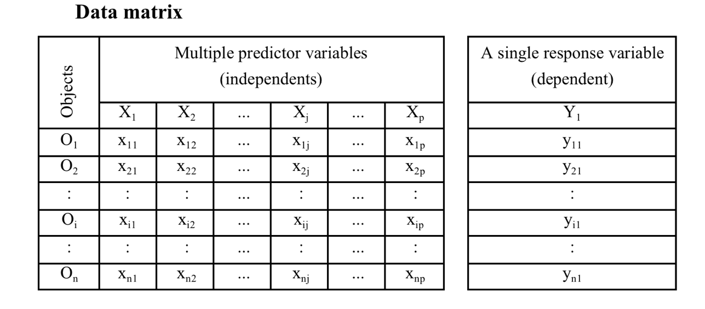

```{r setup, include=FALSE}
knitr::opts_chunk$set(fig.width=5, fig.height=5, fig.align="center", collapse = TRUE, comment = "##", dev="png", error = TRUE)
library(RColorBrewer)
cols = brewer.pal(8, "Set1")

## to use tables
library(knitr)
library(kableExtra)
```

## Multiple linear regression model

<div class="left lt">

Multiple metric continuous independent predictors are used to predict *one* metric response variable.

Model formulation: linear combination of *k* predictors:
$$
\mathbb{E}(y) =\beta_0+\beta_1X_1+\beta_2X_2+...+\beta_kX_k
$$

* $\beta_0$ is the intercept
* $\beta_1...\beta_k$ are *partial* regression coefficients for $X_1...X_k$
* The change in $\mathbb{E}(y)$ per unit change in an $X_j$ holding all other $X$-variables constant
* $\beta_0...\beta_k$ are estimated by $b_0...b_k$ from the sample.
</div>

<div class="right rt">
{width=90%}
</div>


## Multiple linear regression model

<div class="left lt">

Using matrix notation:

$$
\hat{y} = \mathbf{X}\mathbf{B}
$$

$\mathbf{B}$ is the **parameter vector**

$\mathbf{X}$ is the **design matrix**

$$
\mathbf{X} = \begin{bmatrix}
1 & x_{1,1} & x_{2,1} & \dots & x_{k,1} \\
1 & x_{1,2} & x_{2,2} & \dots & x_{k,2} \\
\vdots & \vdots & \vdots & \dots & \vdots \\
1 & x_{1,n} & x_{2,n} & \dots & x_{k,n} \\
\end{bmatrix}
$$

<br/>

$$
\begin{aligned}
\mathbb{E}(y) = \hat{y} & = \mathbf{X}\mathbf{B} \\
y &= \mathbf{X}\mathbf{B} + \epsilon  \\
\epsilon & \sim \mathcal{N}(0, s_\epsilon)
\end{aligned}
$$

The equation is a **linear system** and can be solved with linear algebra by OLS, minimizing the sum of squared residuals:

$$
\mathrm{min}: \sum \epsilon^2 = \sum \left (\mathbf{X}\mathbf{B} - y \right)^2
$$
</div>
<div class="right rt">
{width=90%}


</div>

## Multiple linear regression: Hypotheses

1. $\mathbf{H_{0,regression}}$: **All partial regression coefficients are zero**. 
	- The model (i.e., the linear system $\mathbf{XB}$) does not explain any of the variation in $y$.
	- Test with ANOVA as with linear regression against a null model (with no predictors).

## Multiple linear regression: Hypotheses

1. $\mathbf{H_{0,regression}}$: **All partial regression coefficients are zero**. 
	- The model (i.e., the linear system $\mathbf{XB}$) does not explain any of the variation in $y$.
	- Test with ANOVA as with linear regression against a null model (with no predictors).

2. $\mathbf{H_{0,coef_j}}$: **An individual partial regression coefficient, the slope of the relationship between $y$ and $x_j$, is zero**. 
	- with $k$ predictors, there are $k$ such hypotheses.
	- test with a $t$-statistic

## Multiple linear regression: Goodness of fit

* Explained variance: **multiple $R^2$**
* Similar interpretation as with simple LR: the percentage of variation of Y explained by *all* X variables.

## Multiple linear regression: Goodness of fit

* Explained variance: **multiple $R^2$**
* Similar interpretatin as with simple LR: the percentage of variation of Y explained by *all* X variables.

BUT: adding predictors (even random numbers) will always increase $R^2$ (by making the model more flexible)

One solution is **Adjusted** $R^2$: penalises $R^2$ for additional model complexity.

$$
{R^2}_{adj}=1-\frac{SS_{res}}{SS_{tot}}\times\frac{n-1}{n-k}
$$

## Choosing predictors

Simplest approach: fit a full model with all predictors, then drop anything that is non-significant

## Choosing predictors

Simplest approach: fit a full model with all predictors, then drop anything that is non-significant

### Caveats:

* Predictors may represent important hypotheses
* Predictors can influence other predictors!
	- $x_2$ is significant only if $x_1$ is in the model, but $x_1$ is never significant
* Interactions must include all main effects:
	- $\mathbb{E}(y) = b_0 + b_1x_1 + b_2x_2 + b_3x_1x_2$
	- A model with $b_3$ must include $b_1$ and $b_2$, even if non-significant!
* High-order terms (e.g., polynomials) must also include all lower-order terms
	- $\mathbb{E}(y) = b_0 + b_1x_1 + b_2x_1^2$
	- A model with $b_2$ must include $b_1$ 


## Comparing effects

Do not compare p-values to determine which predictor is "better"

Rather, compare **standardized effects**

Either standardize all predictors (especially if $s_{x_1} >> s_{x_2}$) or standardize the coefficients.

$$
{b_j}^*=b_j\frac{s_{X_j}}{s_Y}
$$

Higher ${b_j}^*$ means stronger influence of $x_j$. Note that in software output ${b_j}^*$ is often referred to as $\beta_j$.


## Choosing models based on information theory

The best model in a set is the one that lets you accurately predict the value of a new unobserved outcome $y_*$ based on the vector of inputs/predictors $\mathbf{X}_*$.

We want to minimize the **expected prediction error** 

$$
	\mathbb{E}(\epsilon_*) = | \hat{y}_* - \mathbf{BX}^* |
$$

## Choosing models based on information theory

The best model in a set is the one that lets you accurately predict the value of a new unobserved outcome $y_*$ based on the vector of inputs/predictors $\mathbf{X}_*$.

We want to minimize the **expected prediction error** 

$$
	\mathbb{E}(\epsilon_*) = | \hat{y}_* - \mathbf{BX}^* |
$$

We usually do not measure it, rather we approximate it with Akaike's Information Criterion (AIC)

$$
\mathrm{AIC} = n \ln \left( \frac{SS_{err}}{n} + \right ) + 2k
$$
Like adjusted $R^2$, it penalises models for complexity

Lower AIC is better, models with AIC within 2 units are equivalent 

## Choosing models based on information theory

**Question**: What measurements can be used to predict bill length?

<div class="left lt">
```{r echo = FALSE}
data(penguins, package = "palmerpenguins")
penguins = as.data.frame(penguins)
penguins = penguins[complete.cases(penguins), ]
penguins = subset(penguins, species == "Gentoo")

plot(penguins[, 3:7])
```

</div>

<div class="right rt">
```{r}
full_mod = lm(bill_length_mm ~ bill_depth_mm + flipper_length_mm + 
			  	body_mass_g + sex, data = penguins)
summary(full_mod)

```
</div>


## Choosing models based on information theory

**Question**: What measurements can be used to predict bill length?

Does sex matter? Or can a sex effect be more simply explained by size?

<div class="left lt">
```{r echo = FALSE}
data(penguins, package = "palmerpenguins")
penguins = as.data.frame(penguins)
penguins = penguins[complete.cases(penguins), ]
penguins = subset(penguins, species == "Gentoo")

plot(penguins[, 3:7])
```

</div>

<div class="right rt">
```{r}
simple_mod = lm(bill_length_mm ~ bill_depth_mm + flipper_length_mm + 
					body_mass_g, data = penguins)
AIC(full_mod) - AIC(simple_mod)

```
</div>


## Model building

>- Stepwise model selection, implemented `step` in R will build a model for you automatically, adding or dropping terms in an attempt to find a model that minimises AIC 
>- This is an ok approach for **exploration** but not for **hypothesis testing**
>- p-values resulting from such a model are not useful
>- We should view such models as hypotheses to be explored with further data collection
>- Unwise to speak of significance

## Model building

* Stepwise model selection, implemented `step` in R will build a model for you automatically, adding or dropping terms in an attempt to find a model that minimises AIC 
* This is an ok approach for **exploration** but not for **hypothesis testing**
* p-values resulting from such a model are not useful
* We should view such models as hypotheses to be explored with further data collection
* Unwise to speak of significance

Such models are prone to **Overfitting**:" irrelevant predictors that correlate with the outcomes by chance result in a model that fits the dataset well, but performs poorly when challenged with new data (low **transferability**)


## Pitfalls: Model flexibility

<div class="left lt">

```{r fig.show='hide'}
hom = data.frame(
	body_mass_kg = c(34.5, 35.5, 37, 41.5, 55.4, 53.4, 60.9), 
	brain_volume_cc = c(652.4, 464.5, 448.8, 549.3, 819.9, 1540.4, 963.2)
)
mod1 = lm(brain_volume_cc ~ body_mass_kg, data = hom)
```
</div>

<div class="right rt">
```{r echo = FALSE, fig.width = 8, fig.height = 12}
par(mfrow = c(3, 2), bty='n', pch = 16, mgp = c(2,1,0), mar = c(3,3,0,0), cex = 1.5)
xt = 35
yt = 1300
tcex = 0.8
xp = data.frame(body_mass_kg = seq(30, 65, length.out = 200))
plot(brain_volume_cc ~ body_mass_kg, data = hom, 
	 xlab = "Body Mass (kg)", ylab = "Brain Volume (cc)")
lines(xp$body_mass_kg, predict(mod1, newdata = xp))
text(xt, yt, paste(expression(R^2), "=", round(summary(mod1)$r.squared, 2)), pos = 4, cex = tcex)
```

</div>

## Pitfalls: Model flexibility

<div class="left lt">

```{r fig.show='hide'}
mod1 = lm(brain_volume_cc ~ body_mass_kg, data = hom)
mod2 = lm(brain_volume_cc ~ body_mass_kg + I(body_mass_kg^2), data = hom)
```
</div>

<div class="right rt">
```{r echo = FALSE, fig.width = 8, fig.height = 12}
par(mfrow = c(3, 2), bty='n', pch = 16, mgp = c(2,1,0), mar = c(3,3,0,0), cex = 1.5)
plot(brain_volume_cc ~ body_mass_kg, data = hom, 
	 xlab = "Body Mass (kg)", ylab = "Brain Volume (cc)")
lines(xp$body_mass_kg, predict(mod1, newdata = xp))
text(xt, yt, paste(expression(R^2), "=", round(summary(mod1)$r.squared, 2)), pos = 4, cex = tcex)

plot(brain_volume_cc ~ body_mass_kg, data = hom, 
	 xlab = "Body Mass (kg)", ylab = "Brain Volume (cc)")
lines(xp$body_mass_kg, predict(mod2, newdata = xp))
text(xt, yt, paste(expression(R^2), "=", round(summary(mod2)$r.squared, 2)), pos = 4, cex = tcex)

```

</div>


## Pitfalls: Model flexibility

<div class="left lt">

```{r fig.show='hide'}
mod1 = lm(brain_volume_cc ~ body_mass_kg, data = hom)
mod2 = lm(brain_volume_cc ~ body_mass_kg + I(body_mass_kg^2), data = hom)
mod3 = lm(brain_volume_cc ~ body_mass_kg + I(body_mass_kg^2) + I(body_mass_kg^3), data = hom)
mod4 = lm(brain_volume_cc ~ body_mass_kg + I(body_mass_kg^2) + I(body_mass_kg^3) + I(body_mass_kg^4), data = hom)
mod5 = lm(brain_volume_cc ~ body_mass_kg + I(body_mass_kg^2) + I(body_mass_kg^3) + I(body_mass_kg^4) + I(body_mass_kg^5), data = hom)
mod6 = lm(brain_volume_cc ~ body_mass_kg + I(body_mass_kg^2) + I(body_mass_kg^3) + I(body_mass_kg^4) + I(body_mass_kg^5) + I(body_mass_kg^6), data = hom)
```
</div>

<div class="right rt">
```{r echo = FALSE, fig.width = 8, fig.height = 12}
par(mfrow = c(3, 2), bty='n', pch = 16, mgp = c(2,1,0), mar = c(3,3,0,0), cex = 1.5)
plot(brain_volume_cc ~ body_mass_kg, data = hom, ylim = c(400, 1600),
	 xlab = "Body Mass (kg)", ylab = "Brain Volume (cc)")
lines(xp$body_mass_kg, predict(mod1, newdata = xp))
text(xt, yt, paste(expression(R^2), "=", round(summary(mod1)$r.squared, 2)), pos = 4, cex = tcex)

plot(brain_volume_cc ~ body_mass_kg, data = hom, ylim = c(400, 1600),
	 xlab = "Body Mass (kg)", ylab = "Brain Volume (cc)")
lines(xp$body_mass_kg, predict(mod2, newdata = xp))
text(xt, yt, paste(expression(R^2), "=", round(summary(mod2)$r.squared, 2)), pos = 4, cex = tcex)

plot(brain_volume_cc ~ body_mass_kg, data = hom, ylim = c(400, 1600),
	 xlab = "Body Mass (kg)", ylab = "Brain Volume (cc)")
lines(xp$body_mass_kg, predict(mod3, newdata = xp))
text(xt, yt, paste(expression(R^2), "=", round(summary(mod3)$r.squared, 2)), pos = 4, cex = tcex)
plot(brain_volume_cc ~ body_mass_kg, data = hom, ylim = c(400, 1600),
	 xlab = "Body Mass (kg)", ylab = "Brain Volume (cc)")
lines(xp$body_mass_kg, predict(mod4, newdata = xp))
text(xt, yt, paste(expression(R^2), "=", round(summary(mod4)$r.squared, 2)), pos = 4, cex = tcex)
plot(brain_volume_cc ~ body_mass_kg, data = hom, ylim = c(400, 1800),
	 xlab = "Body Mass (kg)", ylab = "Brain Volume (cc)")
lines(xp$body_mass_kg, predict(mod5, newdata = xp))
text(xt, yt, paste(expression(R^2), "=", round(summary(mod5)$r.squared, 2)), pos = 4, cex = tcex)
plot(brain_volume_cc ~ body_mass_kg, data = hom, 
	 xlab = "Body Mass (kg)", ylab = "Brain Volume (cc)", ylim = c(200, 1800))
lines(xp$body_mass_kg, predict(mod6, newdata = xp))
text(xt, yt, paste(expression(R^2), "=", round(summary(mod6)$r.squared, 2)), pos = 4, cex = tcex)
```

</div>


## The curse of dimensionality

* High dimensional spaces (lots of $x$ variables) require lots of data
* Rule-of-thumb minimum: $n > 5k$
   - with large $k$, even more is needed (as the necessary n to cover multidimensional space increases as a power law of k).

<br/>

Assume predictors $X_1$ and $X_2$ and limited sampling effort of n=16:

1. When studying only one predictor, we can cover its entire range of interest well. 
2. When studying two predictors with the same effort, our samples are dispersed in the 2D-space. We can´t get the same density but still cover the entire 2D-space in a regular grid.
3. The more likely reality produces a dispersed distribution over the 2D-space with well and less well covered areas. The data becomes **sparse**. Maintaining high sampling density becomes increasingly difficult when more than two 2 dimensions are involved. We don´t cover our predictors well enough anymore! 

<br/>

```{r, echo=FALSE, fig.width=14}

par(mfrow = c(1,3))
n = 16
x = seq(-3, 3, length.out=n)
plot(x, rep(0, n), yaxt='n', pch = 16, bty='n', ylab = "",
     main = paste("avg distance =", round(x[2]-x[1], 2)))

x1 = x2 = seq(-3, 3, length.out=sqrt(n))
dat = expand.grid(x1, x2)

plot(dat$Var1, dat$Var2, pch = 16, bty='n', 
     main = "avg distance ≈ 2.42", xlab=expression(x[1]), 
     ylab=expression(x[2]))

plot(runif(16, -3, 3), runif(16, -3, 3), pch = 16, bty='n', 
     main = "much unsampled space", xlab=expression(x[1]), 
     ylab=expression(x[2]), xlim=c(-3, 3), ylim=c(-3, 3))

```


## Additional assumptions
* All $X_j$ measured with no/minimal error
* Linearity between $Y$ and $BX$, in other words linear relationships are assumed between $Y$ and every $X_j$ adjusted for all other $X$-variables (hard to check!)
* Normally distributed residuals with constant variance
   - use `qqnorm(residuals(mod))`, `qqline(residuals(mod))`, and `plot(mod)`
   - plot $|res|$ or $res^2$ against $\hat{Y}$ to detect variance heterogeneity (no trend!)
   - examine residuals for high leverage/influence
   
* Limited multicollinearity
   - quick test: run `cor` on predictor matrix, check for large correlations
   - formal test: Variance Inflation Factors (VIF) < 10 (ish)

## Dealing with multicollinearity

Why is this a problem?

* Numerical instability (hard to find parameter estimates)
* large CIs for regression slopes
* unsure importance of predictors (but could still be good overall model).

## Variance inflation factors

Ignoring $y$ for a moment, we can perform regressions of the $x$ variables against each other:

$$
x_i = b_0 + b_1x_1 \dots b_kx_k +\epsilon \mathrm{~;~excluding~x_i}
$$

Large $R^2_i$ would argue for redundancy of $x_i$ (its information is already contained in a linear combination of all other $x$-variables). 

$VIF_i$ is a transformation of $R^2_i$:

$$
\mathrm{VIF}_i = \frac{1}{1-R^2_i}
$$
The VIF (name!) tells you by how much the SE of a regression coefficient increases due to inclusion of additional $x$-variables:

$$
s_b = s_{b,\rho=0}\sqrt{\mathrm{VIF}}
$$

$s_{b,\rho=0}$ is the standard error of a regression coefficient, assuming that all predictors are uncorrolated


## VIF in R

```{r}
# install.packages(car) # install the package, only need to do this once!
library(car)

full_mod = lm(bill_length_mm ~ bill_depth_mm + flipper_length_mm + 
                body_mass_g + sex, data = penguins)
vif(full_mod)
```

Procedure: if any VIF > 10, drop the variable with the largest VIF, repeat

## Presenting Results

### Always:

1. A complete description of the model, all variables, and whatever variable selection method
2. A table of regression parameters, std errors or confidence intervals, p-values
3. $R^2$ or another metric of goodness of fit


## Presenting Results

### Graphical options

1. Scatterplot-like representations not possible for >2 predictors
2. Diagnostics (qq-plots, residulas vs fits) are even more important!
3. **Partial response curves**: effect of each variable, holding others constant

{width=50%}


