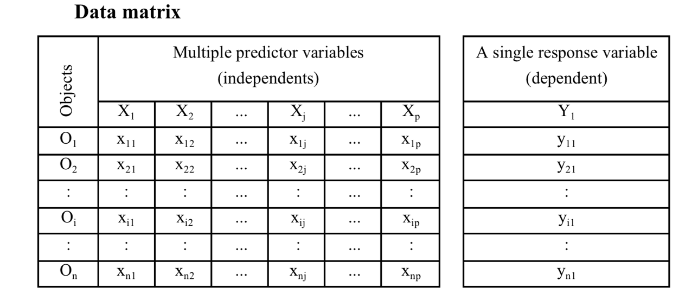
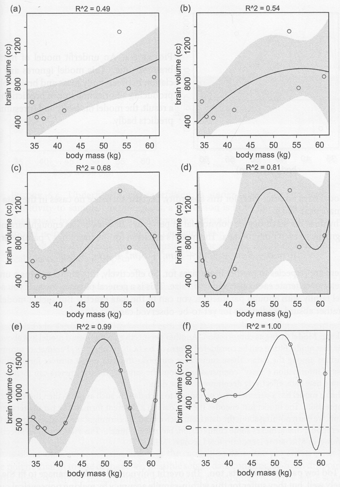

```{r setup, include=FALSE}
knitr::opts_chunk$set(fig.width=5, fig.height=5, fig.align="center", collapse = TRUE, comment = "##", dev="png")
library(RColorBrewer)
cols = brewer.pal(8, "Set1")

## to use tables
library(knitr)
library(kableExtra)
```

## Multiple linear regression: Model

<div class="left lt">

Multiple metric continuous independent predictors are used to predict *one* metric response variable.



Already met 2-way ANOVA and ANCOVA as models with >1 predictor.

<br/>

Model formulation as a linear combination of *k* predictors:
$$
Y=\beta_0+\beta_1X_1+\beta_2X_2+...+\beta_kX_k
$$
$\beta_0$ is the intercept
$\beta_1...\beta_k$ are *partial* regression coefficients for $X_1...X_k$, expressing the change in $Y$ per unit change in a particular $X_j$ holding all other $X$-variables constant (for instance, effect of $X_1$ while adjusting for any effects of $X_2...X_k$).

$\beta_0...\beta_k$ are estimated by $b_0...b_k$ from the sample.

</div>

<div class="right rt">

Using matrix notation:

$$
\hat{y} = \mathbf{X}\mathbf{B}
$$

$\mathbf{B}$ is the **parameter vector**

$\mathbf{X}$ is the **design matrix**

$$
\mathbf{X} = \begin{bmatrix}
1 & x_{1,1} & x_{2,1} & \dots & x_{k,1} \\
1 & x_{1,2} & x_{2,2} & \dots & x_{k,2} \\
\vdots & \vdots & \vdots & \dots & \vdots \\
1 & x_{1,n} & x_{2,n} & \dots & x_{k,n} \\
\end{bmatrix}
$$

<br/>

$$
\begin{aligned}
\hat{y} & = \mathbf{X}\mathbf{B} \\
y &= \mathbf{X}\mathbf{B} + \epsilon  \\
\epsilon & \sim \mathcal{N}(0, s_\epsilon)
\end{aligned}
$$

The equation is a **linear system** and can be solved with linear algebra by OLS, minimizing the sum of squared residuals:

$$
\mathrm{min}: \sum \epsilon^2 = \sum \left (\mathbf{X}\mathbf{B} - y \right)^2
$$

</div>

## Multiple linear regression: Hypotheses

1. $\mathbf{H_{0,regression}}$: **All partial regression coefficients are zero**. The model (i.e., the linear system $\mathbf{XB}$) does not explain any of the variation in $y$.

Tested by ANOVA (as in simple LR): $SS_{reg}$ and $SS_{res}$ converted to $MS_{reg}$ and $MS_{res}$, then F-ratio of explained to residual variance to get P.

2. $\mathbf{H_{0,coef_j}}$: **An individual partial regression coefficient, the slope of the relationship between $y$ and $x_j$, is zero**. k predictors give rise to k such hypotheses.

Tested with $t$-statistic (in output of `lm`) or by forming CIs for each partial regression coefficient and check overlap with 0. Alternatively: Use nested ANOVA models to compare fit of a full and a reduced model (without the predictor in question) and check for a significant change of $SS_{reg}$ using a partial F-test.

<br/>

Explained variance: **multiple $r^2$** (analogous to simple regression) = “the percentage of variation of Y explained by *all* X variables.

BUT: More predictors (even if random) always cause higher $r^2$, therefore **adjusted $r^2$**, which accounts for the number of predictors.

$$
{r^2}_{adj}=1-\frac{SS_{res}}{SS_{tot}}\cdot\frac{n-1}{n-k}
$$
The idea is to balance the increment in $r^2$ with the additional complexity of the model. The cost of adding an additional predictor must be balanced by an actual gain in $r^2$.


## Which predictors are important?

1. Consider dropping non-significant predictors
    - unless you know/strongly suspect they are important
    - $x_1$ might be significant, but only when $x_2$ is in the model!
    - interactions (more on this later) must always have the main effect ($b_1x_1 + b_2x_2 + b_3x_1x_2$)
    - higher-order polynomials should always have lower-order ($b_1x+b_2x^2$)
2. Compare slopes in a scale-independent way
    - standardize your predictors (especially if $s_{x_1} >> s_{x_2}$), or
    - standardize the coefficients

$$
{b_j}^*=b_j\frac{s_{X_j}}{s_Y}
$$

Higher ${b_j}^*$ means stronger influence of $X_j$. Note that in software output ${b_j}^*$ is often referred to as $\beta_j$.

## Model building

Classical tools to search for important predictors to include: forward and backward stepwise modelling with addition or dropping of predictors based on F or P-values (`drop` or `add` or `step`).

<br/>

**Model building**: The extensive search to identify important predictors using leads away from strict hypothesis testing. Prediction quality counts more than significance testing, thus also insignificant predictors may be worthwhile to keep and extensive model building may happen.

<br/>

**Overfitting**: In an **overfitted** model a predictor contributes to an increase of $r^2$ by random noise in the *specific* dataset used to build the model.

The inclusion of *irrelevant* predictors:

* affects the regression of coefficients of actually relevant predictors.
* lowers transferability of the model to the population or a new dataset.
* decreases low $r^2$ when applying a model to a new dataset.

**Ways out**:

1. Use ${r^2}_{adj}$ when judging model fit and comparing models: Large differences between $r^2$ and ${r^2}_{adj}$ point to an overfitted model.

2. Use information criteria to compare models: The **Akaike Information criterion** (AIC) aims to identify a **most parsimonious model**,  i.e. the model achieving the best fit with the lowest complexity (=number of predictors). Similarly to ${r^2}_{adj}$ it is computed by "punishing" a measure of model fit with a term involving the number of predictors k:

$$
AIC=n\cdot{\ln{SS_{res}}}+2(k+1)-n\cdot{\ln{n}}
$$
We aim for models with low AIC. Models with a $\Delta{AIC}<2$ are considered equivalent.

<br/>

**Validation techniques**:

* Partitioning the dataset into a *training set* used for model building and a *validation set* (ratio depending on data availability).
* Leave-1-out **cross-validation**: leaves out 1 observation at a time, forms the model without it and predicts for the left-out case. A 1:1 plot of predicted vs. observed for left-out cases (and a correlation coefficient) helps to assess validity of a model.

</div>


## Pitfalls: Model flexibility

<div class="left lt">

{width=70%}
</div>

<div class="right rt">
```{r eval=FALSE}
lm(brain ~ mass, data = hominid)
lm(brain ~ mass + I(mass^2), data = hominid)
lm(brain ~ mass + I(mass^2) + I(mass^3), data = hominid)
## etc...
```

</div>

## The curse of dimensionality

* High dimensional spaces (lots of $x$ variables) require lots of data
* Rule-of-thumb minimum: $n > 5k$
   - with large $k$, even more is needed (as the necessary n to cover multidimensional space increases as a power law of k).

<br/>

Assume predictors $X_1$ and $X_2$ and limited sampling effort of n=16:

1. When studying only one predictor, we can cover its entire range of interest well. 
2. When studying two predictors with the same effort, our samples are dispersed in the 2D-space. We can´t get the same density but still cover the entire 2D-space in a regular grid.
3. The more likely reality produces a dispersed distribution over the 2D-space with well and less well covered areas. The data becomes **sparse**. Maintaining high sampling density becomes increasingly difficult when more than two 2 dimensions are involved. We don´t cover our predictors well enough anymore! 

<br/>

```{r, echo=FALSE, fig.width=14}

par(mfrow = c(1,3))
n = 16
x = seq(-3, 3, length.out=n)
plot(x, rep(0, n), yaxt='n', pch = 16, bty='n', ylab = "",
     main = paste("avg distance =", round(x[2]-x[1], 2)))

x1 = x2 = seq(-3, 3, length.out=sqrt(n))
dat = expand.grid(x1, x2)

plot(dat$Var1, dat$Var2, pch = 16, bty='n', 
     main = "avg distance ≈ 2.42", xlab=expression(x[1]), 
     ylab=expression(x[2]))

plot(runif(16, -3, 3), runif(16, -3, 3), pch = 16, bty='n', 
     main = "much unsampled space", xlab=expression(x[1]), 
     ylab=expression(x[2]), xlim=c(-3, 3), ylim=c(-3, 3))

```


## Additional assumptions
* All $X_j$ measured with no/minimal error
* Linearity between $Y$ and $BX$, in other words linear relationships are assumed between $Y$ and every $X_j$ adjusted for all other $X$-variablese (hard to check!)
* Normally distributed residuals with constant variance
   - use `qqnorm(residuals(mod))`, `qqline(residuals(mod))`, and `plot(mod)`
   - plot $|res|$ or $res^2$ against $\hat{Y}$ to detect variance heterogeneity (no trend!)
   - examine residuals for high leverage/influence
   
* Limited multicollinearity
   - quick test: run `cor` on predictor matrix, check for large correlations
   - formal test: Variance Inflation Factors (VIF) < 10 (ish)

Highly correlating predictor variables cause model instability, large CIs for regression slopes, unsure importance of predictors (but could still be good overall model).

**Assessing collinearity by VIF**:
Ignoring $y$ for a moment, we can perform regressions of the $x$ variables against each other:

$$
x_i = b_0 + b_1x_1 \dots b_kx_k +\epsilon \mathrm{~;~excluding~x_i}
$$

Large $R^2_i$ would argue for redundancy of $x_i$ (its information is already contained in a linear combination of all other $x$-variables). $VIF_i$ is a transformation of $R^2_i$:
$$
\mathrm{VIF}_i = \frac{1}{1-R^2_i}
$$

> Matt, please cast your equation of how VIF affects SE of regression coefficients into words. My explanation is likely not correct. I don´t understand the rho=0 in the equation.

The VIF (name!) tells you by how much the SE of a regression coefficient increases due to inclusion of additional $x$-variables:

$$
s_b = s_{b,\rho=0}\sqrt{\mathrm{VIF}}
$$

Get VIF with `car::vif(full_model)` for all predictors of a particular model.

## MLR: Results presentation

Geometrical representation / graphing:

1. A plane in 3D-space for two predictors, but higher-order surfaces are needed (and not printable) for >2 predictors.
2. 2 predictors defining a plane, response as color gradient in dots or by using contour lines. 
3. Often observed vs. predicted values (should fall on a 1:1 line) are graphed to at least provide a graphical assessment of model quality.


## MLR in R

```{r}
# data from limnology: SPM in lakes
# required: MLR to predict SPM from other variables
data<-read.table(file="data/LakeSPM.txt",header=TRUE)[,-c(1:2)] 
# remove first two variables (just lakename and # in dataset)

plot(data)   # correlations? collinearity?
boxplot(scale(data)) # distributions?
data[,-c(5,10)]<-log(data[,-c(5,10)]) # transform all except pH and Vd

# dropping colinear variables using VIF
mlr.full<-lm(spm~.,data=data) # makes a model with all predictors
library(car)
vif(mlr.full)
# check high VIF for area
summary(lm(area~.-spm,data=data)) # -> r2 is 1!
# continue dropping variables until VIF <5-10
del<-which(names(data) %in% c("area","Dm","Dmax"))
data<-data[,-del]
mlr.full<-lm(spm~.,data=data) # refit after variable deletion

# start with simple regression model 
simple.mod1<-lm(spm~TP,data=data)
summary(simple.mod1)
plot(spm~TP,data=data)
abline(simple.mod1,col="red")

# forward stepwise MLR building using F
# start with TP and see if other terms can be added to the model
names(data)
add1(simple.mod1,scope=~pH+TP+T+Q+DR+Vd,test="F") 
# adds single terms and compares models with an F-test

mlr1<-lm(spm~TP+pH,data=data)
summary(mlr1)
# -> good model, try adding more terms

# backward stepwise MLR building using F
# start with full model (all terms) and see if terms can be dropped
summary(mlr.full)
drop1(mlr.full,test="F")
# -> drop Q (lowest F, highest P, also makes lowest AIC)
mlr2<-lm(spm~pH+TP+T+DR+Vd,data=data)
summary(mlr2)
# continue until no more dropping...

# automatic stepwise search based on AIC
step(mlr.full,direction="backward")
step(simple.mod1,scope=~pH+TP+T+Q+DR+Vd,direction="forward")
# same solutions! compare with selection by F!

# combined forward and backward selection based on AIC
step(mlr.full,direction="both")
mlr3<-lm(spm~pH+TP+DR+Vd,data=data)
AIC(mlr3)
extractAIC(mlr3)
```


