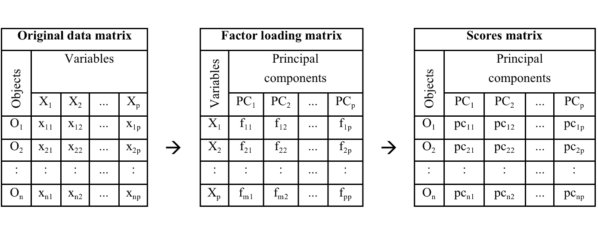
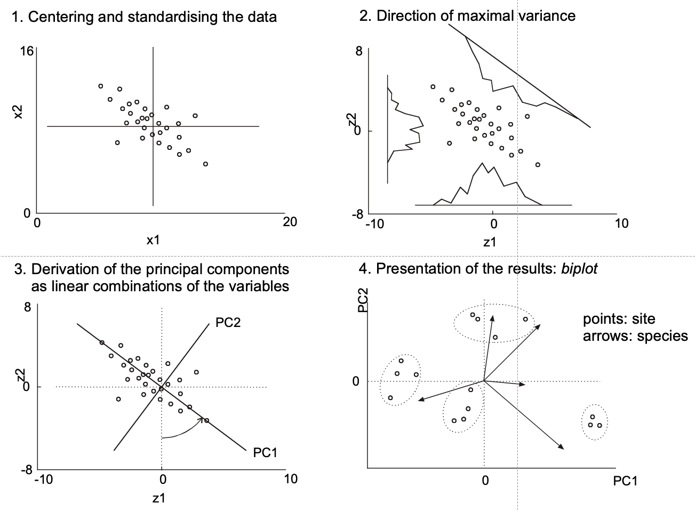

```{r setup, include=FALSE}
knitr::opts_chunk$set(fig.width=5, fig.height=5, fig.align="center", collapse = TRUE, comment = "##", dev="png")
library(RColorBrewer)
cols = brewer.pal(8, "Set1")

## to use tables
library(knitr)
library(kableExtra)
```

## Multivariate statistics - in R
What you have learned so far (among other things):
{width=80}


However, ecological datasets often have one or both of these datasets (if not more):

{width=800%}


## A short intro to classical ordination methods - in R
**Ordination** is an umbrella term for multivariate methods which arrange data along a
gradient (axis, scale). A sloppy explanation is "putting things in order".

**Ordination** is a word almost exclusively used by ecologists. Outside most of these methods are known as **scaling techniques**. The phrase **gradient analysis** makes a bit more sense in ecology.


## Principal component analysis (PCA)

PCA can be understood as a MLR on theoretical (latent) instead of observed dependent variables.

The regression coefficients in PCA are **factor loadings**.

The predicted values of the theoretical dependent are **scores**.



For instance, in a PCA on this matrix of n objects times p variables PC1 is computed as:

$$
PC_1=f_1X_1+f_2X_2+...+f_pX_p
$$
There must be as many PCs as original variables. The factor loading matrix translates p $X$-variables into p $PCs$.

PCA can be understood as a rotation of the original coordinate system made up of p $X$-variables into a new coordinate system defined by p $PCs$.

<br/>




## Principal component analysis (PCA) in R

```{r}
library(vegan)
library(shape) # plots nice arrows
setwd("Z:/COURSES/datenanalyse/vu_datenanalyse/unit_3") #set working directory
mara.raw<-read.table(file="data/MaraRiver.txt",header=TRUE) # water chemistry in 54 streams, 3 types of land use
dim(mara.raw)

head(mara.raw)
mara<-mara.raw[,c(4,9:26)] #only select columns of interest

which(is.na(mara), arr.ind=TRUE) #find rows with NAs
mara<-mara[-6,] #delete row with NAs

landuse<-mara$landuse
wc<-mara[,-1]

apply(wc, 2, hist) #check normal distribution
wc[,-2]<-log(wc[,-2]) #log-transform concentration data (not pH)
apply(wc, 2, hist) #check normal distribution

plot(wc) # check potential for PCA by correlation plot

pca<-prcomp(scale(wc),center=F,scale.=F)
pca<-prcomp(wc,center=T,scale.=T)   # equivalent to line above

summary(pca)

pca$sdev # stdevs of PCs (squares are eigenvalues); eigenvalues correspond to the variance of their respective principal component (PC)
eigenvals(pca)==pca$sdev^2

head(scores<-pca$x) # site scores on all PCs

head(scale(wc) %*% pca$rotation) # to manually compute scores from variables and loadings
head(loadings<-pca$rotation) # the variable loadings


# how many axes should be kept?
#there is not the one well-accepted method
#1. visual examination
#looking for a point at which the proportion of variance explained by each subsequent principal component drops off (elbow of scree plot)
screeplot(pca, npcs=length(pca$sdev), type = "lines") # plots eigenvalues vs. principal components (PCs) #
#2 Kaiser-Guttman criterion
# retain PCs with eigenvalues>1, PCs with eigenvalues<1 contain less informatin than one original variable
abline(h=1,col="red")
# eigenvalue of PC5<1
#3. variance explained method: set an "arbitrary" threshold of explained variance (e.g. 70%, 80%, 90%) and choose as many PCs till threshold is reached.
summary(pca)

# -> the first 3-4 PCs seem useful, and just PC1 and PC2 alone are already explaining a lot of overall variance


# for a DISTANCE BIPLOT (focus is on sites, "scaling 1")
# each principal component has variance given by eigenvalue, loadings remain unscaled
str(landuse)
landuse<-as.factor(landuse)
plot(scores[,1:2],asp=1,pch=21, cex=2, bg=landuse) # note asp=1
arrows<-loadings*15 # with extension factor
Arrows(x0=0,y0=0,x1=arrows[,1],y1=arrows[,2],col="darkgreen")
text(x=arrows[,1]*1.2,y=arrows[,2]*1.2,labels=names(wc),cex=0.8)
#text(scores[,1:2], rownames(wc), pos=2)
legend("bottomright", legend=c("Agriculture", "Mixed", "Forest"), pch=21, pt.cex=2, pt.bg=c("black","green","darkred"), cex=1.5)

biplot(pca,scale=0)
# in this plot:
# 1) distances among sites are approximating true Euclidean distances in multivariate space
# 2) angles between arrows do not reflect correlations among variables
# 3) projecting site on descriptor at right angle gives its appr. descriptor value

# for a CORRELATION BIPLOT (focus is on variables, "scaling 2")
# each principal component is weighted by 1/sqrt(eigenvalue), so it has variance 1
var(scores[,1]/pca$sdev[1]) # just demo
plot(scores[,1]/pca$sdev[1],scores[,2]/pca$sdev[2],pch=21,bg=landuse,asp=1)
# loadings are weighted by sqrt(eigenvalues)
arrows<-loadings*matrix(pca$sdev,nrow=nrow(loadings),ncol=ncol(loadings),byrow=TRUE)
arrows<-arrows*2 # choose extension factor
Arrows(x0=0,y0=0,x1=arrows[,1],y1=arrows[,2],col="purple")
# as alternative just compute correlation of scores with original data ("structure coefficients")
(structure<-cor(wc,scores))
structure<-2*structure
Arrows(x0=0,y0=0,x1=structure[,1],y1=structure[,2],col="red")
text(x=arrows[,1]*1.3,y=arrows[,2]*1.2,labels=names(wc),cex=0.7)

biplot(pca,scale=1)
# in this plot
# 1) distances among sites are not approximating true Euclidean distances in multivariate space
# 2) angles between arrows reflect correlations among variables (NOT proximity of arrow heads)
# 3) projecting site on descriptor at right angle gives its appr. descriptor value

# PCA using the rda function from the vegan package
pca2<-rda(X=wc,scale=TRUE)
summary(pca2,scaling=1)
summary(pca2,scaling=2)

layout(matrix(1:2, nrow=1))
biplot(pca2,scaling=1)
biplot(pca2,scaling=2)
# note different scaling factors, but solution remains same


##############################
# some follow-up suggestions #
# test PCA-axes for effect of landuse or stream size (as log(Q)) using ANOVA or ANCOVA
# correlate PCA-axes with other potential "controlling" variables (e.g. canopy cover) to give "meta-dimensions" more meaning
# useful function envfit() to relate additional variables to the ordination space
```


## Redundancy analysis (RDA) in R
The classical ordination methods always target **dimension reduction**

* are based on **linear or unimodal** relationships, and
* may involve **direct** regression on a 2nd matrix of explanatory variables (as opposed to **indirectly** reconstructing gradients from a single data matrix)


## Redundancy analysis (RDA) in R
<div class="left lt">

Two involved matrices: one dependent, one independent.

(Note: For correlation of two matrices see CCorA (Canonical correlation analysis) $\neq$ CCA.)

**Redundancy**: The proportion of total variance of in the response variables that can be explained linear combinations of predictors.

Two steps:

1. MLRs relate each response variable to the independent matrix and predict the response.
2. The matrix of predicted response variables (same size as original: n objects * p variables) is subject to PCA.

The response variables are **constrained** to be linear combinations of the predictors first! The PCA can only "ordinate" variation of the responses that is relatable to predictors.

Significance tests for the overall model, for the various RDA-axes and for the individual predictors are available (permutation-based).

</div>

<div class="right rt">

{width=90%}

Site scores:

* One set of *unconstrained* scores (site scores), $YU$.
* One set of *constrained* scores (LC scores), $\hat{Y}U$.

</div>

## Redundancy analysis (RDA) in R

```{r}
zwc<-scale(wc) # must at least be centered even if dimensionally homogeneous!
xmat<-data.frame(logQ=log(mara.raw$Q),logTDN=log(mara.raw$TDN),canopy=mara.raw$canopy)[-6,]

rda<-rda(zwc~logQ+logTDN+canopy,data=xmat) # take care: confusing X and Y argument names

# actual RDA output check
summary(rda)
str(rda)
?cca.object
RsquareAdj(rda) # redundancy statistic (fractional amount of variation of the response data matrix explained by constraints)

# hypothesis tests #
# testing the first axis (global test)
anova(rda)
anova(rda,first=TRUE)

# testing all axes sequentially (preceding axes are taken as constraints)
anova(rda,by="axis",model="direct",perm.max=9999,step=1000)

# testing the individual terms=constraints
anova(rda,by="terms",model="direct",perm.max=9999,step=1000)  # tests terms sequentially, order matters!
anova(rda,by="margin",model="direct",perm.max=9999,step=1000) # tests each term in full model (like drop1() function)

###################
# making triplots #

# again various types of scaling for the plotting step:
# scaling 1 "distance triplot"
# only angles between constraints and responses reflect their correlations (not angles among responses)
# distances among sites reflect their Euclidean distances

# scaling 2 "correlation triplot"
# all angles between constraints and responses reflect correlations 
# distances among sites do not reflect their Euclidean distances

# in both scaling types sites can be projected on constraints and on responses
# factor constraints are shown as centroids instead of arrows, projecting works identical 

# scaling 3 is compromise

# build an RDA scaling type 1 triplot
plot(rda,scaling=1)

(sites<-scores(rda,choices=c(1,2),display="sites",scaling=1)) 

(lcs<-scores(rda,choices=c(1,2),display="lc",scaling=1)) # fitted/constrained site scores

(species<-scores(rda,choices=c(1,2),display="sp",scaling=1)*0.5)

(constraints<-scores(rda,choices=c(1,2),display="bp",scaling=1)*2)

plot(sites,asp=1,pch=21,bg=landuse,ylim=c(-1.5,1.5))
Arrows(x0=0,y0=0,x1=constraints[,1],y1=constraints[,2],lwd=1.5,col="blue")
text(constraints[,1:2]*1.1,label=rownames(constraints),pos=4,cex=0.8,col="blue")

Arrows(x0=0,y0=0,x1=species[,1],y1=species[,2],lwd=1,arr.length=0)
text(species[,1:2]*1.1,label=rownames(species),pos=4,cex=0.6)
```

## Correspondence Analysis (CA)

<div class="left lt">

Based on one matrix (usually a *species* or *community* matrix).

Considers unimodal responses to (unknown) environmental variables.

An *indirect* GA, resulting gradients are synthetic environmental gradients.

The basis for CA is **weighted averaging** from environmental and species tables. If *env* exists, then this can be done to extract *bioindicatory information*:

$$
u^*=\frac{y_1x_1+y_2x_2+...+y_nx_n}{y_1+y_2+...+y_n}
$$
A *species optimum* $u^*$ is computed as an abundance-weighted means of a specific environmental variable over all sites at which a specific species is present.

This approach works best when:

* Species have narrow amplitude.
* Environmental variable spans the whole range of the species´ tolerance curve with good spacing.

</div>

<div class="right rt">

CA uses a *two-way weighted averaging* with a theoretical environmental variable iteratively in several steps:

1. Take *arbitrary* site scores.
2. Derive species scores by weighted average of sites scores, for species k (of m):
$$
u_k=\sum_{i=1}^n{y_{ki}x_i}/\sum_{i=1}^n{y_{ki}}
$$
3. From the species scores new site scores can be derived, for site i (of n):
$$
x_i=\sum_{k=1}^m{y_{ki}u_k}/\sum_{k=1}^n{y_{ki}}
$$
4. Rescaling (standardization) of site and species scores.
5. Repeat 2-3 several times until stabilisation of site and species scores = first CA axis.
6. Similar procedure to construct second CA axis (uncorrelated to first).

</div>


## Canonical Correspondence Analysis (CCA)

Two involved matrices: one dependent, one independent.

In the reciprocal averaging of CA a constraint is included:

* Site scores are linearly (!) regressed on the independent dataset (environment).
* Predicted values for the site scores are then used to compute the species scores. 

The result are axes which inform about **species-site relationships**, but which also have **maximized correlation with linear combinations of (environmental) predictors**.

Site scores:

* One set of *unconstrained* scores (WA scores), similar but not identical to CA-results
* One set of *constrained* scores (LC scores), usually the ones of interest

```{r}
data(varespec) # a R dataset on vegetation
data(varechem) # soil chemistry
head(varespec)
head(varechem)
apply(varespec,1,sum) # approximate 100 (total cover), "absolute" abundance data

# correspondence analysis #
# run a CA just based on the species data (unconstrained!)
vare.ca<-cca(X=varespec) # function also used for CCA, but here only one matrix X is supplied

summary(vare.ca,scaling=1)
# summary(vare.ca,scaling=2)
# again two different types of scaling are possible for biplots

# scaling 1 (distances among sites matter)
# distances among sites approximate their chi^2 distance
# close sites have similar species abundances
# a site, which is near a specific species, has a high contribution of that species 

# scaling 2 (relationships among species matter)
# distances among species approximate their chi^2 distance
# close species have similar abundances across sites
# a species, which is near a specific site, is more likely to be found at that site

plot(vare.ca,scaling=1)
plot(vare.ca,scaling=2)
plot(vare.ca,scaling=3) # a compromise
# for any scaling take care when interpreting species close to origin:
# these are "everywhere" or have optimum right at the origin (i.e., optimum with regard to both axis shown)

# for more controlled plotting
species.scores<-scores(vare.ca,display="species",scaling=2)
site.scores<-scores(vare.ca,display="sites",scaling=2)

plot(site.scores,col="black",pch=21,xlim=c(-2,2),ylim=c(-2,2))
text(species.scores,col="red",label=names(varespec),cex=0.7)

# post-hoc fitting of an environmental variable
names(varechem)
(ef<-envfit(vare.ca,varechem[,12:13],permutations=1999))
plot(ef)

###########################
# canonical correspondence analysis #
vare.cca<-cca(Y=varespec,X=varechem) # note strange terminology of X and Y in vegan (don´t ask)
vare.cca<-cca(varespec~.,varechem) # hypothesis tests need formula interface (don´t ask)

summary(vare.cca,scaling=1)
summary(vare.cca,scaling=2)
# again two different types of scaling are possible for triplots

# hypothesis tests #
# testing the first axis (global test)
anova(vare.cca)
anova(vare.cca,first=TRUE)

# testing all axes sequentially (preceding axes are taken as constraints)
anova(vare.cca,by="axis",model="direct",perm.max=9999,step=1000)

# testing the individual terms=constraints
anova(vare.cca,by="terms",model="direct",perm.max=9999,step=1000)  # tests terms sequentially, order matters!
anova(vare.cca,by="margin",model="direct",perm.max=9999,step=1000) # tests each term in full model (like drop1() function)

# quite a lot of variables in the constraining matrix, maybe selection would be adequate
# --> function ordistep()

###################
# making triplots #

# again various types of scaling for the plotting step:
# scaling 1 "distance triplot"
# sites can be projected on constraints
# sites close to centroid of factor constraint are more likely to possess the specific state (factor level)
# distances among sites reflect their Chi^2 distances

# scaling 2 "correlation triplot"
# species can be projected on constraints (to give their optimum)
# species close to centroid of factor constraint are more likely to be found in the respective sites
# distances among sites do not reflect their Chi^2 distances

# scaling 3 is compromise

plot(vare.cca,scaling=1,display=c("species","sites"))
plot(vare.cca,scaling=1,display=c("species","sites","bp"))
plot(vare.cca,scaling=2)
plot(vare.cca,scaling=3) # a compromise
# for any scaling take care when interpreting species close to origin:
# these are "everywhere" or have optimum right at the origin (i.e., optimum with regard to both axis shown)

# for more controlled plotting compute scores individually

(species<-scores(vare.cca,display="species",scaling=2))

(lcs<-scores(vare.cca,display="lc",scaling=2)) # fitted site scores

(sites<-scores(vare.cca,display="sites",scaling=2)) # unfitted site scores

(constraints<-scores(vare.cca,choices=c(1,2),display="bp",scaling=2))

plot(sites,col="black",pch=21,xlim=c(-2,2),ylim=c(-2,2))
text(species,col="red",label=names(varespec),cex=0.7)
Arrows(x0=0,y0=0,x1=constraints[,1],y1=constraints[,2],lwd=1.5,col="blue")
text(constraints[,1:2]*1.1,label=rownames(constraints),pos=4,cex=0.8,col="blue")
```
