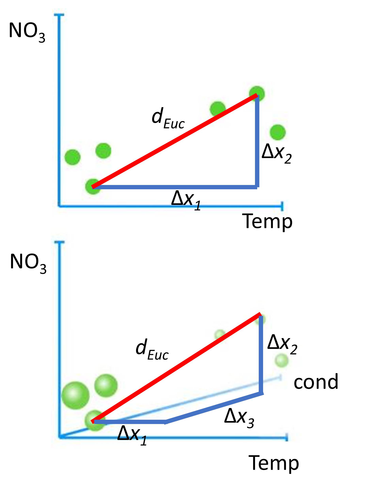
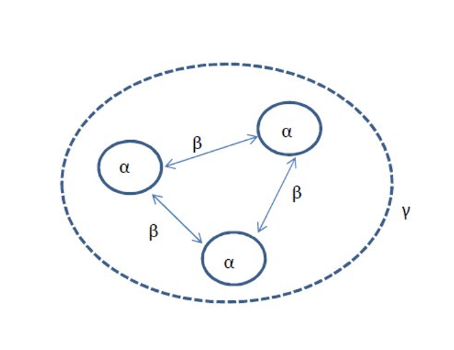
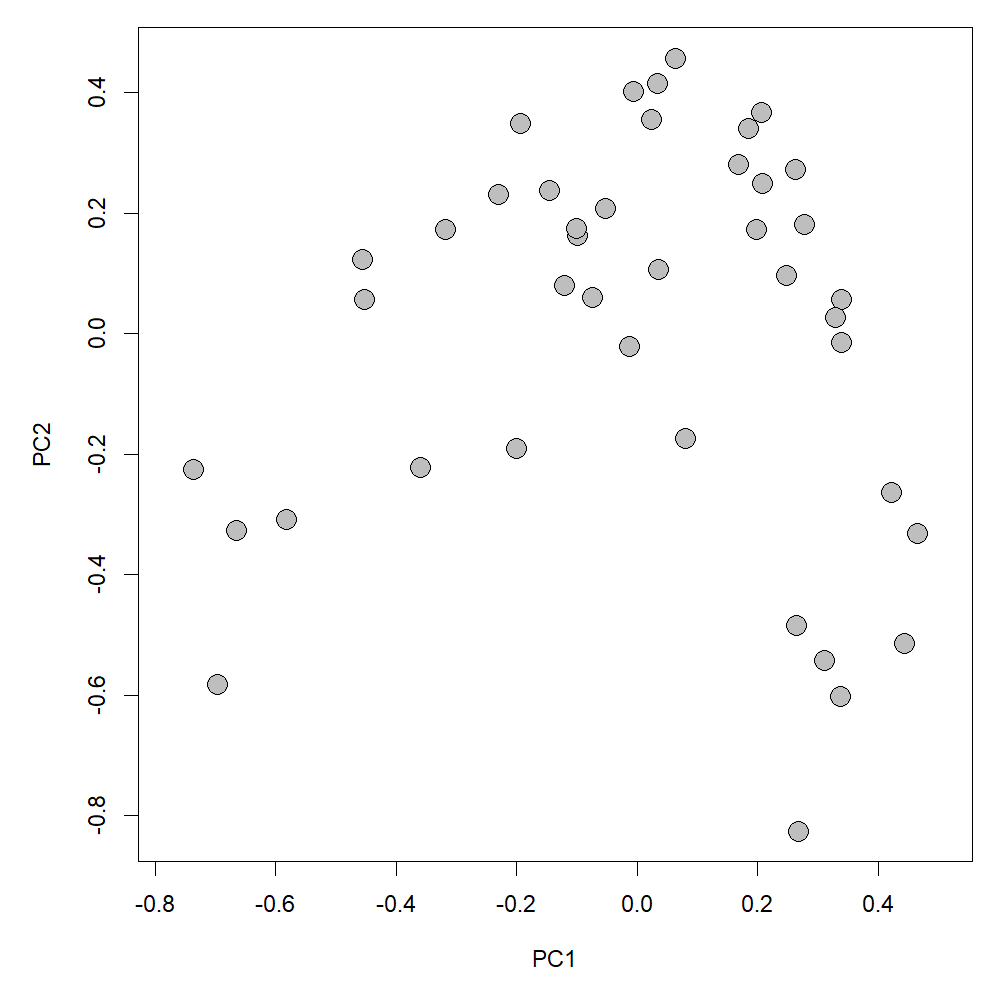
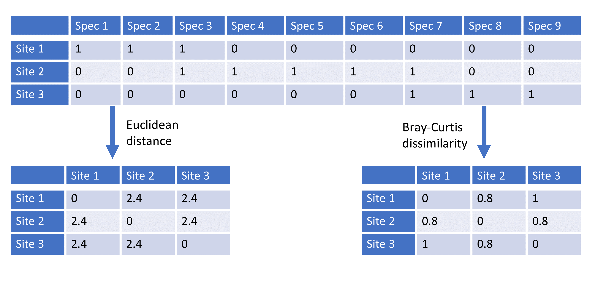
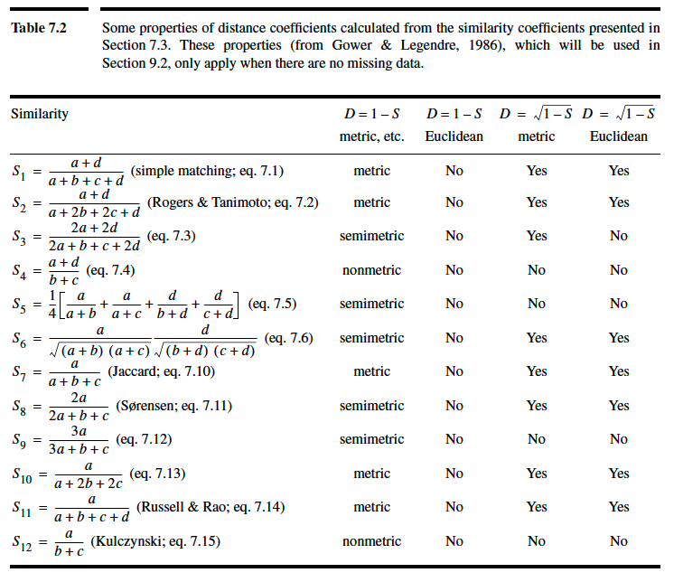
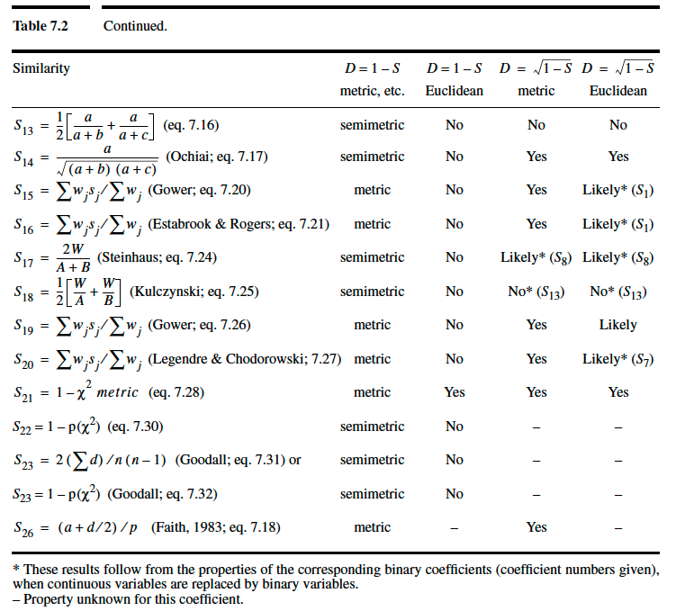
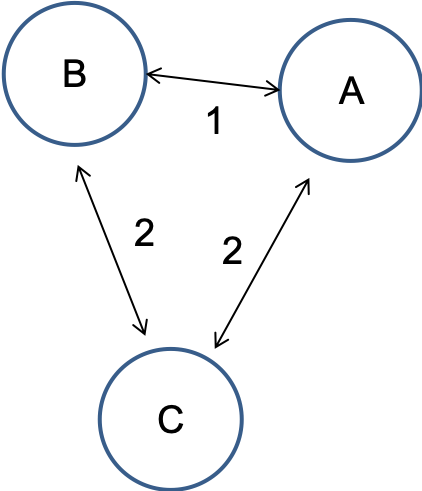
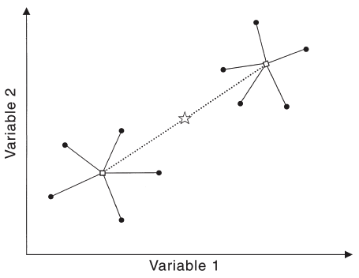
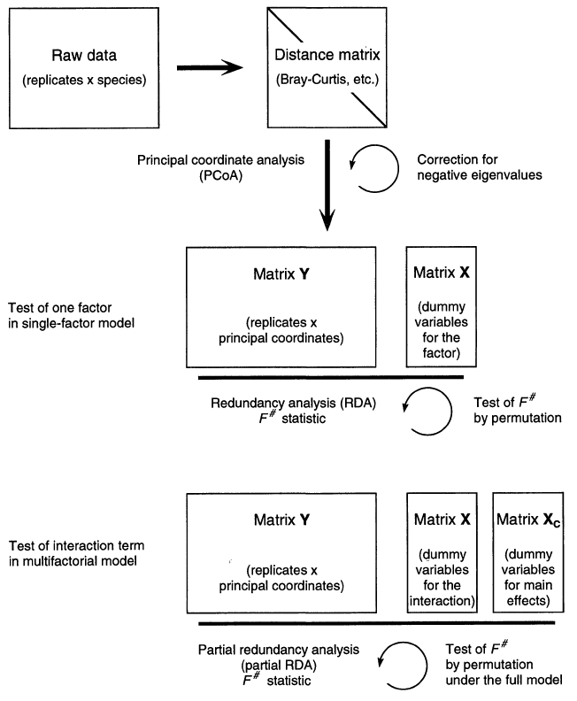
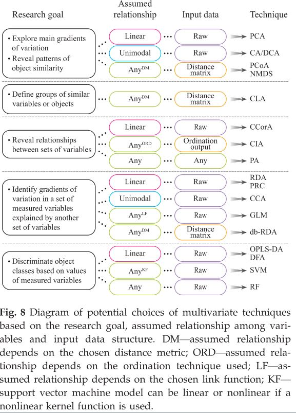

```{r setup, include=FALSE}
knitr::opts_chunk$set(fig.width=5, fig.height=5, fig.align="center", collapse = TRUE, comment = "##", dev="png")
library(RColorBrewer)
cols = brewer.pal(8, "Set1")

## to use tables
library(knitr)
library(kableExtra)
library(vegan)
```

## Methods based on distance/dissimilarity/similarity
Pairs of samples/sites/objects can be more or less similar to each other based on multiple variables.

Two samples, which contain the same species with the same abundances (or exactly same environmental conditions), have the highest similarity (and lowest dissimilarity or distance); the similarity decreases (and dissimilarity/distance increases) with the differences in their species composition (or environmental conditions).


{width=90%}
<div class="left lt">

The most known dissimilarity is a (physical) distance: Euclidean distance, in a 2D-coordinate system it is just computed based on Pythagoras:

$$
d_{Euc}=\sqrt{\Delta{x_1}^2+\Delta{x_2}^2}
$$

Euclidean distance computed between any two sites for $p$ variables:

$$
d_{Euc}=\sqrt{\Delta{x_1}^2+\Delta{x_2}^2+...+\Delta{x_p}^2}
$$
</div>

<div class="right rt">


</div>


## Why use dissimilarity-based methods?

<div class="left lt">

* Quantify how similar or how dissimilar various observations are with regard to many variables simultaneously.
* An efficient way to collapse information from a much too high-dimensional dataset.
* Use various variable types from continuous to presence-absence and qualitative, even simultaneously.
* Similarity may be translated into dissimilarity and vice-versa.
* Beta-diversity is based on dissimilarity measures, hence, they are an explicit way to express (and analyze) community turnover in space and time.



</div>

<div class="right rt">

* Choice of appropriate dissimilarity coefficient may allow avoiding *strange* transformations.
* Better handling of double-zeros, less horseshoe patterns in ordinations in situations of strong community turnover.

{width=80%}


</div>

##  (Dis)similarity coefficients

Two examples of dissimilarity indices here computed between any two sites for $p$ variables:

<div class="left lt">
<br/>
**Euclidean distance**

$$
d_{Euc}=\sqrt{\Delta{x_1}^2+\Delta{x_2}^2+...+\Delta{x_p}^2} 
$$
where $\Delta{x}$ is the distance between two sites along any $X$-variable.

<br/>
Binary version:
$$
d_{Euc}=\sqrt{A+B-2J} 
$$
A and B are numbers of species at compared sites, and J is the number of species that occur on both compared sites.
</div>

<div class="right rt">
<br/>
**Bray-Curtis dissimilarity**
$$
d_{BC}=\frac{\sum_{j=1}^p{|x_{1j}-x_{2j}|}}{\sum_{j=1}^p{(x_{1j}+x_{2j})}}
$$
<br/>
Binary version:
$$
d_{BC}=\frac{A+B-2J}{A+B}
$$


</div>


Double-zero (joint absences for two sites) problem: The fact that a species is missing does not say anything about ecological similarity or difference between both sites.

Double-zero can mean:

1. Sites are located outside of the species niche on the same side (sites A and B), which means sites are similar, or on opposite sites (A and C), which means sites are different.

2. Sites are located inside species niche (D and E), but the species does not occur because it didn’t get there (dispersal limitation), or it was present, but overlooked (sampling bias)

{width=30%}


<div class="left rt">
Bray-Curtis is well-suited for data on species composition because it ignores double-zeros.
</div>

<div class="right rt">
Euclidean distance is useful for environmental data and especially for representing geographic space (from x/y coordinates), but rarely for species data.
</div>

## (Dis)similarity coefficients



<br/>
 



## (Dis)similarity coefficients: some properties

<div class="left lt">

* symmetrical: consider a double zero as contributing to resemblance just like any other value
* asymmetrical: skip double zeros, considering that these are not informative (absence of a species at two sites does not tell anything about how similar these sites are!)
* metric: minimum 0, positive for inequality, symmetric ($D_{(a,b)}=D_{(b,a)}$), triangle inequality holds

$$
D_{(a,b)}+D_{(b,c)}\geq{D_{(a,c)}}
$$
* semimetric: do not follow the triangle inequality

$$
D_{(a,b)}+D_{(b,c)}<{D_{(a,c)}}
$$
... in which case perfect projections into Euclidean space are not possible. Two often used transformations to make semimetric coefficients analyzable in Euclidean space are adding a constant or $\sqrt(D)$.

</div>

<div class="right rt">

Triangle inequality: Distance via an intermediate point must be higher than or equal to distance without such an intermediate point. E.g. consider B as intermediate between A and C as in a triangle: the distance from A to C via B must be larger than the direct distance from A to C.



</div>


## Using dissimilarity: Non-metric multidimensional scaling (NMDS)

The goal: Collapse information from multiple dimensions into just a few, so they can be visualized and interpreted.

Iterative procedure:

1. Compute matrix of dissimilarities.
2. Decide on k, the number of reduced dimensions (typically 2).
3. Arrange objects (e.g. sites) in a random starting configuration.
4. Compute a measure of fit that expresses the match between inter-object distances of the configuration and the observed dissimilarities.  A **Shepard-plot** shows residuals as stress which is inversely related to fit. The measure of fit is computed using **ranks of observed dissimilarities and configuration distances**. (smallest rank corresponding to smallest dissimilarity)
5. Reiteratively reposition the objects in the low-dimensional space and recompute fit to improve the match between inter-object distances and observed dissimilarities.
6. A final configuration is achieved when no more repositioning improves the fit (or reduces the stress). Steps 3) to 6) may be repeated with different random starting positions to avoid getting trapped in local minima.


## Non-metric multidimensional scaling (NMDS) in R

```{r}
# We sampled stream biofilm at 42 different streams across the Vjosa river network. Algal species were derived by 18S rRNA gene amplification
vjosa<-read.csv(file="data/data_vjosa.csv", sep=";") #load data
dim(vjosa) #

com<-vjosa[,grep("ASV",names(vjosa))] # choose only ASV columns, these are the species
env<-vjosa[,-grep("ASV",names(vjosa))] # choose everything expect ASV


# We try to find the "best" reproduction of dissimilarities among sites in a 2 dimensional space.
# We use non-metric multidimensional scaling on Bray-Curtis dissimilarity matrix.

mds_vjosa <- metaMDS(comm = com, distance = "bray", k = 2) # to run a NMDS, $points to get scores, $stress to get information about fit
mds_vjosa$stress
## % of dissimilarities unrepresented
## Generally, stress < 0.05 provides an excellent represention in reduced 
# dimensions, < 0.1 is great, < 0.2 is good, and stress > 0.3 provides a poor representation
# if high stress is a problem, the argument trymax (number of default iterations) or number of dimensions (e.g. k=3) can be increased 

stressplot(mds_vjosa) # to compare configuration distances with observed dissimilarities
goodness(mds_vjosa) # sample-specific goodness of fit

#quick plot
plot(mds_vjosa, type="t")
#Do different sizes of streams (approximated by catchment area) have different communities?
ordisurf(mds_vjosa, env$catchment)

#customized plot
#use catchment_class as point size in plot
cex.catch <- as.factor(env$catchment_class)
levels(cex.catch)<-c(3,2,1)
cex.catch<-as.numeric(as.character(cex.catch))

plot(mds_vjosa$points,asp=1,cex=cex.catch, xlab="MDS dimension 1",ylab="MDS dimension 2")

#connect catchment classes in plot
ordihull(mds_vjosa, env$catchment_class)
#alternative: ordispider(mds_vjosa, env$catchment_class)

legend("topleft", pch=21, pt.cex=c(1,2,3), legend=c("small","medium", "large"))
```


## Hypothesis tests in the distance world


All known *study designs* with factors or continuous predictors may be transferred to the distance domain.

* PERMANOVA: An ANOVA-type of analysis testing effects of factors (also in interaction) on a multivariate matrix, thus MANOVA. Useful to test effects on *composition*. In the distance domain known as *permutational* MANOVA. In R implemented as `vegan::adonis`.

* dbRDA (distance-based RDA) and CAP (canonical analysis of principal coordinates): multiple-step analysis to test for effects of continuous predictors on a dissimilarity matrix. In R `vegan::capscale`.

* Mantel-test: An old-school test for correlation between two distance/dissimilarity matrices (e.g. one describing environment or physical distance, the other describing community turnover or genetic differentiation).  In R `vegan::mantel`.


## Permutational MANOVA (PERMANOVA)

<div class="left lt">

Uses a test statistic based on distances within groups (to a group centroid or averaged among all pairs) versus distances from group centroids to the overall centroid.

<br/>

{width=80%}

</div>

<div class="right rt">

1. The within-group sum of squares ($SS_w$) is the sum of squared distances from individual replicates to their group centroid.
2. The among-group sum of squares ($SS_A$) is the sum of squared distances from group centroids to the overall centroid.
3. A (pseudo-) F-value is computed using number of groups (a) and the total number of observations (N) as:
$$
F=\frac{SS_A/(a-1)}{SS_w/(N-a)}
$$
4. Significance is assessed by recomputing the test-statistic after permutations of group assignment.

<br/>

Prerequisite similar to ANOVA: homogeneous dispersion (multivariate variance, *cloud shape*). Tested using within-group distances to centroids.

</div>

## Permutational MANOVA (PERMANOVA) in R

```{r}
# PERMANOVA - non-parametric permutational MANOVA #
# a multivariate hypothesis test: 
# 1 factor (catchment class) and 1 multivariate response = "community composition"

# compute a distance matrix:
dmat = vegdist(com, method = "bray") # compute a dissimilarity matrix

# first testing for homogeneity of dispersion (homogeneous distances to group centroids)
catch_fac<-as.factor(env$catchment_class)

disp.check<-betadisper(dmat, catch_fac)
disp.check$distances

boxplot(disp.check$distances~catch_fac)
# or directly: boxplot(disp.check)

anova(lm(disp.check$distances~catch_fac))
#or directly on anova(disp.check) #also works directly on disp.check

# the actual PERMANOVA would work like this, however, we do not have homogeneous dispersion...
adonis2(dmat~catch_fac)

#... however, we found another interesting result, beta diversity among small stream is larger then among medium stream and large streams.
```

## Cluster analysis

Hierarchical group-forming (clustering) based on pairwise (dis)similarity.

Three types:

1. Divisive: start with all, successively split into 2.
2. **Agglomerative**: start with individual observations and cluster pairwise, continue grouping clusters.
3. Non-hierarchical: e.g. K-means clustering (forcing K clusters)

<br/>

Various “linkage rules” to group clusters in agglomerative clustering:

* Single linkage looks for the nearest neighbour of any group member to other observations (tends to chaining). 
* **Average linkage** computes dissimilarities between two groups as the average dissimilarity among all pairwise group member dissimilarities (one from each cluster).
* **UPGMA** (unweighted-pair-groups method using arithmetic averages) is a version of an average linkage rule. 


```{r}
lipids<-read.table(file="data/BacterialMembrane.txt",header=TRUE)
names(lipids)
lip_data<-lipids[,4:20]
# abbreviations: MU = mono-unsaturated, SA = saturated, nb = non-branched, b = branched
# SA_branprop = proportion of branched and saturated FAs
# theory: unsaturated and branched FAs increase fluidity of membrane
# test (i) adaptation vs. (ii) acclimatization to temperature by changing FA composition of membranes

isolate<-factor(lipids$isolate)
temperature<-factor(lipids$temperature)
combifac<-factor(paste(temperature,"_",isolate,sep=""))

## distance matrix: Euclidean distance on arcsine-sqr-data
as_lip_data<-asin(sqrt(lip_data)) # very old-school, better don´t do ;-)
lipids_distE<-vegdist(as_lip_data, method="euclidean") 

## alternatively: Bray-Curtis distance with proportional data
lipids_distBC<-vegdist(lip_data, method="bray")

# cluster analysis #
# various agglomeration methods available and the choice is important, explore method=
# "single": nearest neighbour counts (good for gradients, but makes chains)
# "complete": all group members must be close, farthest group member counts (makes small spheric groups, good to find outliers)
# "average": compromise average strategy, new member joins at mean distance to all group members, actually UPGMA
# "ward.D": aims at minimizing within-group sums of squares of distances
lipids_cluster<-hclust(lipids_distBC, method = "ward.D")
lipids_cluster$height<-sqrt(lipids_cluster$height) # may help

# then compare effect of agglomeration method on dendrogram
plot(lipids_cluster, hang = -1, labels = combifac, ylab = "BC")

# which agglomeration method (and thus dendrogram) is best?
#cophenetic(lipids_cluster) # linkage distances in dendrogram
plot(lipids_distBC,cophenetic(lipids_cluster))
cor(lipids_distBC,cophenetic(lipids_cluster),method="spearman")

cutree(lipids_cluster,k=4)
cutree(lipids_cluster,h=0.05)

plot(lipids_cluster, hang = -1, labels = combifac, ylab = "BC")
rect.hclust(lipids_cluster,k=4) # or specify height h instead of k

```

## Using dissimilarity: Principal Coordinate Analysis (PCoA)

(aka *metric multidimensional scaling*)

PCoA = distance-based unconstrained ordination

The goal of PCoA is to project sites onto Cartesian (Euclidean) coordinates from pairwise dissimilarities.

Imagine a road distance matrix between major towns. A 2D-projection of all pairwise distances produces a map (which gets better with less mountains and straighter roads in the area).

<br/>
Steps in PCoA:

1. Place the first point (sample site) at the origin of a coordinate system.

2. Add the second point the correct distance away from the first point along the first axis.

3. Position the third point the correct distance away from each of the first two points, adding a second axis if necessary.

4. Continue until all points have been added.  The result is a set of no more than n-1 axes.

But how do we get back down to fewer (e.g. 2) dimensions? Well, simply do a PCA on these constructed points.

5. Conduct a PCA on the constructed points to organize the variation among the points in a series of axes of diminishing importance.


```{r}
lipids<-read.table(file="data/BacterialMembrane.txt",header=TRUE)
names(lipids)
lip_data<-lipids[,4:20]
# abbreviations: MU = mono-unsaturated, SA = saturated, nb = non-branched, b = branched
# SA_branprop = proportion of branched and saturated FAs
# theory: unsaturated and branched FAs increase fluidity of membrane
# test (i) adaptation vs. (ii) acclimatization to temperature by changing FA composition of membranes

isolate<-factor(lipids$isolate)
temperature<-factor(lipids$temperature)
combifac<-factor(paste(temperature,"_",isolate,sep=""))

## distance matrix: Bray-Curtis distance with proportional data
lipids_distBC<-vegdist(lip_data, method="bray")

# using the same distance matrix as cluster analysis 
pcoa<-cmdscale(lipids_distBC,k=2,eig=TRUE,add=TRUE)
# argument add=TRUE means a constant is added to distances to avoid negative eigenvalues

cumsum(pcoa$eig/sum(pcoa$eig)) # contributions of various PCoA axes
# first two axes cover 67% of variation of distances

pcoa$points # the site scores (coordinates in reduced space)

col.isolate<-isolate
levels(col.isolate)<-c("white","red")
col.isolate<-as.character(col.isolate)

pch.temperature<-as.numeric(as.character(temperature))
pch.temperature[pch.temperature==6]<-21
pch.temperature[pch.temperature==28]<-23

plot(pcoa$points,pch=pch.temperature,bg=col.isolate)
legend("topleft",pch=c(21,21,23,23),pt.bg=c("white","red","white","red"),
       legend=c("6°C - warm isolate","6°C - cold isolate","28°C - warm isolate","28°C - cold isolate"),cex=0.6)
```
```{r eval=FALSE}
# how to relate species (=fatty acids) to ordination?
wascores(pcoa$points,lip_data) # as weighted averages of site (=sample) scores
text(wascores(pcoa$points,lip_data),labels=names(lip_data),cex=0.5)

ordisurf(pcoa$points,lip_data$FA7_MU,col="darkgreen",add=TRUE) # as contourplot

plot(envfit(pcoa$points,lip_data)) # take care: behaviour of species not necessarily monotonous in ordination space
```


## Canonical analysis of principal coordinates (CAP)

<div class="left lt">

Following scheme taken from description of db-RDA. Essentially 3 steps:

1. Computation of a (square) dissimilarity matrix D from (Cartesian) raw data. Choose coefficient well!
2. PCoA based on D *recreates* Cartesian coordinates with a dimensionality imposed by n (or p if p<n). If D was semimetric, (minor) axes with negative eigenvalues may occur.
3. RDA on the PCoA-axes and constraints of choice (factors/dummy variables, continuous predictors). Instead of RDA other constrained methods are possible as well, e.g. discriminant analysis, other classification routines, etc.

</div>

<div class="right rt">
 
{width=90%}

</div>

## Canonical analysis of principal coordinates (CAP)

```{r}
cap<-capscale(lipids_distBC~isolate*temperature)
summary(cap)

anova(cap,by="axis",model="direct",perm.max=9999,step=1000)
anova(cap,by="terms",model="direct",perm.max=9999,step=1000)

# all functions more or less taken from RDA
# e.g. to get site scores for plotting
#scores(cap,display="sites")[,1:2]
```


## Choice of the multivariate analysis
<div class="left rt">
In general, to analyse:

* short gradients > linear methods: PCA and RDA

* long gradients > unimodal methods: CA and CCA

* similarities among samples based on distance calculations > PCoA, NMDS, db-RDA

<br/>

* Explore main gradients of variation > unconstrained methods: PCA, CA, PCoA, NMDS

* Identify gradients of variation in a dataset explained by another dataset > constrained methods: RDA, CCA, db-RDA

</div>

<div class="right rt">

<font size="4"> Paliy and Shankar in Molecular Ecology 2016</font>


