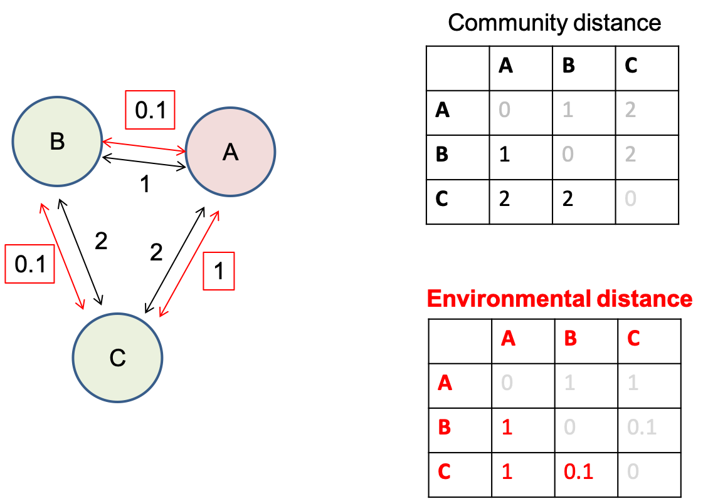

```{r setup, include=FALSE}
knitr::opts_chunk$set(fig.width=5, fig.height=5, fig.align="center", collapse = TRUE, comment = "##", dev="png")
library(RColorBrewer)
cols = brewer.pal(8, "Set1")

## to use tables
library(knitr)
library(kableExtra)
library(vegan)
```

## Methods based on distance/dissimilarity/similarity

{width=90%}
The most known dissimilarity is a (physical) distance: Euclidean distance, in a 2D-coordinate system it is just computed based on Pythagoras:

$$
d_{Euc}=\sqrt{\Delta{x_1}^2+\Delta{x_2}^2}
$$

Euclidean distance computed between any two sites for $p$ variables:

$$
d_{Euc}=\sqrt{\Delta{x_1}^2+\Delta{x_2}^2+...+\Delta{x_p}^2}
$$

## Why use dissimilarity-based methods?

<div class="left lt">

* Quantify how similar or how dissimilar various observations are with regard to many variables simultaneously.
* An efficient way to collapse information from a much too high-dimensional dataset.
* Use various variable types from continuous to presence-absence and qualitative, even simultaneously.
* Choice of appropriate dissimilarity coefficient may allow avoiding *strange* transformations.
* Better handling of double-zeros, less horseshoe patterns in ordinations in situations of strong community turnover.
* Similarity may be translated into dissimilarity and vice-versa.

</div>

<div class="right rt">

* An explicit way to express (and analyze) community turnover in space and time (beta-diversity).

Whenever compositional turnover at regional scale is of interest!

Diversity partitioning into $\alpha$, $\beta$, $\gamma$:


$\beta$-diversity is linked to species-accumulation curves.
</div>

##  (Dis)similarity coefficients

Euclidean and Bray-Curtis (Steinhaus, Sorenson) are two examples of many dissimilarity indices, here computed between any two sites for $p$ variables:

$$
d_{Euc}=\sqrt{\Delta{x_1}^2+\Delta{x_2}^2+...+\Delta{x_p}^2}
$$
where $\Delta{x}$ is the distance between two sites along any $X$-variable.

<br/>

$$
d_{BC}=\frac{\sum_{j=1}^p{|x_{1j}-x_{2j}|}}{\sum_{j=1}^p{(x_{1j}+x_{2j})}}
$$
which includes a notable normalization of differences between two sites with regard to any variable used.


## (Dis)similarity coefficients: some properties

<div class="left lt">

* symmetrical: consider a double zero as contributing to resemblance just like any other value
* asymmetrical: skip double zeros, considering that these are not informative (absence of a species at two sites does not tell anything about how similar these sites are!)
* metric: minimum 0, positive for inequality, symmetric ($D_{(a,b)}=D_{(b,a)}$), triangle inequality holds

$$
D_{(a,b)}+D_{(b,c)}\geq{D_{(a,c)}}
$$
* semimetric: do not follow the triangle inequality

$$
D_{(a,b)}+D_{(b,c)}<{D_{(a,c)}}
$$
... in which case perfect projections into Euclidean space are not possible. Two often used transformations to make semimetric coefficients analyzable in Euclidean space are adding a constant or $\sqrt(D)$.

</div>

<div class="right rt">

<br/>

Triangle inequality: Distance via an intermediate point must be higher than or equal to distance without such an intermediate point. E.g. consider B as intermediate between A and C as in a triangle: the distance from A to C via B must be larger than the direct distance from A to C.


</div>


## (Dis)similarity coefficients


<br/>
 


## Using dissimilarity: Cluster analysis

Hierarchical group-forming (clustering) based on pairwise (dis)similarity.

Three types:

1. Divisive: start with all, successively split into 2.
2. **Agglomerative**: start with individual observations and cluster pairwise, continue grouping clusters.
3. Non-hierarchical: e.g. K-means clustering (forcing K clusters)

<br/>

Various “linkage rules” to group clusters in agglomerative clustering:

* Single linkage looks for the nearest neighbour of any group member to other observations (tends to chaining). 
* **Average linkage** computes dissimilarities between two groups as the average dissimilarity among all pairwise group member dissimilarities (one from each cluster).
* **UPGMA** (unweighted-pair-groups method using arithmetic averages) is a version of an average linkage rule. 

```{r}
lipids<-read.table(file="data/BacterialMembrane.txt",header=TRUE)
names(lipids)
lip_data<-lipids[,4:20]
# abbreviations: MU = mono-unsaturated, SA = saturated, nb = non-branched, b = branched
# SA_branprop = proportion of branched and saturated FAs
# theory: unsaturated and branched FAs increase fluidity of membrane
# test (i) adaptation vs. (ii) acclimatization to temperature by changing FA composition of membranes

isolate<-factor(lipids$isolate)
temperature<-factor(lipids$temperature)
combifac<-factor(paste(temperature,"_",isolate,sep=""))

## distance matrix: Euclidean distance on arcsine-sqr-data
as_lip_data<-asin(sqrt(lip_data)) # very old-school, better don´t do ;-)
lipids_distE<-vegdist(as_lip_data, method="euclidean") 

## alternatively: Bray-Curtis distance with proportional data
lipids_distBC<-vegdist(lip_data, method="bray")

# cluster analysis #
# various agglomeration methods available and the choice is important, explore method=
# "single": nearest neighbour counts (good for gradients, but makes chains)
# "complete": all group members must be close, farthest group member counts (makes small spheric groups, good to find outliers)
# "average": compromise average strategy, new member joins at mean distance to all group members, actually UPGMA
# "ward.D": aims at minimizing within-group sums of squares of distances
lipids_cluster<-hclust(lipids_distBC, method = "ward.D")
lipids_cluster$height<-sqrt(lipids_cluster$height) # may help

# then compare effect of agglomeration method on dendrogram
plot(lipids_cluster, hang = -1, labels = combifac, ylab = "BC")

# which agglomeration method (and thus dendrogram) is best?
#cophenetic(lipids_cluster) # linkage distances in dendrogram
plot(lipids_distBC,cophenetic(lipids_cluster))
cor(lipids_distBC,cophenetic(lipids_cluster),method="spearman")

cutree(lipids_cluster,k=4)
cutree(lipids_cluster,h=0.05)

plot(lipids_cluster, hang = -1, labels = combifac, ylab = "BC")
rect.hclust(lipids_cluster,k=4) # or specify height h instead of k

```


## Using dissimilarity: Principal Coordinate Analysis (PCoA)

(aka *metric scaling*)

Technique to project sites onto Cartesian (Euclidean) coordinates from pairwise dissimilarities. 

Imagine a road distance matrix between major towns. A 2D-projection of all pairwise distances produces a map (which gets better with less mountains and straighter roads in the area).

PCoA can be regarded as the inverse operation to computing a distance matrix. However, it can´t produce more "axes" than (n-1) as this is the maximum number of dimensions needed to completely represent n objects. A dissimilarity matrix and a consecutive PCoA are efficient means to condense data with p>>n.

PCoA is an important step in hypothesis-testing methods in the distance domain (see later).

<br/>

PCoA is based on an eigenvector decomposition like PCA:

* fast (not iterative)
* results in dimensions of ranked importance as in PCA
* forces sites into a Euclidean space and may thus represent non-metric dissimilarities (e.g. Bray-Curtis) not so well
* *made for* Euclidean distance or coefficients that can be transformed adequately.
* To improve representation (avoid negative eigenvalues) add constant to D or $\sqrt(D)$.

```{r}
# using the same distance matrix as cluster analysis 
pcoa<-cmdscale(lipids_distBC,k=2,eig=TRUE,add=TRUE)
# argument add=TRUE means a constant is added to distances to avoid negative eigenvalues

cumsum(pcoa$eig/sum(pcoa$eig)) # contributions of various PCoA axes
# first two axes cover 67% of variation of distances

pcoa$points # the site scores (coordinates in reduced space)

col.isolate<-isolate
levels(col.isolate)<-c("white","red")
col.isolate<-as.character(col.isolate)

pch.temperature<-as.numeric(as.character(temperature))
pch.temperature[pch.temperature==6]<-21
pch.temperature[pch.temperature==28]<-23

plot(pcoa$points,pch=pch.temperature,bg=col.isolate)
legend("topleft",pch=c(21,21,23,23),pt.bg=c("white","red","white","red"),
       legend=c("6°C - warm isolate","6°C - cold isolate","28°C - warm isolate","28°C - cold isolate"),cex=0.6)
```
```{r eval=FALSE}
# how to relate species (=fatty acids) to ordination?
wascores(pcoa$points,lip_data) # as weighted averages of site (=sample) scores
text(wascores(pcoa$points,lip_data),labels=names(lip_data),cex=0.5)

ordisurf(pcoa$points,lip_data$FA7_MU,col="darkgreen",add=TRUE) # as contourplot

plot(envfit(pcoa$points,lip_data)) # take care: behaviour of species not necessarily monotonous in ordination space
```


## Using dissimilarity: Non-metric multidimensional scaling (NMDS)

An iterative search for an ordination configuration in a low-dimensional space with inter-object distances representing the observed dissimilarity/distance matrix as well as possible.

The measure of fit used is not actual dissimarity/distance but rank order of dissimilarities.

Iterative procedure:

1. Compute matrix of dissimilarities.
2. Decide on k, the number of dimensions.
3. Arrange objects in a random starting configuration.
4. Compute a measure of fit that expresses the match between inter-object distances of the configuration and the observed dissimilarities.  A **Shepard-plot** shows residuals as stress which is inversely related to fit. The measure of fit is computed using **ranks of observed dissimilarities and configuration distances**.
5. Reiteratively reposition the objects in the low-dimensional space and recompute fit to improve the match between inter-object distances and observed dissimilarities.
6. A final configuration is achieved when no more repositioning improves the fit. Steps 3) to 6) may be repeated with different random starting positions to avoid getting trapped in local minima.

```{r}
# non-metric multidimensional scaling (NMDS) #
# note that all resulting axes are equally important, plots may be rotated as needed

# using the same distance matrix as cluster analysis 
#mds_lipids<-isoMDS(lipids_distBC, k = 2, maxit=1000)
mds_lipids<-metaMDS(comm=lip_data, distance="bray", k = 2,trymax=100)

mds_lipids$stress # approximately 6.8% of dissimilarities remain unrepresented
mds_lipids$points # the site scores
stressplot(mds_lipids,lipids_distBC)
(gof<-goodness(mds_lipids,statistic="distance")) # goodness of fit by NMDS for each sample

# plotting of MDS scores
plot(mds_lipids$points,asp=1,xlab="MDS dimension 1",ylab="MDS dimension 2")
points(mds_lipids$points,pch=pch.temperature,bg=col.isolate,cex=gof*200) # to check goodness of fit, large symbol means bad fit

legend("topleft",pch=c(21,21,23,23),pt.bg=c("white","red","white","red"),
	legend=c("6°C - warm isolate","6°C - cold isolate","28°C - warm isolate","28°C - cold isolate"),cex=0.7)
```

```{r eval=FALSE}
# relating underlying variables to ordination in nMDS
wascores(mds_lipids$points,lip_data) # as weighted averages of site (=sample) scores
text(wascores(pcoa$points,lip_data),labels=names(lip_data),cex=0.5)

ordisurf(mds_lipids,lip_data$FA7_MU,col="darkgreen",add=TRUE)

plot(envfit(pcoa$points,lip_data)) # take care: behaviour of species not necessarily monotonous in ordination space

# some more useful graphical tools
plot(mds_lipids$points,pch=pch.temperature,bg=col.isolate,asp=1,xlab="MDS dimension 1",ylab="MDS dimension 2",cex=2)
ordispider(mds_lipids$points,groups=combifac)
ordihull(mds_lipids$points,groups=combifac)
ordiellipse(mds_lipids$points,groups=combifac)
ordicluster(mds_lipids$points,cluster=lipids_cluster)
```

```{r}
plot(mds_lipids$points,pch=pch.temperature,bg=col.isolate,asp=1,xlab="MDS dimension 1",ylab="MDS dimension 2",cex=2)
ordispider(mds_lipids$points,groups=combifac)
```


## Hypothesis tests in the distance world


All known *study designs* with factors or continuous predictors may be transferred to the distance domain.

* PERMANOVA: An ANOVA-type of analysis testing effects of factors (also in interaction) on a multivariate matrix, thus MANOVA. Useful to test effects on *composition*. In the distance domain known as *permutational* MANOVA. In R implemented as `vegan::adonis`.

* dbRDA (distance-based RDA) and CAP (canonical analysis of principal coordinates): multiple-step analysis to test for effects of continuous predictors on a dissimilarity matrix. In R `vegan::capscale`.

* Mantel-test: An old-school test for correlation between two distance/dissimilarity matrices (e.g. one describing environment or physical distance, the other describing community turnover or genetic differentiation).  In R `vegan::mantel`.




## Permutational MANOVA (PERMANOVA)

<div class="left lt">

Uses a test statistic based on distances within groups (to a group centroid or averaged among all pairs) versus distances from group centroids to the overall centroid.

<br/>

{width=80%}

</div>

<div class="right rt">

1. The within-group sum of squares is the sum of squared distances from individual replicates to their group centroid.
2. The among-group sum of squares is the sum of squared distances from group centroids to the overall centroid.
3. A (pseudo-) F-value is computed using number of groups (a) and the total number of observations (N) as:
$$
F=\frac{SS_A/(a-1)}{SS_w/(N-a)}
$$
4. Significance is assessed by recomputing the test-statistic after permutations of group assignment.

<br/>

Prerequisite similar to ANOVA: homogeneous dispersion (multivariate variance, *cloud shape*). Tested using within-group distances to centroids.

</div>

## Permutational MANOVA (PERMANOVA)

```{r}
# PERMANOVA - non-parametric permutational MANOVA #
# a multivariate hypothesis test: 
# two factors and 1 multivariate response = "membrane FA composition"

# first testing for homogeneity of dispersion (homogeneous distances to group centroids)
disp.check<-betadisper(lipids_distBC,combifac)
disp.check$distances
boxplot(disp.check$distances~combifac)
anova(lm(disp.check$distances~combifac))
anova(disp.check)
permutest(disp.check)

# the actual PERMANOVA
adonis(lipids_distBC~isolate*temperature)
```

## Canonical analysis of principal coordinates (CAP)

<div class="left lt">

Following scheme taken from description of db-RDA. Essentially 3 steps:

1. Computation of a (square) dissimilarity matrix D from (Cartesian) raw data. Choose coefficient well!
2. PCoA based on D *recreates* Cartesian coordinates with a dimensionality imposed by n (or p if p<n). If D was semimetric, (minor) axes with negative eigenvalues may occur.
3. RDA on the PCoA-axes and constraints of choice (factors/dummy variables, continuous predictors). Instead of RDA other constrained methods are possible as well, e.g. discriminant analysis, other classification routines, etc.

</div>

<div class="right rt">
 
{width=90%}

</div>

## Canonical analysis of principal coordinates (CAP)

```{r}
cap<-capscale(lipids_distBC~isolate*temperature)
summary(cap)

anova(cap,by="axis",model="direct",perm.max=9999,step=1000)
anova(cap,by="terms",model="direct",perm.max=9999,step=1000)

# all functions more or less taken from RDA
# e.g. to get site scores for plotting
#scores(cap,display="sites")[,1:2]
```


