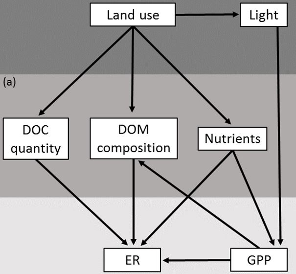

```{r setup, include=FALSE}
knitr::opts_chunk$set(echo = TRUE)
```

## Guidelines

Below you will find tasks, similar to exercises we have done in class. Your task is to produce a document answering the numbered questions below using the tools you've learned in unit 3. Please produce a word/PDF document or similar with the answers organised by Task and question. If figures or tables are requested, you can embed them in this document. **Note that figures and tables should be near publication quality - proper use of colours, labeled axes, units included, etc.**

Please do **not** embed code in this document unless specifically asked to do so. Instead, please save your code in a separate R file. You can mark the task and question number using comments in the code. Turn in the code along with the writeup.

You may work on this individually or in small groups (maximal 3 students). Please turn this in to Thomas (thomas.fuss@uibk.ac.at) by **February 14, 2025** at the latest. If you are stuck, please get in touch by email to make an appointment **well in advance**.

## Dataset: Dissolved organic matter (DOM), water chemistry and metabolism of 33 streams in Austria
We will use a dataset (from [Fuß et al. 2017](https://onlinelibrary.wiley.com/doi/10.1111/fwb.12887)) to investigate links among (i) catchment land use (as derived from a geographical analysis of satellite data), (ii) composition of DOM in transport in the water column, and (iii) stream ecosystem metabolism, i.e. gross primary production (GPP) and ecosystem respiration (ER) estimated from 24 hour profiles of dissolved oxygen concentration.

### Some background information:
In-stream metabolism is the result of GPP, which is the rate of converting solar energy into organic matter by photosynthesis of autotrophs, and ER, which is the decay of organic matter into inorganic compounds by all autotroph and heterotroph biota in the stream ecosystem. Both processes can be expressed in terms of a carbon or oxygen flux (units mass O2 per area per time). Since autotrophs require light as energy source and nutrients for growth, GPP is often controlled by light and nutrient availability. In contrast, heterotroph microbes require nutrients for growth and organic carbon as external energy source, hence ER is often controlled by nutrient availability and quantity and composition of organic matter. Only dissolved organic matter (DOM) is directly usable for heterotroph microbes, its quantity is usually expressed as dissolved organic carbon (DOC), a measurement of bulk carbon in organic form that gives no information about its composition or quality. DOM in stream ecosystems is to a large extent of allochthonous origin and its composition is thus controlled by the terrestrial environment (input and leaching of leaves, soil water input) but some fractions of DOM may also be produced in the system by GPP (autochthonous algal leachates) or represent the products of microbial reworking of DOM of various sources. DOM represents the largest fraction and the most bioavailable pool of organic carbon transported along the fluvial continuum, it is extremely complex in terms of its chemical structure (thousands of different compounds) and occupies a key position linking various ecosystem functions and their external controls. This DOM pool can be characterized using spectroscopic techniques (e.g., absorbance and fluorescence) and multiple indicators derived from spectroscopic measurements provide information about various relevant characteristics such as aromaticity, molecular weight, extent of humification and origin of DOM. Due to the tight connection of stream ecosystems with their surrounding terrestrial ecosystems, land cover of stream catchments is generally thought to affect both GPP and ER because it influences direct controls such as light availability (existence of riparian vegetation), nutrient and carbon quantities (soil water), and DOM composition. DOM composition can be under direct control of land use (the components exported from terrestrial ecosystems) or under indirect control via GPP (the components produced in the stream ecosystem). Land use information is usually available in the form of areal percentages of various land use categories in the catchment.

{width=30%}

This figure illustrates hypothesized effects (described in the previous paragraph and illustrated as arrows) of land use on dissolved organic matter composition (DOM) and the concentrations of nutrients and dissolved organic carbon (DOC), and their linkage to ecosystem respiration (ER) and gross primary production (GPP).

Here is some code to load the data (which is located in `vu_datenanalyse_students/unit_3/data/`):
```{r data_load, eval = FALSE}
# assumes your working directory is already unit_3
data = read.csv("data/Data_Metabolism.csv", sep=";")
names(data) #a detailed description of the variables can be found here: vu_datenanalyse_students/unit_3/data/Data_Metabolism.xlsx
```


## Task 1: Explore main land use gradients and DOM composition gradients.

1. Explore variables, consider transformations. (Land use categories are in columns 2:7 and descriptors for DOM are in columns 15:27.) 
2. Reduce the multivariate land use dataset to a few meaningful gradients. Show main land use gradients in an appropriate graph and explain the main gradients.
3. Reduce the multivariate DOM dataset to a few meaningful gradients. Show main compositional gradients of DOM in an appropriate graph and explain the main gradients.

## Task 2: Does land use affect DOM composition?

1. We hypothesized that land use and GPP affects DOM composition. Improve your graph from Task 1 point 3. How can you visualize land use and GPP in this graph? (Think of color gradients or/and the function envfit). Additionally to the graph, explain your results in written text. 
2. Choose an appropriate direct/constrained ordination method to investigate the effect of land use on DOM composition. Show the result in an appropriate graph. Compare the result to the previous point (Task 2 1.), do you find the same outcomes?

## Task 3: What are the drivers of stream metabolism?

1. We hypothesized that GPP is driven by nutrients (column 12,13) and light. Choose these variables as potential predictors for GPP in multiple linear regression.
2. Use an appropriate model building strategy to build a parsimonious model and report the results in written text and table.
3. We hypothesized that ER is driven by GPP, DOC quantity (column 14), nutrients (column 12,13) and DOM composition (choose main gradients derived in Task 1 3.). Choose these variables as potential predictors for ER in multiple linear regression.
4. Use an appropriate model building strategy to build a parsimonious model and report the results in written text and table.


