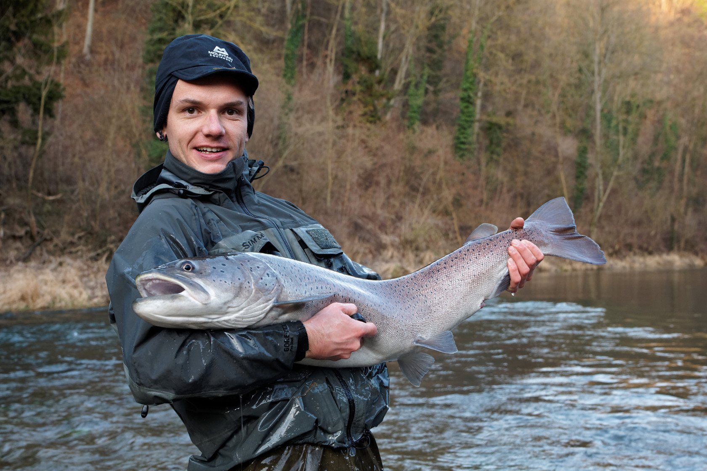

```{r setup, include=FALSE}
knitr::opts_chunk$set(echo = TRUE, error=TRUE)
```


## Hucho record captures in Austrian rivers

Fishermen like to catch record-breaking large fish and if successful will do a bit of effort to document their historic achievement in the local pub ;-) This dataset contains sizes of such record catches of Hucho in various Austrian streams and rivers of various size, the data was collected from various sources including the eventual black-and-white photograph hanging in a pub.

Here is one such picture from the author of the study:
s


The Danube salmon is an endangered species in now dwindling populations. It needs intact river corridors for migration. Hydropower facilities should have a fish ladder allowing the fish to bypass turbines. The size of such a fish ladder is a cost issue AND an ecological issue - it needs to be large enough to accommodate the expected fish size in any given system. Usually large rivers host large fish. So, river size could be taken as a proxy of fish size to be expected.

```{r}
hucho = read.table("data/HuchoRatschan2012.txt", header = TRUE)
```

1. Look for a reasonable relationship of a river size measure with a fish size measure. Deliver a model that could guide construction of fish passes. Consider transformations to linearize relationships.
2. A potential confounding variable could be population size. When a population of Hucho is very small, it is less likely to contain large specimens. The dataset includes an estimate of population size based on expert (= fishermen) opinion. Explore differences in maximum Hucho body size captured in the various systems depending on population size. Test for differences and produce a publishable final graph showing average maximum fish size in dependence from population size. Don´t forget to check assumptions before running your statistical analysis and justify your choice of method.
3. You will find that both river size and population size affect maximum Hucho size. How can you test both predictors at once? Which would be the best model for fish ladder builders if they wanted to improve the conservation status of Danube salmon in the future?


## Solid particulate matter in lakes

Load the LakeSPM dataset (Lindström, M., Håkanson, L., Abrahamsson, O., Johansson, H. (1999) An empirical model for prediction of lake water suspended particulate matter. Ecological Modelling 121, 185–198).

```{r}
lakes <- read.table("data/LakeSPM.txt",header=TRUE)
```

The study has a set of lakes with SPM=solid particulate matter as the main response of interest. High SPM is a water quality issue, it can be generated through excessive phytoplankton growth or resuspension of sediment in shallow lakes or terrigeneous input into smaller lakes. For water quality prediction a model to predict SPM from easily accessible lake data should be generated. The available predictors include

* Measures of lake size and morphology that could influence sensitivity to terrestrial loading and resuspension of lake sediment.
* Measures of water renewal.
* Proxies for productivity.

1. Explore the data for potential relationships with the response SPM. Assess distributions and chance for collinearity by graphical means (e.g. using `pairs` or `plot(data)`). Consider appropriate transformation to improve linearity of relationships.
2. With `vif` from the `car`-package you can assess collinearity. Identify redundant variables using VIF and drop them from the dataset.
```{r eval=FALSE}
plot(lakes)
lakes<-lakes[,-c(1:2)]
plot(lakes) # skewness issues!
boxplot(lakes)
boxplot(scale(lakes))
lakes[,-c(5,10)]<-log(lakes[,-c(5,10)])
plot(lakes)

mlr.full<-lm(spm~.,data=lakes) # makes a model with all predictors available
summary(mlr.full)
#install.packages("car")
library(car)
vif(mlr.full) #computes VIF
summary(lm(area~.-spm,data=lakes)) #r2=1!!

vif(lm(spm~.-area,data=lakes))
vif(lm(spm~.-area-Dm,data=lakes))
vif(lm(spm~.-area-Dm-Dmax,data=lakes))

names(lakes)
lakes<-lakes[,-c(2:4)]

```
3. Identify the best **simple** linear regression model and a **full** model with only one predictor or all non-redundant ones to start a forward and a backward model building process.
```{r}
plot(lakes)
summary(m1<-lm(spm~TP,data=lakes))
plot(spm~TP,data=lakes); abline(m1)

summary(mf<-lm(spm~.,data=lakes))

```


4. Using the functions `add1`and `drop1` terms can be added to or removed from models. Follow a forward and a backward model building process until a final result and compare the two final models.
```{r eval=FALSE}

add1(m1,scope=~pH+TP+T+Q+DR+Vd,test="F")
m2<-lm(spm~TP+pH,data=lakes)
add1(m2,scope=~pH+TP+T+Q+DR+Vd,test="F")

drop1(mlr.full,test="F")

```
5. Use `step` to identify a *good* model based on the AIC. How does this compare to the models created above? Check model assumptions and decide for a final model.

```{r}
step(mf,direction="both")

summary(m3<-lm(spm~pH + TP + DR + Vd,data=lakes))
```

6. The model is intended to be used for prediction. Test its prediction capacity using a leave-1-out approach. Leave-1-out means to predict the response for each observation with a model built without this observation. For this, pick your most favourite model built above. Use a loop to leave out 1 case at a time, then predict for the left-out case. Finally compare observed vs. (unbiased) predictions and plot on a 1:1 graph.

for(in 1:nrow(lakes)) {

}
predict(m1)


## Mortality/Abundacne of sugar maple

These data are from a study of the response of trees in North America to climate change (Talluto, et al. (2017) Extinction debt and colonization credit delay range shifts of eastern North American trees. Nat Ecol Evol 1, 0182 (2017). https://doi.org/10.1038/s41559-017-0182).

Load the somewhat deconstructed dataset, containing climate data, data on tree abundance and mortality, and a species table:

```{r}
clim = read.csv("data/tree_clim.csv")
trees = read.csv("data/trees.csv")
species = read.csv("data/tree_species.csv")
```

We have two potential hypotheses to explore:

**1**: Mortality of sugar maple (*Acer saccharum*) is negatively related to temperature and/or climatic variability.

**2**: Abundance of sugar maple has a hump-shaped (quadratic) relationship to climate (i.e., there is a climatic optimum)

Choose one of the two to work on. 1 implies a binomial process (k trees died out of n trees present), and will have cbind(died, n) as the response variable. 2 implies a poisson process and will have n as the response. Formulate a more specific alternative hypothesis.

### Reshaping

The data will need to be reshaped a bit before use.

1. Explore the climate data. Use `reshape2::dcast` to produce a "wide" format dataset. You have 6 variables, measured in plots across multiple years. 

**Measures of climate location**

* annual_mean_temp
* mean_temp_wettest_quarter
* tot_annual_pp (precipitation)
* pp_warmest_quarter

**Measures of climate variability**

* mean_diurnal_range
* pp_seasonality

```{r}
library(reshape2)
head(clim)
clim_wide<-dcast(clim,plot_id+year_measured~variable)
names(clim_wide)
```

Multicollinearity is usually a problem with climate variables, because many variables measure very similar things. However, the data set is very large, and so variance inflation is somewhat less of a problem. You should still choose a smaller number of variables to test (max 4); justify this choice based on a hypothesis. You can use `cor(clim[, -c(1,2)])` to make a correlation matrix; if two variables have a correlation > 0.6, you should only use one of them. You may (optionally) also check VIFs, but you should do so after fitting the model.

```{r}
pairs(clim_wide[,-c(1:2)]) # a lot of data points, be careful, can take very long
cor(clim_wide[,-c(1:2)])
```


2. Merge the climate data with the tree data (as shown in the lecture), and filter the data to only include *Acer saccharum*

```{r}
head(clim_wide)
head(trees)
head(species)
trees<-merge(trees,species,by.x="species_code",by.y="spName")
trees<-merge(trees,clim_wide,by.x=c("plot","year"),by.y=c("plot_id","year_measured"))
```


3. Fit GLMs (using the `glm` function with the `family = poisson` or `family = 'binomial'` option, depending on your response). Use `AIC(mod)` to compare different hypotheses about which variables to include. Choose a final 'best' model, and report the results using appropriate tables, figures, etc. If you use a poisson model, be sure to check for overdispersion in each of your models (it is not necessary to correct if it is too high in your final model, but do report it).

**1**: Mortality of sugar maple (*Acer saccharum*) is negatively related to temperature and/or climatic variability.
```{r}
acer<-subset(trees,species_name=="Acer saccharum")
mort<-acer$died/acer$n
hist(mort)
plot(mort~annual_mean_temp,data=acer)
summary(m1<-glm(mort~annual_mean_temp,data=acer,family=binomial))
summary(m2<-glm(mort~pp_seasonality,data=acer,family=binomial))
summary(m3<-glm(mort~pp_seasonality+annual_mean_temp,data=acer,family=binomial))
AIC(m1,m2,m3)
```

**2**: Abundance of sugar maple has a hump-shaped (quadratic) relationship to climate (i.e., there is a climatic optimum)
```{r}
pca<-prcomp(scale(trees[,9:14]),retx=TRUE)
summary(pca)
trees$climPC<-pca$x[,1]
acer<-subset(trees,species_name=="Acer saccharum")
plot(n~climPC,data=acer)
summary(m4<-glm(n~climPC,data=acer,family=binomial))
```

