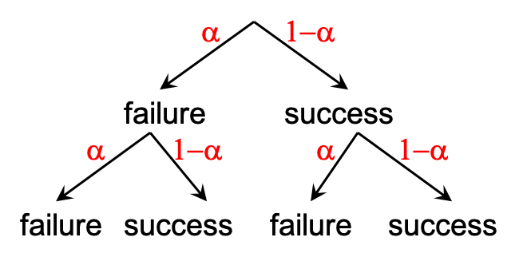
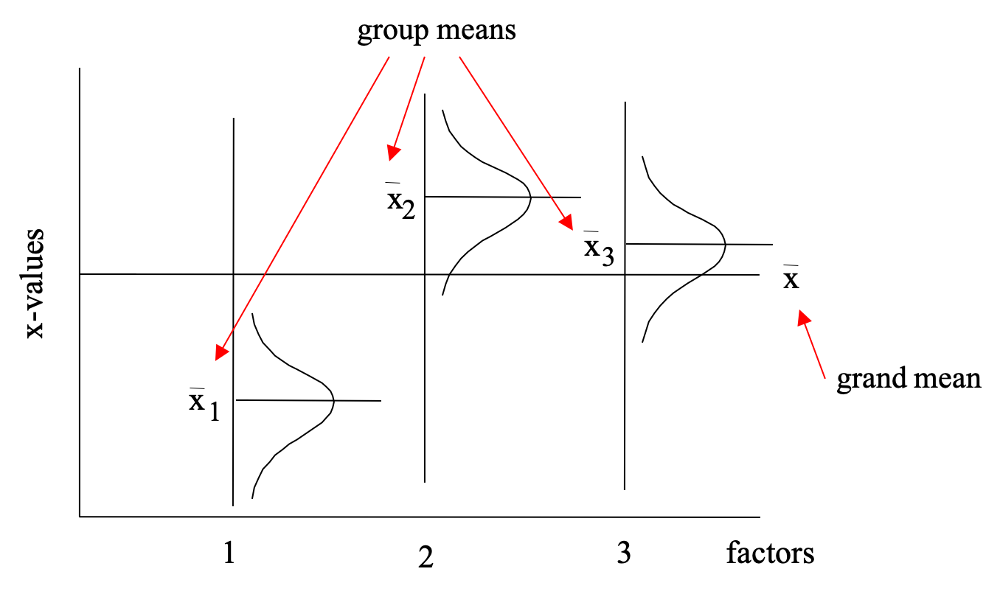
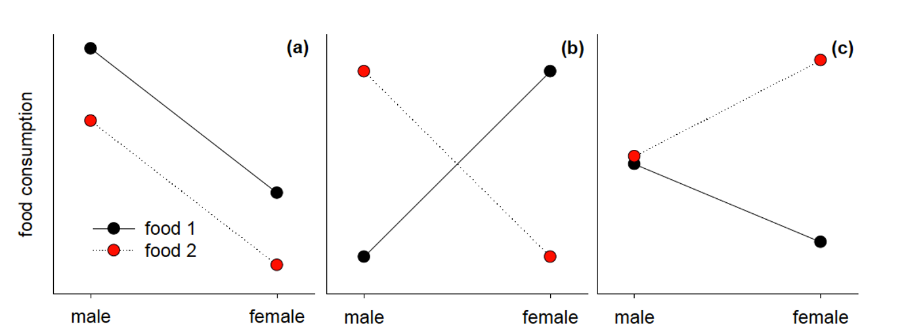
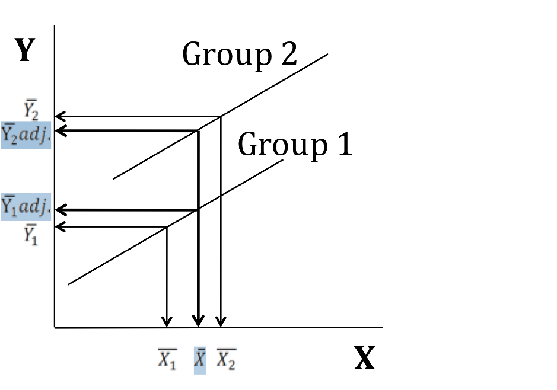

```{r setup, include=FALSE}
knitr::opts_chunk$set(fig.width=5, fig.height=5, fig.align="center", collapse = TRUE, comment = "##", dev="png")
library(RColorBrewer)
cols = brewer.pal(8, "Set1")

## to use tables
library(knitr)
library(kableExtra)
```


## Standard test procedure tables: what is "standard" for a comparison of locations? ;-)

* **Independent samples** 
* **Dependent/paired** Measurements can be paired (*aligned*) across time or space for repeatedly measured objects (e.g. same patients before and after a drug).

<br/>


## Parametric vs. non-parametric tests, testing normality

* **Parametric** tests assume applicability of a known parameterized probability distribution, e.g. ND ($\mu$, $\sigma$). Mostly the word is used to describe tests that assume ND for data.
* **Non-parametric** tests do not make any assumption about frequency distributions. They are also called *distribution-free*.

<br/>

This makes it necessary to **check** normal distribution:

* Compute **skewness and kurtosis**.
* Check relative difference of **mean and median**.
* Plot **histograms**, **boxplots**, **QQ-plots**.
* *Notorious* **Statistical tests** allow a formal test of H0: data is normal.

<br/>

**Statisticians tend to rely on graphical means!**

<br/>

Consider data transformation to achieve normally distributed data: Applying the same mathematical operation to all data. Consider $pH=-\log_{10}[H_3O^+]$. A log-normal distribution is very common in ecological/environmental data!

* Data skewed to the left: exponential functions x^2 or x^3, etc.
* Data skewed to the right: $\log(x)$ or $\sqrt(x)$ or $\frac{1}{x}$ or $\frac{1}{x^2}$, etc.
* Data with zeros: $\log(x+min(x))$ where min(x) is often just 1 (especially for count data).

For final graphs and tables, data may be back-transformed into its original units, e.g. $x=e^y$ for $y=\ln(x)$.


## Standard test procedure tables: what is "standard" for a comparison of locations? ;-)

* **Independent samples** 
* **Dependent/paired** Measurements can be paired (*aligned*) across time or space for repeatedly measured objects (e.g. same patients before and after a drug).

<br/>


## Multiple comparisons:

<div class="left lt">

What happens if we have more than two groups and all we know is the t-test?

Pairwise testing is possible: For example groups A, B, C might be tested A vs. B, B vs. C, A vs. C. 

Two major problems:

1. The amount of work quickly escalates.
2. We repeatedly use the same data - type I error inflates seriously!

What is the real "experimentwise error rate" when doing two tests in sequence?



<br/>

</div>

<div class="right rt">

A conservative estimate for the probability to make *any* failure (total error) in multiple test procedures is:

$$
\alpha_t=1-(1-\alpha)^k
$$
... where $\alpha$ and $\alpha_t$ are alpha errors for any single test and the sequence of $k$ tests. 

**Bonferroni**-correction (also known as *Dunn-Sidak*):

$$
\alpha_{adj}=1-(1-\alpha_t)^{\frac{1}{k}}
$$
with $\alpha_t$ set to a desired level (0.05) this results in an adjusted (lower) $\alpha_{adj}$ to be used for any single test.

</div>


## ANalysis Of VAriance: One-way ANOVA

A parametric test procedure for testing significant differences among means of more than two independent samples from normally distributed populations.

<br/>

Continuous response variable = dependent.

Categorical group coding variable = independent = factor (groups = factor levels).

<br/>

Different types of ANOVA:

<br/>

* ANOVA with more than one factor = multifactorial ANOVA
* ANOVA, where the comparison between groups should be independent of one ore more continuous variables (= covariables) = ANCOVA = ANalysis Of COVariance
* ANOVA with more than one dependent variable = MANOVA = multivariate ANOVA
* ANOVA with dependent samples = Repeated measures ANOVA

<br/>

* model I ANOVA: with treatment factors (deliberate manipulation)
* model II ANOVA: with random effects (e.g. random replication at multiple levels – fish within cages within ponds)
* mixed model ANOVAs have both treatment factor(s) and random effect(s)


## ANalysis Of VAriance: Assumptions and remedies

<div class="left lt">

1. Response X has to show **normal distribution at each factor level**.
2. **Homogeneity of variances**: More critical! Test with `bartlett.test`.

<br/>

*When assumption of normal distribution is violated*:

* ANOVA is considered **robust against violations**.
* **Transform** variable, e.g. $\log(x)$.
* **Assume ND**? What do you know about the *population*? Which process generated the data? Reasons to assume random measurement error?
* Switch to **non-parametric procedures**.

<br/>

*When assumption of variance homogeneity violated*:

* **Transform** variable.
* Switch to **non-parametric test**.
* Run **multiple pairwise comparisons** using t-tests or U-tests and adjust P.
* Use variant of Welch test `oneway.test`.

</div>

<div class="right rt">

```{r fig.height=4,fig.width=4}
data<-read.table(file="data/MaraRiver.txt",header=TRUE) # landuse and water chemistry of 54 streams
data$landuse<-factor(data$landuse)   # define factor
levels(data$landuse)
data$landuse<-factor(data$landuse,levels=c("A","M","F"))
# First check ND and variance homogeneity?
boxplot(TDN~landuse,data=data)
shapiro.test(data$TDN[data$landuse=="M"]) # also needed for A, F

bartlett.test(TDN~landuse,data=data)
# -> variances differ significantly among landuses !

# Get out of here ASAP ;-)
oneway.test(TDN~landuse,data=data,var.equal=FALSE)

# ... or try again with log-transformed TDN!
boxplot(log(TDN)~landuse,data=data)
bartlett.test(log(TDN)~landuse,data=data)
#-> variances now homogeneous (i.e. "not found heterogeneous")
# ready for ANOVA
```

</div>


## ANalysis Of VAriance: Hypotheses

<div class="left lt">

(Illustration assumes 3 groups and equal group sizes n.)

<br/>

$H_0$: The three groups are not different, i.e. they come from same population. $\mu_1=\mu_2=\mu_3$

$H_A$: At least one group differs from at least one other, i.e. one comes from a different population. 
$\mu_1\neq\mu_2=\mu_3$ or $\mu_1=\mu_2\neq\mu_3$ or $\mu_1\neq\mu_2\neq\mu_3$.

<br/>

These hypotheses are here formulated for means (ANOVA), but are similarly formulated for variances (Bartlett-test).

<br/>

We will use variances to test these hypotheses!

<br/>

Recall F-distribution built by taking two (!) samples from a population (ND with $\mu,\sigma^2$) and computing:
$$
F=\frac{s_1^2}{s_2^2}\sim1
$$
</div>

<div class="right rt">

```{r echo=FALSE}
x<-seq(0,5,by=.01)
plot(x,df(x,df1=4,df2=19),type="l",bty="n",lwd=2,ylab="Density",xlab="F-quantile")
lines(x,df(x,df1=19,df2=4),type="l",bty="n",lty=2,lwd=2)
lines(x,df(x,df1=3,df2=10),type="l",bty="n",lty=3,lwd=2)
qf<-qf(p=0.05,df1=4,df2=19,lower.tail=FALSE)
polygon(c(qf,seq(qf,5,by=0.01),5),c(0,df(seq(qf,5,by=0.01),df1=4,df2=19),0),col="red")
abline(v=qf,lty=3,lwd=2)
text(qf,0.4,bquote("F"["4,19"]*"="*.(round(qf,2))),pos=4)
legend(3.5,0.20,legend=expression(symbol(alpha)*"=0.05"),fill="red",bty="n")
legend(1,0.65,legend=c(expression("F"["4,19"]),expression("F"["19,4"]),expression("F"["3,10"])),lty=c(1:3),lwd=2,bty="n")
```

</div>


## ANalysis Of VAriance: Graphical scheme

Remember $H_0$ is true :-).
Task: Estimate variance from the **ONE** underlying population!

1. Ignore groups, pool data and compute a **total** variance.  
2. Compute average of variances **within** each group.
3. Compute **between** (**among**) variance from SEM = standard deviation of group means from grand mean. 

<br/>



<br/>

<br/>

For step 2: Calculation of sum of squares **within** the groups, i.e. the sum of the squared differences between each data point and the respective group mean.

<br/>


<br/>

For step 3: Calculation of sums of squares **between** the groups, i.e. the sum of the squared differences between the **group means** and the **grand mean**.

<br/>


<br/>


## ANalysis Of VAriance: Partitioning sums of squares

<div class="left lt">

For each strategy to estimate variance an expression for sums of squares is needed:

<br/>

1. $SS_t$ is always an expression for total variation.

$$
SS_{t(total)}=\sum_{z=1}^Z\sum_{i=1}^n(x_{iz}-\bar{x})^2
$$

<br/>

2. $SS_w$ is an expression for within-group variation, also called *not explained* SS (*due to random error*).

$$
SS_{w(within)}=\sum_{z=1}^Z\sum_{i=1}^n(x_{iz}-\bar{x}_z)^2
$$

<br/>

3. $SS_b$ is an expression for group-to-group variation, also called the *explained* SS (*due to treatment*).

$$
SS_{b(between)}=n\cdot\sum_{z=1}^Z(\bar{x}_z-\bar{x})^2
$$

</div>

<div class="right rt">

Sums of squares are additive! The variation of the whole dataset is now partitioned into two parts depending on origin!

$$
SS_t=SS_b+SS_w
$$

<br/>

This can be translated into percentages of variation due to treatment and due to random error!

<br/>

The process is also called **Partitioning the total sum of squares (SS) (“Splitting of variance”)**

</div>


## ANalysis Of VAriance: Mean squares

<div class="left lt">

Sums of squares are turned into *mean squared deviations* by dividing through the appropriate degrees of freedom:

$$
MS_t=\frac{SS_t}{Z\cdot{n}-1}
$$
$$
MS_w=\frac{SS_w}{Z\cdot{(n-1)}}
$$
$$
MS_b=\frac{SS_b}{Z-1}
$$

<br/>

All mean squares are **variance estimates**!

Recall that $SEM^2=\frac{s^2}{n}$. As in $SS_b$ the sum of squared group mean deviations from the grand mean was already multiplied with $n$, $MS_b$ estimates $\sigma^2$.

</div>

<div class="right rt">

**Under a true $H_0$** all mean squares are good estimates for the same population variance $\sigma^2$.

<br/>

**Under a true $H_A$**:

1. $MS_w$ is still the average within-group variation and thus estimates $\sigma_1^2=\sigma_2^2=\sigma_3^2$ (variance homogeneity!).
2. $MS_b$ now includes substantial group-to-group variation, its estimate for $\sigma^2$ is larger than expected!

<br/>

Calculation of the test statistic F:

$$
TS=F_{emp}=\frac{MS_b}{MS_w}
$$

<br/>

$F\approx1$ under a true $H_0$, but $F>>1$ when $MS_b$ includes a group effect. A P-value can be computed from F-distribution with $df_1=Z-1$ and $df_2=Z(n-1)$.

<br/>

**Post-hoc tests**: Pairwise comparisons with adjusted P-values after all!

</div>


## ANalysis Of VAriance in R

```{r}
# using the Mara river data
fit<-aov(log(TDN)~landuse,data=data)
summary(fit)

fit2<-lm(log(TDN)~landuse,data=data)
anova(fit2)
# -> yes, there is a significant landuse effect on log(TDN)

TukeyHSD(fit) # post hoc tests, needs usage of aov() above
# check last column for adjusted p-values
pairwise.t.test(log(data$TDN),data$landuse,p.adj="bonferroni",pool.sd=TRUE)
# -> F differs from M and A, F has lowest TDN (i.e. "some" agriculture already increases TDN)

# in case of unequal variances: Welch-test variant for >2 groups
# here applied on the non-transformed TDN data
oneway.test(TDN~landuse,data=data,var.equal=FALSE)

# should then be followed up by appropriate post-hoc tests
pairwise.t.test(data$TDN,data$landuse,p.adj="bonferroni",pool.sd=FALSE)
# -> similar result, but less powerful (P-values are closer to significance threshold)

# in case of no ND and/or unequal variances: H-test after Kruskal and Wallis
# based on ranks, so can be applied on non-transformed TDN data
kruskal.test(TDN~landuse,data=data)

# appropriate post-hoc tests by multiple U-tests (only possible manually) #
wilcox.test(TDN~landuse,data=data[data$landuse!="A",]) # this is F vs. M
wilcox.test(TDN~landuse,data=data[data$landuse!="M",]) # this is A vs. F
wilcox.test(TDN~landuse,data=data[data$landuse!="F",]) # this is A vs. M

# get the P-values of these tests
P.values<-c(FM=0,AF=0,AM=0)
for (i in 1:3) {
  P.values[i]<-wilcox.test(TDN~landuse,data=data[data$landuse!=c("A","M","F")[i],])$p.value
  }

# and adjust them using Bonferroni
p.adjust(P.values,method="bonferroni")


```


## Two-way ANOVA

<div class="left lt">

A two-factorial ANOVA considers two factors **simultaneously**. A multifactorial ANOVA...

The simplest example has **2 factors with 2 levels each**, the data is stratified into 4 groups.

A random sample has to be collected for each factor level combination.

In such an *experimental design* each group forms a *cell* with several replicates.

<br/>

**A hypothetical example**:

1. response = food consumption of rats
2. factor 1 = sex with levels male and female
3. factor 2 = food type with levels fresh and old

<br/>

</div>

<div class="right rt">

**Possible outcomes of this experiment**:

<br/>

1. difference in food consumption between sexes
2. preference for a certain food type
3. difference in food preference among sexes, e.g. males prefer one food, females prefer the other

<br/>

Options 1. and 2. are **main effects**.

Option 3. is **interaction**: dependence of effect of one factor on level of other  factor, can be inhibition or synergism.

<br/>

**3 sets of hypotheses, the null hypotheses are**:

$H_0$: no difference between sexes

$H_0$: no difference between food types

$H_0$: no interaction

<br/>

</div>


## Two-way ANOVA: Partitioning sums of squares

<div class="left lt">
$SS_t$ is again the expression for total variation.
$$
SS_{t}=\sum_{s=1}^S\sum_{f=1}^F\sum_{i=1}^n(x_{isf}-\bar{\bar{x}})^2
$$

$SS_{sex}$ is computed from means of sexes (food types pooled).
$$
SS_{sex}=F\cdot{n}\cdot\sum_{s=1}^S(\bar{x}_{s}-\bar{\bar{x}})^2
$$

$SS_{food}$ is computed from means of food types (sexes pooled).
$$
SS_{food}=S\cdot{n}\cdot\sum_{f=1}^F(\bar{x}_{f}-\bar{\bar{x}})^2
$$

$SS_w$ is *still* an expression for within-group variation, also called *not explained* SS (*due to random error*).

$$
SS_{w}=\sum_{s=1}^S\sum_{f=1}^F\sum_{i=1}^n(x_{isf}-\bar{x}_{sf})^2
$$

</div>

<div class="right rt">

Sums of squares are additive!

$SS_{interaction}$ can be computed by difference from $SS_t$:

$$
SS_{interaction}=SS_t-(SS_{sex}+SS_{food}+SS_w)
$$

The variation of the whole dataset is partitioned into two 4 (!) components depending on origin! All MS except $MS_w$ are expressions for group-to-group variation (and thus *explained* SS, i.e. *due to treatment*).

</div>


## ANalysis Of VAriance: Mean squares

<div class="left lt">

Sums of squares are turned into *mean squared deviations* by dividing through the appropriate degrees of freedom:

$$
MS_t=\frac{SS_t}{S\cdot{F}\cdot{n}-1}
$$
$$
MS_w=\frac{SS_w}{S\cdot{F}\cdot{(n-1)}}
$$
$$
MS_{sex}=\frac{SS_{sex}}{S-1}
$$
$$
MS_{food}=\frac{SS_{food}}{F-1}
$$
$$
MS_{interaction}=\frac{SS_{interaction}}{(S-1)\cdot{(F-1)}}
$$
<br/>

All mean squares are again **variance estimates**!

<br/>

</div>

<div class="right rt">

**Under the respective true $H_0$ (one of 3)** the respective mean square is an equally good estimate for $\sigma^2$ as $MS_w$:

$$
MS_w\approx{MS}_{sex}\approx{MS}_{food}\approx{MS}_{interaction}
$$

<br/>

**Under the respective true $H_A$ (one of 3) the respective mean square is larger than $MS_w$.**

<br/>

Calculation of the F test statistics:

$$
F_{sex}=\frac{MS_{sex}}{MS_w}
$$
$$
F_{food}=\frac{MS_{food}}{MS_w}
$$
$$
F_{interaction}=\frac{MS_{interaction}}{MS_w}
$$

An effect of sex, food or interaction adds variation to the corresponding MS and the respective $F>>1$.

P-values can be computed from F-distributions with the appropriate df.

<br/>

</div>


## Two-way ANOVA: Post-hoc tests and interaction patterns

**Post-hoc tests**: Pairwise comparisons with adjusted P-values often still of interest after all!

In the rats x food illustration case we only have 2 factor levels for each factor, post-hoc tests are thus only interesting for specific interaction patterns.

A significant interaction effect is often the more interesting effect ;-).

A significant interaction effect also means main effects need to be carefully evaluated :-(. Main effects may be made worthless by a strong interaction.



Fig (a) shows a parallel response without interaction, while (b) and (c) show two (of many possible) types of interaction.

<br/>


## Two-way ANOVA in R

```{r}
data<-read.table("data/RatsFood.txt",header=TRUE)

tapply(data$cons,list(data$food,data$sex),mean)
tapply(data$cons,list(data$food,data$sex),sd)
tapply(data$cons,list(data$food,data$sex),length)     # check if design is balanced

# Make sure factors are recognized properly
data$food<-factor(data$food)
data$sex<-factor(data$sex)

# could check ND tediously in each cell of the design
f1s1<-data$cons[data$food=="1" & data$sex=="male"]

# or after standardisation within each cell
combfac<-factor(paste(data$food,data$sex,sep="_"))
z <- unlist(tapply(data$cons, INDEX=combfac, scale))

shapiro.test(z)

layout(matrix(c(1:4),2,2,byrow = TRUE))
hist(z,freq=FALSE); lines(density(z))
boxplot(cons~food,data=data,main="Differences by food")
boxplot(cons~sex,data=data,main="Differences by sex")
boxplot(cons~food*sex,data=data,main="Differences by sex and food")

bartlett.test(cons~combfac,data=data) # testing variance homogeneity

# two-way ANOVA table - BETTER ONLY USE THIS FOR BALANCED DESIGNS !
fit<-aov(cons~food*sex,data=data)
fit
summary(fit)
anova(lm(cons~food*sex,data=data))

layout(matrix(c(1:2),1,2,byrow = TRUE))
interaction.plot(data$food,data$sex,data$cons)
interaction.plot(data$sex,data$food,data$cons)

#######################################
# Post-hoc comparisons between groups #
TukeyHSD(fit)

```


## ANalysis of COVAriance

<div class="left lt">

A combination of ANOVA and regression, can be regarded as:

<br/>

1. A regression model including a categorical predictor to make room for variation of the regression among groups.
2. An ANOVA model including a *covariate*  (= often a variable not interesting but having high influence on the response)

Simplest case: One metric continuous response Y, one factor A (at least 2 levels) and one metric continuous variable X as predictors. In the simplest case we do not assume interaction between A and X.


where:

* $\beta_0$ is the intercept
* $\beta_1$ is the slope for the covariate (pooled across all levels of A)
* $\alpha_j$ is the effect of level j of the factor A (relative to a reference level or the overall mean)
* $\epsilon$ is remaining random error

</div>

<div class="right rt">



**Adjusted means** are accounting for the effect of the covariate. They represent the group means at the overall grand mean of X. They are classically computed in case of a *nuisance covariate* when the ANOVA-component of the model is important and the range of X covered by the two groups differ.


</div>

## ANCOVA: Hypotheses and assumptions

<div class="left lt">

Assuming the simplest case of 1 factor and 1 covariate and no interaction included. 2 hypotheses (pairs):


H0: **All adjusted means are identical**, no treatment effects (ANOVA hypothesis but considering simultaneous adjustment with the covariate). Given the assumption of slope homogeneity, this is identical to a test of equality of group intercepts!

H0: **No effect of the covariate** (as in simple linear regression).

<br/>

Adding an interaction term:


H0: **No interaction**. Equal slopes between groups. This is the easiest way to **test for homogeneity of slopes**!

<br/>

Assumption and diagnostics as in ANOVA and LR:

* Normal distribution of residuals
* Variance homogeneity of residuals across groups and X
* Conceptual issue: No collinearity between covariate and factor
</div>

<div class="right rt">

```{r echo=FALSE}
data<-read.table(file="data/MaraRiver.txt",header=TRUE) # landuse and water chemistry of 54 streams
data$landuse<-factor(data$landuse)   # define factor
data$landuse<-factor(data$landuse,levels=c("A","M","F"),ordered=FALSE)
```

```{r}
# continuing analysis of log(TDN) in the Mara River
plot(log(data$TDN)~log(data$Q),col=data$landuse) # effect of catchment size?
summary(lm(log(TDN)~log(Q),data=data))

m1<-lm(log(TDN)~log(Q)+landuse,data=data)
anova(m1)
summary(m1)

# with interaction: the effect of catchment size 
# could differ between landuses
m2<-lm(log(TDN)~log(Q)*landuse,data=data)
anova(m2) # no interaction

# adjusted means only make sense when slopes are homogeneous!
common.slope<-coefficients(m1)[2]
adj.m<-tapply(log(data$TDN),INDEX=data$landuse,FUN=mean)-
  common.slope*
  (tapply(log(data$Q),INDEX=data$landuse,FUN=mean)-mean(log(data$Q)))
adj.m
adj.m-adj.m[1] # these are the differences to reference level=A
# same as in the summary(m1) output

# compare with unadjusted means
m<-tapply(X=log(data$TDN),INDEX=data$landuse,FUN=mean)
m-m[1] # these are the differences of unadjusted means to reference level=large

# --> the inclusion of the covariate has reduced 
# the "apparent" differences a bit

# checking assumptions
shapiro.test(m1$res)
bartlett.test(m1$res~data$landuse)
layout(matrix(1:4,2,2))
hist(m1$res)
qqnorm(m1$res); qqline(m1$res)
plot(m1$res~m1$fitted) # unexplained relationship/pattern left?
plot(m1$res^2~m1$fitted) # variances homogeneous? should not show any trend
layout(matrix(1:4,2,2))
plot(m1)
```


</div>


