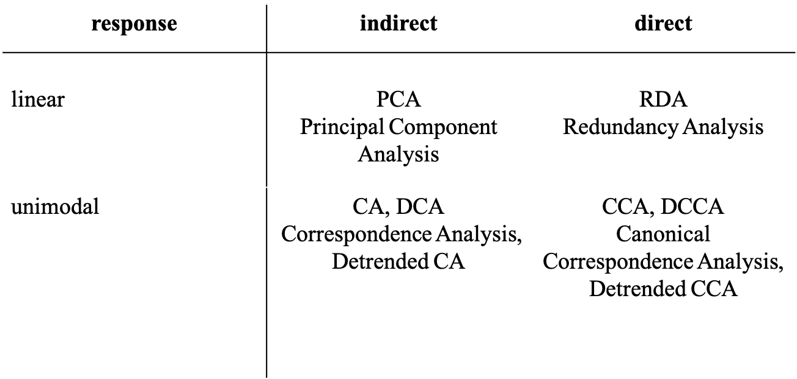
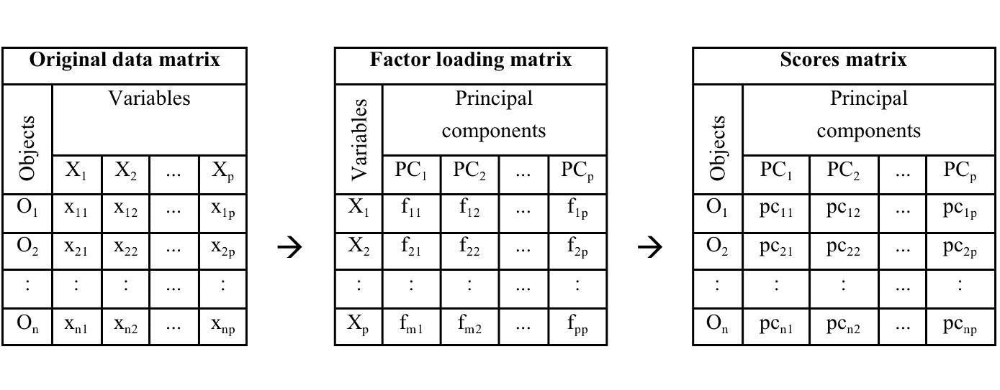
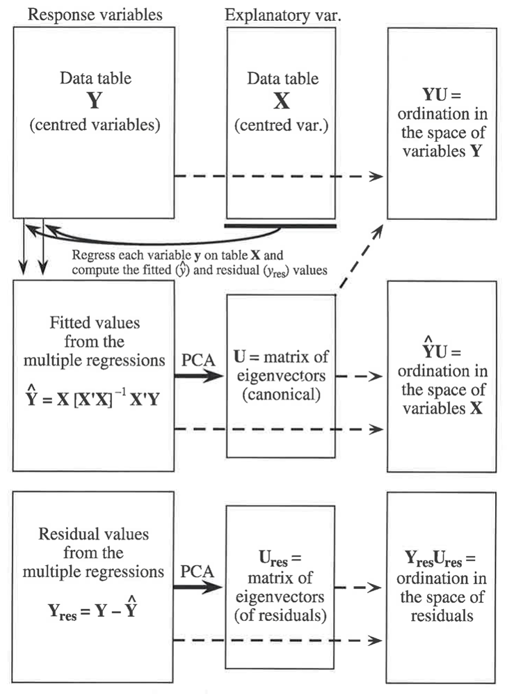
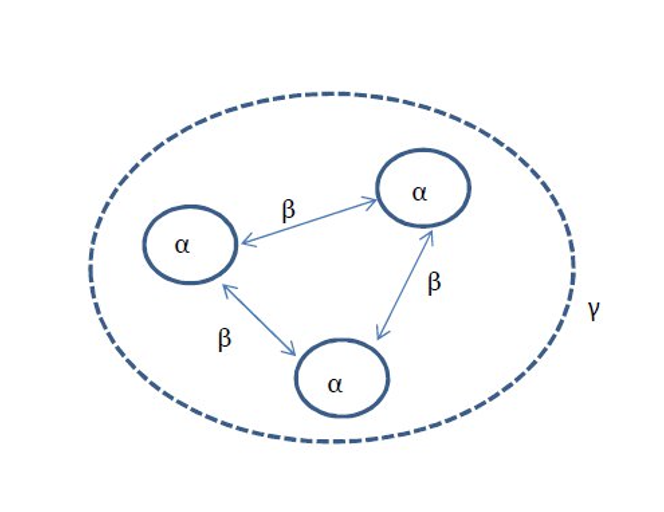
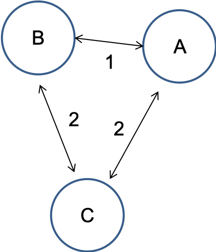
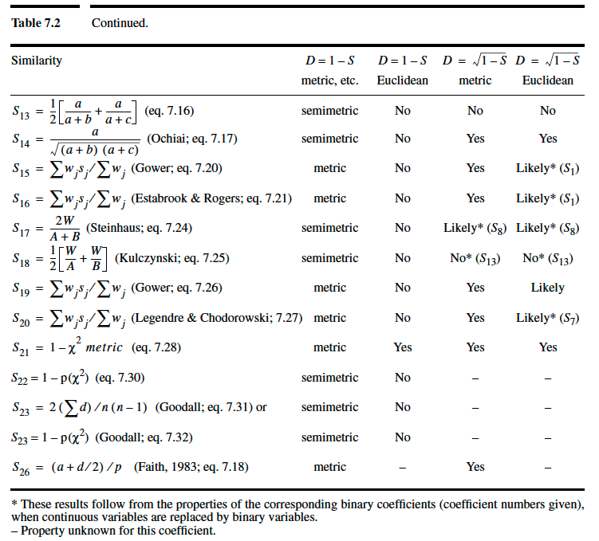
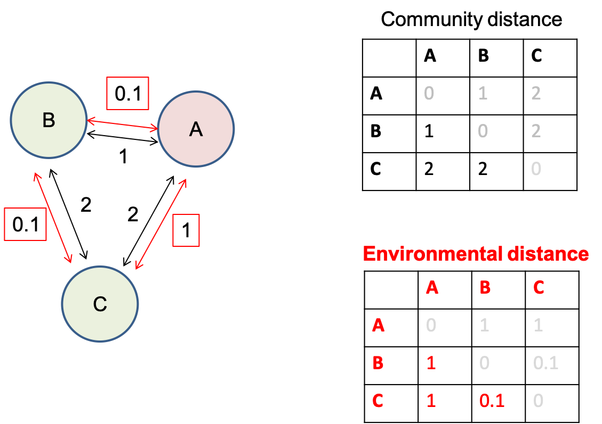
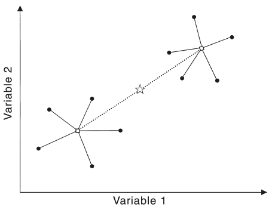
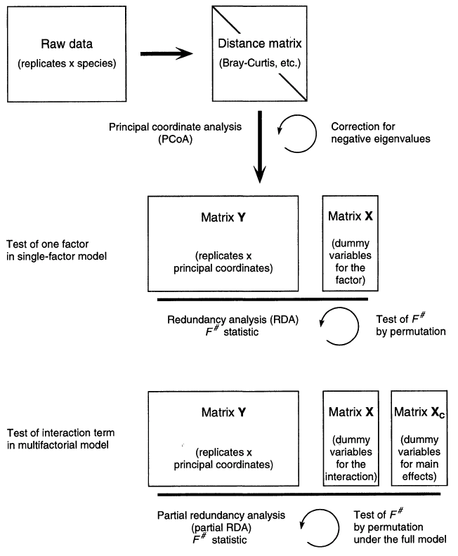

```{r setup, include=FALSE}
knitr::opts_chunk$set(fig.width=5, fig.height=5, fig.align="center", collapse = TRUE, comment = "##", dev="png")
library(RColorBrewer)
cols = brewer.pal(8, "Set1")

## to use tables
library(knitr)
library(kableExtra)
```

## A short recap on classical ordination methods - in R ;-)

Ecological datasets have one or both of these datasets (if not more):


## A short recap on classical ordination methods - in R ;-)

The classical ordination methods always target dimension reduction, and

* are based on **linear or unimodal** relationships, and
* may involve **direct** regression on a 2nd matrix of explanatory variables (as opposed to **indirectly** reconstructing gradients from a single data matrix)



Note that **ordination** is a word almost exclusively used by ecologists. Outside most of these methods are known as **scaling techniques**. The phrase **gradient analysis** makes a bit more sense in ecology ;-)

Specifically PCA and RDA are quite useful outside of the classical species or species~environment framework of ecology.


## Principal component analysis (PCA) in R

PCA can be understood as a MLR on theoretical (latent) instead of observed variables dependent variables.

The regression coefficients in PCA are **factor loadings**.

The predicted values of the theoretical dependent are **scores**.



For instance, in a PCA on this matrix of n objects times p variables PC1 is computed as:

$$
PC_1=f_1X_1+f_2X_2+...+f_pX_p
$$
There must be as many PCs as original variables. The factor loading matrix translates p $X$-variables into p $PCs$.

```{r}
library(vegan)
library(shape) # nice arrows
mara<-read.table(file="data/MaraRiver.txt",header=TRUE) # water chemistry in 54 streams, 3 types of landuse

wc<-log(mara[-c(5,6),9:26]) # just clean-up
landuse<-mara$landuse[-c(5,6)]
plot(wc) # check potential for PCA by correlation plot

pca<-prcomp(scale(wc),retx=T,center=F,scale.=F)
pca<-prcomp(wc,retx=T,center=T,scale.=T)   # equivalent to line above

summary(pca)

pca$sdev # stdevs of PCs (squares are eigenvalues)

head(scores<-pca$x) # site scores on all PCs

head(scale(wc) %*% pca$rotation) # to manually compute scores from variables and loadings
head(loadings<-pca$rotation) # the variable loadings

# how many axes should be kept?)
screeplot(pca,npcs=length(pca$sdev),type = "lines") # plots eigenvalues vs. component #
abline(h=1,col="red")
# -> the first 3-4 PCs seem useful, and just PC1 and PC2 alone are already explaining a lot of overall variance
# eigenvalue of PC5<1, so PC5 contributes less than one original variable (Kaiser-Guttman criterion)

# for a DISTANCE BIPLOT (focus is on sites, "scaling 1")
# each principal component has variance given by eigenvalue, loadings remain unscaled
plot(scores[,1:2],asp=1,pch=21,bg=landuse) # note asp=1
arrows<-loadings*7 # with extension factor
Arrows(x0=0,y0=0,x1=arrows[,1],y1=arrows[,2],col="darkgreen")
text(x=arrows[,1]*1.3,y=arrows[,2]*1.2,labels=names(wc),cex=0.7)

biplot(pca,scale=0)
# in this plot:
# 1) distances among sites are approximating true Euclidean distances in multivariate space
# 2) angles between arrows do not reflect correlations among variables
# 3) projecting site on descriptor at right angle gives its appr. descriptor value

# for a CORRELATION BIPLOT (focus is on variables, "scaling 2")
# each principal component is weighted by 1/sqrt(eigenvalue), so it has variance 1
var(scores[,1]/pca$sdev[1]) # just demo
plot(scores[,1]/pca$sdev[1],scores[,2]/pca$sdev[2],pch=21,bg=landuse,asp=1)
# loadings are weighted by sqrt(eigenvalues)
arrows<-loadings*matrix(pca$sdev,nrow=nrow(loadings),ncol=ncol(loadings),byrow=TRUE)
arrows<-arrows*2 # choose extension factor
Arrows(x0=0,y0=0,x1=arrows[,1],y1=arrows[,2],col="purple")
# as alternative just compute correlation of scores with original data ("structure coefficients")
(structure<-cor(wc,scores))
structure<-2*structure
Arrows(x0=0,y0=0,x1=structure[,1],y1=structure[,2],col="red")
text(x=arrows[,1]*1.3,y=arrows[,2]*1.2,labels=names(wc),cex=0.7)

biplot(pca,scale=1)
# in this plot
# 1) distances among sites are not approximating true Euclidean distances in multivariate space
# 2) angles between arrows reflect correlations among variables (NOT proximity of arrow heads)
# 3) projecting site on descriptor at right angle gives its appr. descriptor value

# PCA using the rda function from the vegan package
pca2<-rda(X=wc,scale=TRUE)
summary(pca2,scaling=1)
scores(wc,scaling=0)
biplot(pca2,scaling=1)
biplot(pca2,scaling=2)
# note different scaling factors, but solution remains same


##############################
# some follow-up suggestions #
# test PCA-axes for effect of landuse or stream size (as log(Q)) using ANOVA or ANCOVA
# correlate PCA-axes with other potential "controlling" variables (e.g. TDN, canopy cover) to give "meta-dimensions" more meaning
# useful function envfit() to relate additional variables to the ordination space
```


## Redundancy analysis (RDA) in R

<div class="left lt">

Two involved matrices: one dependent, one independent.

(Note: For correlation of two matrices see CCorA (Canonical correlation analysis) $\neq$ CCA.)

**Redundancy**: The proportion of total variance of in the response variables that can be explained linear combinations of predictors.

Two steps:

1. MLRs relate each response variable to the independent matrix and predict the response.
2. The matrix of predicted response variables (same size as original: n objects * p variables) is subject to PCA.

The response variables are **constrained** to be linear combinations of the predictors first!

Significance tests for the overall model, for the various RDA-axes and for the individual predictors are available (permutation-based).

</div>

<div class="right rt">



Site scores:

* One set of *unconstrained* scores (site scores), $YU$.
* One set of *constrained* scores (LC scores), $\hat{Y}U$.

</div>

## Redundancy analysis (RDA) in R

```{r}
zwc<-scale(wc) # must at least be centered even if dimensionally homogeneous!
xmat<-data.frame(logQ=log(mara$Q),logTDN=log(mara$TDN),canopy=mara$canopy)[-c(5,6),]

rda<-rda(zwc~logQ+logTDN+canopy,data=xmat) # take care: confusing X and Y argument names

# actual RDA output check
summary(rda)
?cca.object
RsquareAdj(rda) # redundancy statistic (fractional amount of variation of the response data matrix explained by constraints)

# hypothesis tests #
# testing the first axis (global test)
anova(rda)
anova(rda,first=TRUE)

# testing all axes sequentially (preceding axes are taken as constraints)
anova(rda,by="axis",model="direct",perm.max=9999,step=1000)

# testing the individual terms=constraints
anova(rda,by="terms",model="direct",perm.max=9999,step=1000)  # tests terms sequentially, order matters!
anova(rda,by="margin",model="direct",perm.max=9999,step=1000) # tests each term in full model (like drop1() function)

###################
# making triplots #

# again various types of scaling for the plotting step:
# scaling 1 "distance triplot"
# only angles between constraints and responses reflect their correlations (not angles among responses)
# distances among sites reflect their Euclidean distances

# scaling 2 "correlation triplot"
# all angles between constraints and responses reflect correlations 
# distances among sites do not reflect their Euclidean distances

# in both scaling types sites can be projected on constraints and on responses
# factor constraints are shown as centroids instead of arrows, projecting works identical 

# scaling 3 is compromise

# build an RDA scaling type 1 triplot
plot(rda,scaling=1)

(sites<-scores(rda,choices=c(1,2),display="sites",scaling=1)) 

(lcs<-scores(rda,choices=c(1,2),display="lc",scaling=1)) # fitted/constrained site scores

(species<-scores(rda,choices=c(1,2),display="sp",scaling=1)*0.5)

(constraints<-scores(rda,choices=c(1,2),display="bp",scaling=1)*2)

plot(sites,asp=1,pch=21,bg=landuse,ylim=c(-1.5,1.5))
Arrows(x0=0,y0=0,x1=constraints[,1],y1=constraints[,2],lwd=1.5,col="blue")
text(constraints[,1:2]*1.1,label=rownames(constraints),pos=4,cex=0.8,col="blue")

Arrows(x0=0,y0=0,x1=species[,1],y1=species[,2],lwd=1,arr.length=0)
text(species[,1:2]*1.1,label=rownames(species),pos=4,cex=0.6)
```

## Correspondence Analysis (CA)

<div class="left lt">

Based on one matrix (usually a *species* or *community* matrix).

Considers unimodal responses to (unknown) environmental variables.

An *indirect* GA, resulting gradients are synthetic environmental gradients.

The basis for CA is **weighted averaging** from environmental and species tables. If *env* exists, then this can be done to extract *bioindicatory information*:

$$
u^*=\frac{y_1x_1+y_2x_2+...+y_nx_n}{y_1+y_2+...+y_n}
$$
A *species optimum* $u^*$ is computed as an abundance-weighted means of a specific environmental variable over all sites at which a specific species is present.

This approach works best when:

* Species have narrow amplitude.
* Environmental variable spans the whole range of the species´ tolerance curve with good spacing.

</div>

<div class="right rt">

CA uses a *two-way weighted averaging* with a theoretical environmental variable iteratively in several steps:

1. Take *arbitrary* site scores.
2. Derive species scores by weighted average of sites scores, for species k (of m):
$$
u_k=\sum_{i=1}^n{y_{ki}x_i}/\sum_{i=1}^n{y_{ki}}
$$
3. From the species scores new site scores can be derived, for site i (of n):
$$
x_i=\sum_{k=1}^m{y_{ki}u_k}/\sum_{k=1}^n{y_{ki}}
$$
4. Rescaling (standardization) of site and species scores.
5. Repeat 2-3 several times until stabilisation of site and species scores = first CA axis.
6. Similar procedure to construct second CA axis (uncorrelated to first).

</div>


## Canonical Correspondence Analysis (CCA)

Two involved matrices: one dependent, one independent.

In the reciprocal averaging of CA a constraint is included:

* Site scores are linearly (!) regressed on the independent dataset (environment).
* Predicted values for the site scores are then used to compute the species scores. 

The result are axes which inform about **species-site relationships**, but which also have **maximized correlation with linear combinations of (environmental) predictors**.

Site scores:

* One set of *unconstrained* scores (WA scores), similar but not identical to CA-results
* One set of *constrained* scores (LC scores), usually the ones of interest

```{r}
data(varespec) # a R dataset on vegetation
data(varechem) # soil chemistry
head(varespec)
head(varechem)
apply(varespec,1,sum) # approximate 100 (total cover), "absolute" abundance data

# correspondence analysis #
# run a CA just based on the species data (unconstrained!)
vare.ca<-cca(X=varespec) # function also used for CCA, but here only one matrix X is supplied

summary(vare.ca,scaling=1)
# summary(vare.ca,scaling=2)
# again two different types of scaling are possible for biplots

# scaling 1 (distances among sites matter)
# distances among sites approximate their chi^2 distance
# close sites have similar species abundances
# a site, which is near a specific species, has a high contribution of that species 

# scaling 2 (relationships among species matter)
# distances among species approximate their chi^2 distance
# close species have similar abundances across sites
# a species, which is near a specific site, is more likely to be found at that site

plot(vare.ca,scaling=1)
plot(vare.ca,scaling=2)
plot(vare.ca,scaling=3) # a compromise
# for any scaling take care when interpreting species close to origin:
# these are "everywhere" or have optimum right at the origin (i.e., optimum with regard to both axis shown)

# for more controlled plotting
species.scores<-scores(vare.ca,display="species",scaling=2)
site.scores<-scores(vare.ca,display="sites",scaling=2)

plot(site.scores,col="black",pch=21,xlim=c(-2,2),ylim=c(-2,2))
text(species.scores,col="red",label=names(varespec),cex=0.7)

# post-hoc fitting of an environmental variable
names(varechem)
(ef<-envfit(vare.ca,varechem[,12:13],permutations=1999))
plot(ef)

###########################
# canonical correspondence analysis #
vare.cca<-cca(Y=varespec,X=varechem) # note strange terminology of X and Y in vegan (don´t ask)
vare.cca<-cca(varespec~.,varechem) # hypothesis tests need formula interface (don´t ask)

summary(vare.cca,scaling=1)
summary(vare.cca,scaling=2)
# again two different types of scaling are possible for triplots

# hypothesis tests #
# testing the first axis (global test)
anova(vare.cca)
anova(vare.cca,first=TRUE)

# testing all axes sequentially (preceding axes are taken as constraints)
anova(vare.cca,by="axis",model="direct",perm.max=9999,step=1000)

# testing the individual terms=constraints
anova(vare.cca,by="terms",model="direct",perm.max=9999,step=1000)  # tests terms sequentially, order matters!
anova(vare.cca,by="margin",model="direct",perm.max=9999,step=1000) # tests each term in full model (like drop1() function)

# quite a lot of variables in the constraining matrix, maybe selection would be adequate
# --> function ordistep()

###################
# making triplots #

# again various types of scaling for the plotting step:
# scaling 1 "distance triplot"
# sites can be projected on constraints
# sites close to centroid of factor constraint are more likely to possess the specific state (factor level)
# distances among sites reflect their Chi^2 distances

# scaling 2 "correlation triplot"
# species can be projected on constraints (to give their optimum)
# species close to centroid of factor constraint are more likely to be found in the respective sites
# distances among sites do not reflect their Chi^2 distances

# scaling 3 is compromise

plot(vare.cca,scaling=1,display=c("species","sites"))
plot(vare.cca,scaling=1,display=c("species","sites","bp"))
plot(vare.cca,scaling=2)
plot(vare.cca,scaling=3) # a compromise
# for any scaling take care when interpreting species close to origin:
# these are "everywhere" or have optimum right at the origin (i.e., optimum with regard to both axis shown)

# for more controlled plotting compute scores individually

(species<-scores(vare.cca,display="species",scaling=2))

(lcs<-scores(vare.cca,display="lc",scaling=2)) # fitted site scores

(sites<-scores(vare.cca,display="sites",scaling=2)) # unfitted site scores

(constraints<-scores(vare.cca,choices=c(1,2),display="bp",scaling=2))

plot(sites,col="black",pch=21,xlim=c(-2,2),ylim=c(-2,2))
text(species,col="red",label=names(varespec),cex=0.7)
Arrows(x0=0,y0=0,x1=constraints[,1],y1=constraints[,2],lwd=1.5,col="blue")
text(constraints[,1:2]*1.1,label=rownames(constraints),pos=4,cex=0.8,col="blue")
```


## Methods based on distance/dissimilarity/similarity


## Why use dissimilarity-based methods?

<div class="left lt">

* Quantify how similar or how dissimilar various observations are with regard to many variables simultaneously.
* An efficient way to collapse information from a much too high-dimensional dataset.
* An explicit way to express (and analyze) community turnover in space and time (beta-diversity).
* Use various variable types from continous to presence-absence and qualitative, even simultaneously.
* Choice of appropriate dissimilarity coefficient may allow avoiding *strange* transformations.
* Better handling of double-zeros, less horseshoe patterns in ordinations in situations of strong community turnover.
* Similarity may be translated into dissimilarity and vice-versa.

</div>

<div class="right rt">

Whenever compositional turnover at regional scale is of interest!

Diversity partitioning into $\alpha$, $\beta$, $\gamma$:


$\beta$-diversity is linked to species-accumulation curves.
</div>

##  (Dis)similarity coefficients

Euclidean and Bray-Curtis (Steinhaus, Sorenson) are two examples of many dissimilarity indices, here computed between any two sites for $p$ variables:

$$
d_{Euc}=\sqrt{\Delta{x_1}^2+\Delta{x_2}^2+...+\Delta{x_p}^2}
$$
where $\Delta{x}$ is the distance between two sites along any $X$-variable.

<br/>

$$
d_{BC}=\frac{\sum_{j=1}^p{|x_{1j}-x_{2j}|}}{\sum_{j=1}^p{(x_{1j}+x_{2j})}}
$$
which includes a notable normalization of differences between two sites with regard to any variable used.


## (Dis)similarity coefficients

<div class="left lt">

* symmetrical: consider a double zero as contributing to resemblance just like any other value
* asymmetrical: skip double zeros, considering that these are not informative (absence of a species at two sites does not tell anything about how similar these sites are!)

<br/>

* metric: minimum 0, positive for inequality, symmetric ($D_{(a,b)}=D_{(b,a)}$), triangle inequality holds

$$
D_{(a,b)}+D_{(b,c)}\geq{D_{(a,c)}}
$$
(think of a triangle: the distance from A to C via B must be larger than the direct distance from A to C)

* semimetric: do not follow the triangle inequality

$$
D_{(a,b)}+D_{(b,c)}<{D_{(a,c)}}
$$
... in which case perfect projections into Euclidean space are not possible. Two often used transformations to make semimetric coefficients analyzable in Euclidean space are adding a constant or $\sqrt(D)$.

</div>

<div class="right rt">



</div>


## (Dis)similarity coefficients


<br/>
 


## Using dissimilarity: Cluster analysis

Hierarchical group-forming (clustering) based on pairwise (dis)similarity.

Three types:

1. Divisive: start with all, successively split into 2.
2. **Agglomerative**: start with individual observations and cluster pairwise, continue grouping clusters.
3. Non-hierarchical: e.g. K-means clustering (forcing K clusters)

<br/>

Various “linkage rules” to group clusters in agglomerative clustering:

* Single linkage looks for the nearest neighbour of any group member to other observations (tends to chaining). 
* **Average linkage** computes dissimilarities between two groups as the average dissimilarity among all pairwise group member dissimilarities (one from each cluster).
* **UPGMA** (unweighted-pair-groups method using arithmetic averages) is a version of an average linkage rule. 

```{r}
lipids<-read.table(file="data/BacterialMembrane.txt",header=TRUE)
names(lipids)
lip_data<-lipids[,4:20]
# abbreviations: MU = mono-unsaturated, SA = saturated, nb = non-branched, b = branched
# SA_branprop = proportion of branched and saturated FAs
# theory: unsaturated and branched FAs increase fluidity of membrane
# test (i) adaptation vs. (ii) acclimatization to temperature by changing FA composition of membranes

isolate<-factor(lipids$isolate)
temperature<-factor(lipids$temperature)
combifac<-factor(paste(temperature,"_",isolate,sep=""))

## distance matrix: Euclidean distance on arcsine-sqr-data
as_lip_data<-asin(sqrt(lip_data)) # very old-school, better don´t do ;-)
lipids_distE<-vegdist(as_lip_data, method="euclidean") 

## alternatively: Bray-Curtis distance with proportional data
lipids_distBC<-vegdist(lip_data, method="bray")

# cluster analysis #
# various agglomeration methods available and the choice is important, explore method=
# "single": nearest neighbour counts (good for gradients, but makes chains)
# "complete": all group members must be close, farthest group member counts (makes small spheric groups, good to find outliers)
# "average": compromise average strategy, new member joins at mean distance to all group members, actually UPGMA
# "ward.D": aims at minimizing within-group sums of squares of distances
lipids_cluster<-hclust(lipids_distBC, method = "ward.D")
lipids_cluster$height<-sqrt(lipids_cluster$height) # may help

# then compare effect of agglomeration method on dendrogram
plot(lipids_cluster, hang = -1, labels = combifac, ylab = "BC")

# which agglomeration method (and thus dendrogram) is best?
cophenetic(lipids_cluster) # linkage distances in dendrogram
plot(lipids_distBC,cophenetic(lipids_cluster))
cor(lipids_distBC,cophenetic(lipids_cluster),method="spearman")

cutree(lipids_cluster,k=4)
cutree(lipids_cluster,h=0.05)

plot(lipids_cluster, hang = -1, labels = combifac, ylab = "BC")
rect.hclust(lipids_cluster,k=4) # or specify height h instead of k

```


## Using dissimilarity: Principal Coordinate Analysis (PCoA)

(aka *metric scaling*)

Technique to project sites onto Cartesian (Euclidean) coordinates from pairwise dissimilarities. 

Imagine a road distance matrix between major towns. A 2D-projection of all pairwise distances produces a map (which gets better with less mountains and straighter roads in the area).

PCoA can be regarded as the inverse operation to computing a distance matrix. However, it can´t produce more "axes" than (n-1) as this is the maximum number of dimensions needed to completely represent n objects. A dissimilarity matrix and a consecutive PCoA are efficient means to condense data with p>>n.

PCoA is an important step in hypothesis-testing methods in the distance domain (see later).

<br/>

PCoA is based on an eigenvector decomposition like PCA:

* fast (not iterative)
* results in dimensions of ranked importance as in PCA
* forces sites into a Euclidean space and may thus represent non-metric dissimilarities (e.g. Bray-Curtis) not so well
* *made for* Euclidean distance or coefficients that can be transformed adequately.
* To improve representation (avoid negative eigenvalues) add constant to D or $\sqrt(D)$.

```{r}
# using the same distance matrix as cluster analysis 
pcoa<-cmdscale(lipids_distBC,k=2,eig=TRUE,add=TRUE)
# argument add=TRUE means a constant is added to distances to avoid negative eigenvalues

cumsum(pcoa$eig/sum(pcoa$eig)) # contributions of various PCoA axes
# first two axes cover 67% of variation of distances

pcoa$points # the site scores (coordinates in reduced space)

col.isolate<-isolate
levels(col.isolate)<-c("white","red")
col.isolate<-as.character(col.isolate)

pch.temperature<-as.numeric(as.character(temperature))
pch.temperature[pch.temperature==6]<-21
pch.temperature[pch.temperature==28]<-23

plot(pcoa$points,pch=pch.temperature,bg=col.isolate)
legend("topleft",pch=c(21,21,23,23),pt.bg=c("white","red","white","red"),
       legend=c("6°C - warm isolate","6°C - cold isolate","28°C - warm isolate","28°C - cold isolate"),cex=0.6)
```
```{r eval=FALSE}
# how to relate species (=fatty acids) to ordination?
wascores(pcoa$points,lip_data) # as weighted averages of site (=sample) scores
text(wascores(pcoa$points,lip_data),labels=names(lip_data),cex=0.5)

ordisurf(pcoa$points,lip_data$FA7_MU,col="darkgreen",add=TRUE) # as contourplot

plot(envfit(pcoa$points,lip_data)) # take care: behaviour of species not necessarily monotonous in ordination space
```


## Using dissimilarity: Non-metric multidimensional scaling (NMDS)

An iterative search for an ordination configuration in a low-dimensional space with inter-object distances representing the observed dissimilarity/distance matrix as well as possible.

The measure of fit used is not actual dissimarity/distance but rank order of dissimilarities.

Iterative procedure:

1. Compute matrix of dissimilarities.
2. Decide on k, the number of dimensions.
3. Arrange objects in a random starting configuration.
4. Compute a measure of fit that expresses the match between inter-object distances of the configuration and the observed dissimilarities.  A **Shepard-plot** shows residuals as stress which is inversely related to fit. The measure of fit is computed using **ranks of observed dissimilarities and configuration distances**.
5. Reiteratively reposition the objects in the low-dimensional space and recompute fit to improve the match between inter-object distances and observed dissimilarities.
6 A final configuration is achieved when no more repositioning improves the fit. Steps 3) to 6) may be repeated with different random starting positions to avoid getting trapped in local minima.

```{r}
# non-metric multidimensional scaling (NMDS) #
# note that all resulting axes are equally important, plots may be rotated as needed

# using the same distance matrix as cluster analysis 
#mds_lipids<-isoMDS(lipids_distBC, k = 2, maxit=1000)
mds_lipids<-metaMDS(comm=lip_data, distance="bray", k = 2,trymax=100)

mds_lipids$stress # approximately 6.8% of dissimilarities remain unrepresented
mds_lipids$points # the site scores
stressplot(mds_lipids,lipids_distBC)
(gof<-goodness(mds_lipids,statistic="distance")) # goodness of fit by NMDS for each sample

# plotting of MDS scores
plot(mds_lipids$points,asp=1,xlab="MDS dimension 1",ylab="MDS dimension 2")
points(mds_lipids$points,pch=pch.temperature,bg=col.isolate,cex=gof*200) # to check goodness of fit, large symbol means bad fit

legend("topleft",pch=c(21,21,23,23),pt.bg=c("white","red","white","red"),
	legend=c("6°C - warm isolate","6°C - cold isolate","28°C - warm isolate","28°C - cold isolate"),cex=0.7)
```

```{r eval=FALSE}
# relating underlying variables to ordination in nMDS
wascores(mds_lipids$points,lip_data) # as weighted averages of site (=sample) scores
text(wascores(pcoa$points,lip_data),labels=names(lip_data),cex=0.5)

ordisurf(mds_lipids,lip_data$FA7_MU,col="darkgreen",add=TRUE)

plot(envfit(pcoa$points,lip_data)) # take care: behaviour of species not necessarily monotonous in ordination space

# some more useful graphical tools
plot(mds_lipids$points,pch=pch.temperature,bg=col.isolate,asp=1,xlab="MDS dimension 1",ylab="MDS dimension 2",cex=2)
ordispider(mds_lipids$points,groups=combifac)
ordihull(mds_lipids$points,groups=combifac)
ordiellipse(mds_lipids$points,groups=combifac)
ordicluster(mds_lipids$points,cluster=lipids_cluster)
```

```{r}
plot(mds_lipids$points,pch=pch.temperature,bg=col.isolate,asp=1,xlab="MDS dimension 1",ylab="MDS dimension 2",cex=2)
ordispider(mds_lipids$points,groups=combifac)
```


## Hypothesis tests in the distance world


All known *study designs* with factors or continuous predictors may be transferred to the distance domain.

* PERMANOVA: An ANOVA-type of analysis testing effects of factors (also in interaction) on a multivariate matrix, thus MANOVA. In the distance domain known as *permutational* MANOVA. In R implemented as `vegan::adonis`.

* dbRDA (distance-based RDA) and CAP (canonical analysis of principal coordinates): multiple-step analysis to test for effects of continuous predictors on a dissimilarity matrix. In R `vegan::capscale`.

* Mantel-test: An old-school test for correlation between two distance/dissimilarity matrices (e.g. one describing environment or physical distance, the other describing community turnover or genetic differentiation).  In R `vegan::mantel`.




## Permutational MANOVA (PERMANOVA)

<div class="left lt">

Uses a test statistic based on distances within groups (to a group centroid or averaged among all pairs) versus distances from group centroids to the overall centroid.

<br/>



</div>

<div class="right rt">

1. The within-group sum of squares is the sum of squared distances from individual replicates to their group centroid.
2. The among-group sum of squares is the sum squared distances from group centroids to the overall centroid.
3. A (pseudo-) F-value is computed as

$$
F=\frac{SS_A/(a-1)}{SS_w/(N-a)}
$$

where a and N are the number of groups and the total number of observations.
4. Significance is assessed by recomputing the test-statistic after permutations of group assignment.

<br/>

Prerequisite similar to ANOVA: homogeneous dispersion (multivariate variance, *cloud shape*). Tested using within-group distances to centroids.

</div>

## Permutational MANOVA (PERMANOVA)

```{r}
# PERMANOVA - non-parametric permutational MANOVA #
# a multivariate hypothesis test: 
# two factors and 1 multivariate response = "membrane FA composition"

# first testing for homogeneity of dispersion (homogeneous distances to group centroids)
disp.check<-betadisper(lipids_distBC,combifac)
disp.check$distances
boxplot(disp.check$distances~combifac)
anova(lm(disp.check$distances~combifac))
anova(disp.check)
permutest(disp.check)

# the actual PERMANOVA
adonis(lipids_distBC~isolate*temperature)
```

## Canonical analysis of principal coordinates (CAP)

<div class="left lt">

Following scheme taken from description of db-RDA. Essentially 3 steps:

1. Computation of a (square) dissimilarity matrix D from (Cartesian) raw data. Choose coefficient well!
2. PCoA based on D *recreates* Cartesian coordinates with a dimensionality imposed by n (or p if p<n). If D was semimetric, (minor) axes with negative eigenvalues may occur.
3. RDA on the PCoA-axes and constraints of choice (factors/dummy variables, continuous predictors). Instead of RDA other constrained methods are possible as well, e.g. discriminant analysis, other classification routines, etc.

</div>

<div class="right rt">
 


</div>

## Canonical analysis of principal coordinates (CAP)

```{r}
cap<-capscale(lipids_distBC~isolate*temperature)
summary(cap)

anova(cap,by="axis",model="direct",perm.max=9999,step=1000)
anova(cap,by="terms",model="direct",perm.max=9999,step=1000)

# all functions more or less taken from RDA
# e.g. to get site scores for plotting
#scores(cap,display="sites")[,1:2]
```


