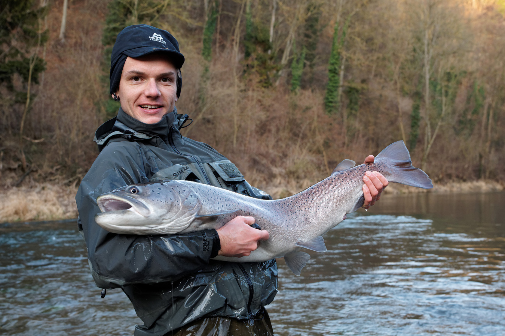

```{r setup, include=FALSE}
knitr::opts_chunk$set(echo = TRUE, error=TRUE)
```

## Niche optima of periphyton

Periphyton, which consists of algae and cyanobacteria attached to stream sediments, was sampled at 137 locations across the Ybbs river network. Next-generation sequencing of the 137 periphyton samples found in total 215 species (column `spec`) which were then assigned to three main taxonomical groups (`Diatoms`, `Chrysophytes` and `Cyanobacteria` in the column `group`). At the same 137 locations flow velocity was measured. 
Species have environmental preferences (niche optima) based on traits (e.g. morphology). One niche optimum (column `vel`) was estimated based on species distributions across the 137 locations. (A niche optimum of a species for velocity was calculated as the mean of the measured velocity across locations where the species occurred). E.g. species which only occurred at locations with high flow velocities, prefer high flow velocities, hence, have their niche optima at high flow velocities.

Hypothesis: Closer related species have more similar traits, hence, have more similar environmental preferences (niche optima) than distant related species. (Two species within a taxonomical group are closer related than two species between groups). 

1. Find out, whether the main taxonomical groups have different preferences (niche optima) in flow velocity. And if yes, which groups differ from each other.


```{r}
data = read.table("data/nicheoptima.txt", header = TRUE)
names(data)
dim(data)
```


```{r}
str(data)
#group is not a factor
data$group<-factor(data$group)   # define factor
levels(data$group)
str(data)

# First check ND and variance homogeneity?

boxplot(vel~group,data=data)
#boxplot looks fine

hist(data$vel[data$group=="Chrysophytes"], main="Chrysophytes", xlab="preferred velocity (niche optima)")
hist(data$vel[data$group=="Cyanobacteria"], main="Cyanobacteria", xlab="preferred velocity (niche optima)") 
hist(data$vel[data$group=="Diatoms"], main="Diatoms", xlab="preferred velocity (niche optima)")
#histograms look fine

#qqplots
qqnorm(data$vel[data$group=="Chrysophytes"], main="Chrysophytes")
qqline(data$vel[data$group=="Chrysophytes"])
qqnorm(data$vel[data$group=="Cyanobacteria"], main="Cyanobacteria")
qqline(data$vel[data$group=="Cyanobacteria"])
qqnorm(data$vel[data$group=="Diatoms"], main="Diatoms")
qqline(data$vel[data$group=="Diatoms"])


shapiro.test(data$vel[data$group=="Chrysophytes"])
shapiro.test(data$vel[data$group=="Cyanobacteria"]) 
shapiro.test(data$vel[data$group=="Diatoms"])
#shapiro test says only Cyanobacteria are normally distributed 


bartlett.test(vel~group,data=data)
# variances seem homogeneous

#Boxplot and histograms look fine and Anova is considered robust against violation of ND assumption, hence, we can apply ANOVA.

```

```{r}
#one-way ANOVA
fit<-aov(vel~group,data=data)
summary(fit)
#ANOVA is significant
```

```{r}
#But which taxonomical groups have different niche optima?
TukeyHSD(fit)
# check last column for adjusted p-values
```

```{r}
pairwise.t.test(data$vel, data$group, p.adj="bonferroni", pool.sd=TRUE)
```

```{r}
# making an appropriate graph
# ANOVA tests differences in locations=means, thus boxplots are not really appropriate
means<-tapply(data$vel,data$group,mean)
sds<-tapply(data$vel,data$group,sd)

plot(c(1:3), means, xlim=c(0.5,4), ylim=c(0.1, 0.35), ylab="preferred velocity (niche optima)", xlab="",xaxt="n",bty="l")
arrows(x0=c(1:3), y0=means-sds, y1=means+sds, angle=90, code=3)
axis(side=1,at=c(1:3),labels=names(means))
text(c(1:3),means,labels=c("a","b","a"),pos=4)
```


Conclude: ANOVA results show significant differences in niche optima between main taxonomical groups. This means that closer related species have more similar niche optima than distant related species. Cyanobacteria prefer higher flow velocities than chrysophytes and diatoms.


## Stoichiometry of microbes

[Hall et al. (2010)](https://www.nature.com/articles/ismej2010115) report microbial biomass stoichiometry measured on a per cell basis using Raman microspectroscopy. We simplified the dataset, now the experiment uses 2 species measured in 2 growth phases on 2 media differing in stoichiometry. Verrucomicroba are slow-growing soil and limnic bacteria, Pectobacterium is an opportunistic fast-growing detritivore isolated from carrots. The experiment is a complete full-factorial design.

The response variable in this design is a signature extracted from Raman spectra collected from individual bacterial cells. This signature is a proxy for nucleic acids (coded by `na_avg`)

```{r}
mic = read.table("data/MicrobesStoichiometry.txt", header = TRUE)
names(mic)
```


1. The growth rate hypothesis links stoichiometry of biomass, specifically the amount of P relative to N or C, to growth rate of organisms. Small, fast growing organisms have lower C:P and N:P ratios as higher growth means more "growth machinery" = ribosomes, that contain a lot of P. Consequently, microbial cells growing exponentially should have higher nucleic acid content. Test whether this is true for the two bacterial species and create an appropriate graph showing differences in means.

Start with selecting only one level of stoichiometry in the medium (either level 5 or 50).
```{r}
mic$NP<-factor(mic$NP)
mic<-subset(mic,subset=(NP==5) )
mic<-droplevels(mic)

```

```{r}
# could do separate tests for each species, but two-way ANOVA is more efficient and could help to find an interesting interaction effect
combfac<-paste(mic$species,mic$phase,sep="_")

#test for variance homogeneity
bartlett.test(mic$na_avg~combfac)
boxplot(na_avg~species*phase,data=mic)
# --> variances assumed as homogeneous
```

```{r}
# could check ND tediously in each cell of the design
Pec_log<-mic$na_avg[mic$species=="Pec" & mic$phase=="log"] #this is the same as the next line
Pec_log<-mic$na_avg[which(combfac=="Pec_log")]
Pec_stat<-mic$na_avg[which(combfac=="Pec_stat")]
Ver_log<-mic$na_avg[which(combfac=="Ver_log")]
Ver_stat<-mic$na_avg[which(combfac=="Ver_stat")]

hist(Pec_log)
hist(Pec_stat)
hist(Ver_log)
hist(Ver_stat)


z<-unlist(tapply(mic$na_avg,combfac,scale)) # quick and dirt check says ND may be given ;-)

layout(matrix(c(1:4),2,2,byrow = TRUE))
hist(z,freq=FALSE); lines(density(z))
boxplot(na_avg~species,data=mic,main="Differences by species")
boxplot(na_avg~phase,data=mic,main="Differences by phase")
boxplot(na_avg~species*phase,data=mic,main="Differences by species and phase")
```

```{r}
an<-aov(na_avg~species*phase,data=mic)
summary(an)
```

```{r}
# interaction not significant, thus in principal no post-hoc tests needed unless groupwise comparisons interesting
TukeyHSD(an)
```

```{r}
# making an appropriate graph
# Anova tests differences in locations=means, thus boxplots are not really appropriate
means<-tapply(mic$na_avg,combfac,mean)
sds<-tapply(mic$na_avg,combfac,sd)
plot(c(1:4),means,xlim=c(0.5,4.5),ylim=c(-1.5,1.8),ylab="avg nucleic acid signature", xlab="",xaxt="n",bty="l")
arrows(x0=c(1:4),y0=means-sds,y1=means+sds,angle=90,code=3)
axis(side=1,at=c(1:4),labels=names(means))
text(c(1:4),means,labels=c("a","b","b","b"),pos=4)
# obvious some things could still be improved, like using different symbols and symbol colors for the treatments  
```

Conclude: ANOVA results show significant main effects and no interaction. The opportunistic species has clearly higher nucleic acid content when in growth phase.

2. Assume nucleic acid abundance as indicating growth. Can both bacterial species translate increased availability of P equally well into more growth? Use the N:P levels 5 and 50 but only data from the logarithmic growth phase.
```{r}
mic = read.table("data/MicrobesStoichiometry.txt", header = TRUE)

mic$NP<-factor(mic$NP)
mic<-subset(mic,subset=(phase=="log"))
mic<-droplevels(mic)

combfac<-paste(mic$species,mic$NP,sep="_")

table(combfac)

bartlett.test(na_avg~combfac,data=mic)
boxplot(na_avg~species*NP,data=mic)
# variances seem homogeneous

hist(unlist(tapply(mic$na_avg,combfac,scale))) # ok
an<-aov(na_avg~species*NP,data=mic)
summary(an)
# interaction significant

# thus post-hoc tests more important
TukeyHSD(an)

# making an appropriate graph
# Anova tests differences in locations=means, thus boxplots are not really appropriate
means<-tapply(mic$na_avg,combfac,mean)
sds<-tapply(mic$na_avg,combfac,sd)
plot(c(1:4),means,xlim=c(0.5,4.5),ylim=c(-1,1.8),ylab="avg nucleic acid signature",xlab="",xaxt="n",bty="l")
arrows(x0=c(1:4),y0=means-sds,y1=means+sds,angle=90,code=3)
axis(side=1,at=c(1:4),labels=names(means))
text(c(1:4),means,labels=c("a","b","b","a,b"),pos=4)
# obvious some things could still be improved, like using different symbols and symbol colors for the treatments  
```

Conclude that the opportunistic species can make better use of high-P medium.


## Hucho record captures in Austrian rivers

Fishermen like to catch record-breaking large fish and if successful will do a bit of effort to document their historic achievement in the local pub ;-) This dataset contains sizes of such record catches of Hucho in various Austrian streams and rivers of various size, the data was collected from various sources including the eventual black-and-white photograph hanging in a pub.

Here is one such picture from the author of the study:



The Danube salmon is an endangered species in now dwindling populations. It needs intact river corridors for migration. Hydropower facilities should have a fish ladder allowing the fish to bypass turbines. The size of such a fish ladder is a cost issue AND an ecological issue - it needs to be large enough to accommodate the expected fish size in any given system. Usually large rivers host large fish. So, river size could be taken as a proxy of fish size to be expected.

```{r}
hucho = read.table("data/HuchoRatschan2012.txt", header = TRUE)
```

1. Look for a reasonable relationship of a river size measure with a fish size measure. Deliver a model that could guide construction of fish passes. Consider transformations to linearize relationships.
```{r}
names(hucho)
plot(length~width,data=hucho)
plot(mass~log(discharge),data=hucho) # I go for this one, but several others may also make sense
humo1<-lm(mass~log(discharge),data=hucho)
summary(humo1)
abline(humo1)
coef(humo1)
```
Hucho model1: fish mass = 14.9+2.4 * log(Q)


2. A potential confounding variable could be population size. When a population of Hucho is very small, it is less likely to contain large specimens. The dataset includes an estimate of population size based on expert (= fishermen) opinion. Explore differences in maximum Hucho body size captured in the various systems depending on population size. Test for differences and produce a publishable final graph showing average maximum fish size in dependence from population size. Don´t forget to check assumptions before running your statistical analysis and justify your choice of method.
```{r}
boxplot(mass~population,data=hucho)
# anova-problem
hist(hucho$mass[hucho$population=="limited"]) # ND will anyway be hard to judge...
qqnorm(hucho$mass[hucho$population=="limited"])
qqnorm(hucho$mass[hucho$population=="medium"])
qqnorm(hucho$mass[hucho$population=="large"])
hist(unlist(tapply(hucho$mass,INDEX=hucho$population,FUN=scale)))
qqnorm(unlist(tapply(hucho$mass,INDEX=hucho$population,FUN=scale)))
shapiro.test(unlist(tapply(hucho$mass,INDEX=hucho$population,FUN=scale))) # check ND
bartlett.test(mass~population,data=hucho) # check var.hom.
humo2<-lm(mass~population,data=hucho)
summary(humo2)
anova(humo2)
# Anova population size does not affect fish size significantly
pairwise.t.test(hucho$mass,hucho$population,method="bonferroni",pool.sd=TRUE)
# pairwise no significant difference!
```

Population size does not significantly influence maximum fish size (F=2.6, df1=2, df2=29, P=0.09), but there is a tendency for the limited populations to have smaller fish on average.

3. You will find that both river size and population size affect maximum Hucho size. How can you test both predictors at once? Which would be the best model for fish ladder builders if they wanted to improve the conservation status of Danube salmon in the future?
```{r}
hucho$population<-factor(hucho$population)
levels(hucho$population) # check order of levels
plot(mass~log(discharge),data=hucho,col=hucho$population)
abline(humo1)
boxplot(humo1$residuals~hucho$population) # this residual analysis strongly hints at an effect of population!
humo3<-lm(mass~log(discharge)*population,data=hucho)

summary(humo3)
anova(humo3)
humo4<-lm(mass~log(discharge)+population,data=hucho)
anova(humo4)
summary(humo4)

plot(mass~log(discharge),data=hucho,col=c("green","red","black"))
abline(a=coef(humo4)[1],b=coef(humo4)[2],col="green")
abline(a=coef(humo4)[1]+coef(humo4)[3],b=coef(humo4)[2],col="red")
abline(a=coef(humo4)[1]+coef(humo4)[4],b=coef(humo4)[2],col="black")
```

The best model to estimate fish ladder dimension comes from mass~log(Q) using only data from large populations:

Hucho model4: Fish mass = 16.67 +2.36 log(Q)

which has similar slope but higher intercept than the model that ignores population size:

Hucho model1: Fish mass = 14.9+2.4 * log(Q)

With model1 fish would be estimated too small, fish passes would not support the largest fish that we could hope for in eventually healthy populations.

